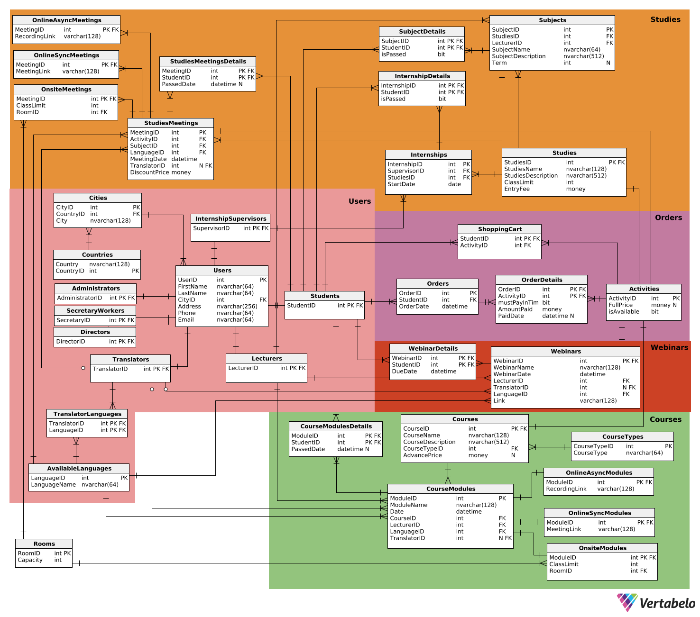

# Projekt \- Bazy danych \- dokumentacja

# System zarządzania kursami i szkoleniami

**Podstawy baz danych 2024/25**

*Jakub Zając, Stanisław Strojniak, Kamil Życzkowski*

[**Funkcje i użytkownicy systemu	5**](#funkcje-i-użytkownicy-systemu)

[Użytkownicy bazy danych	5](#użytkownicy-bazy-danych)

[Funkcje systemu	5](#funkcje-systemu)

[Zarządzanie użytkownikami	5](#zarządzanie-użytkownikami)

[Zarządzanie uprawnieniami	5](#zarządzanie-uprawnieniami)

[Obsługa finansowa i płatności	6](#obsługa-finansowa-i-płatności)

[Zakupy i koszyk	6](#zakupy-i-koszyk)

[Tworzenie i zarządzanie treściami	6](#tworzenie-i-zarządzanie-treściami)

[Obsługa zajęć	6](#obsługa-zajęć)

[Obsługa webinarów i nagrań	7](#obsługa-webinarów-i-nagrań)

[Raportowanie i dokumentacja	7](#raportowanie-i-dokumentacja)

[Oceny i zaliczenia	7](#oceny-i-zaliczenia)

[Dostęp do informacji	7](#dostęp-do-informacji)

[**Schemat bazy danych	8**](#schemat-bazy-danych)

[**Opisy tabel	9**](#opisy-tabel)

[Użytkownicy	9](#użytkownicy)

[Users	9](#users)

[Students	9](#students)

[Lecturers	10](#lecturers)

[Administrators	10](#administrators)

[SecretaryWorkers	10](#secretaryworkers)

[Directors	11](#directors)

[InternshipSupervisors	11](#internshipsupervisors)

[Translators	11](#translators)

[TranslatorLanguages	12](#translatorlanguages)

[AvailableLanguages	12](#availablelanguages)

[Countries	13](#countries)

[Cities	13](#cities)

[Studia	13](#studia)

[Studies	13](#studies)

[Subjects	14](#subjects)

[SubjectDetails	15](#subjectdetails)

[StudiesMeetings	15](#studiesmeetings)

[StudiesMeetingsDetails	16](#studiesmeetingsdetails)

[OnlineAsyncMeetings	17](#onlineasyncmeetings)

[OnlineSyncMeetings	17](#onlinesyncmeetings)

[OnsiteMeetings	18](#onsitemeetings)

[Internships	18](#internships)

[InternshipDetails	19](#internshipdetails)

[Webinary	20](#webinary)

[Webinars	20](#webinars)

[WebinarDetails	21](#webinardetails)

[Kursy	21](#kursy)

[Courses	21](#courses)

[CourseTypes	22](#coursetypes)

[CourseModules	22](#coursemodules)

[CourseModuleDetails	23](#coursemoduledetails)

[OnlineAsyncModules	24](#onlineasyncmodules)

[OnlineSyncModules	24](#onlinesyncmodules)

[OnsiteModules	25](#onsitemodules)

[Zamówienia	25](#zamówienia)

[Orders	25](#orders)

[OrderDetails	26](#orderdetails)

[ShoppingCart	27](#shoppingcart)

[Activities	27](#activities)

[Pozostałe	27](#pozostałe)

[Rooms	27](#rooms)

[**Sposób generowania danych	28**](#sposób-generowania-danych)

[**Widoki	28**](#widoki)

[Zestawienie przychodów dla każdego wydarzenia	28](#zestawienie-przychodów-dla-każdego-wydarzenia)

[Zestawienie przychodów dla każdego kursu	29](#zestawienie-przychodów-dla-każdego-kursu)

[Zestawienie przychodów dla każdego studium	29](#zestawienie-przychodów-dla-każdego-studium)

[Zestawienie przychodów dla każdego webinaru	30](#zestawienie-przychodów-dla-każdego-webinaru)

[Zestawienie osób zalegających z płatnościami	30](#zestawienie-osób-zalegających-z-płatnościami)

[Zestawienie osób spóźnionych z płatnościami za studia	31](#zestawienie-osób-spóźnionych-z-płatnościami-za-studia)

[Widok koszyka wraz z kosztami aktywności	32](#widok-koszyka-wraz-z-kosztami-aktywności)

[Zestawienie liczby osób zapisanych na przyszłe wydarzenia	32](#zestawienie-liczby-osób-zapisanych-na-przyszłe-wydarzenia)

[Zestawienie liczby osób zapisanych na przyszłe spotkania studyjne	33](#zestawienie-liczby-osób-zapisanych-na-przyszłe-spotkania-studyjne)

[Zestawienie liczby osób zapisanych na przyszłe moduły kursów	33](#zestawienie-liczby-osób-zapisanych-na-przyszłe-moduły-kursów)

[Zestawienie liczby osób zapisanych na przyszłe webinary	34](#zestawienie-liczby-osób-zapisanych-na-przyszłe-webinary)

[Zestawienie frekwencji na zakończonych wydarzeniach	34](#zestawienie-frekwencji-na-zakończonych-wydarzeniach)

[Zestawienie frekwencji na zakończonych spotkaniach studyjnych	35](#zestawienie-frekwencji-na-zakończonych-spotkaniach-studyjnych)

[Zestawienie frekwencji na zakończonych modułach kursów	35](#zestawienie-frekwencji-na-zakończonych-modułach-kursów)

[Pokaż dane wszystkich studentów	36](#pokaż-dane-wszystkich-studentów)

[Pokaż dane wszystkich wykładowców	36](#pokaż-dane-wszystkich-wykładowców)

[Pokaż dane wszystkich tłumaczy	36](#pokaż-dane-wszystkich-tłumaczy)

[Pokaż dane wszystkich administratorów	37](#pokaż-dane-wszystkich-administratorów)

[Pokaż dane wszystkich dyrektorów	37](#pokaż-dane-wszystkich-dyrektorów)

[Pokaż dane wszystkich pracowników sekretariatu	37](#pokaż-dane-wszystkich-pracowników-sekretariatu)

[Pokaż dane wszystkich prowadzących praktyki	38](#pokaż-dane-wszystkich-prowadzących-praktyki)

[Lista obecności na każdym wydarzeniu	38](#lista-obecności-na-każdym-wydarzeniu)

[Lista obecności na każdym spotkaniu studyjnym	39](#lista-obecności-na-każdym-spotkaniu-studyjnym)

[Lista obecności na każdym module kursu	40](#lista-obecności-na-każdym-module-kursu)

[Lista obecności na każdym webinarze	40](#lista-obecności-na-każdym-webinarze)

[Lista osób z kolizjami w przyszłym planie zajęć	41](#lista-osób-z-kolizjami-w-przyszłym-planie-zajęć)

[Lista wszystkich przyszłych wydarzeń	42](#lista-wszystkich-przyszłych-wydarzeń)

[Lista wszystkich przyszłych spotkań studyjnych	43](#lista-wszystkich-przyszłych-spotkań-studyjnych)

[Lista wszystkich przyszłych modułów kursów	43](#lista-wszystkich-przyszłych-modułów-kursów)

[Lista wszystkich przyszłych webinarów	43](#lista-wszystkich-przyszłych-webinarów)

[**Procedury	44**](#procedury)

[Dodanie nowego zamówienia	44](#dodanie-nowego-zamówienia)

[Dodanie przedmiotu do koszyka	44](#dodanie-przedmiotu-do-koszyka)

[Dodanie nowego webinaru	45](#dodanie-nowego-webinaru)

[Dodanie nowego kursu	45](#dodanie-nowego-kursu)

[Dodanie nowego modułu zdalnego do kursu	46](#dodanie-nowego-modułu-zdalnego-do-kursu)

[Dodanie nowego modułu hybrydowego do kursu	47](#dodanie-nowego-modułu-hybrydowego-do-kursu)

[Dodanie nowego modułu stacjonarnego do kursu	47](#dodanie-nowego-modułu-stacjonarnego-do-kursu)

[Dodanie nowych studiów	48](#dodanie-nowych-studiów)

[Dodanie nowego przedmiotu do studiów	48](#dodanie-nowego-przedmiotu-do-studiów)

[Dodanie nowego spotkania do przedmiotu	49](#dodanie-nowego-spotkania-do-przedmiotu)

[Dodanie nowego stażu	50](#dodanie-nowego-stażu)

[Dodanie nowego studenta	50](#dodanie-nowego-studenta)

[Dodanie nowego wykładowcy	51](#dodanie-nowego-wykładowcy)

[Dodanie nowego tłumacza	52](#dodanie-nowego-tłumacza)

[Dodanie nowego języka do danego tłumacza	53](#dodanie-nowego-języka-do-danego-tłumacza)

[Dodanie nowego administratora	54](#dodanie-nowego-administratora)

[Dodanie nowego dyrektora	55](#dodanie-nowego-dyrektora)

[Dodanie nowego pracownika sekretariatu	56](#dodanie-nowego-pracownika-sekretariatu)

[Dodanie nowego prowadzącego praktyki	57](#dodanie-nowego-prowadzącego-praktyki)

[**Funkcje	59**](#funkcje)

[Podliczenie frekwencji użytkownika na danym kursie	59](#podliczenie-frekwencji-użytkownika-na-danym-kursie)

[Podliczenie frekwencji użytkownika na danym przedmiocie na studiach	59](#podliczenie-frekwencji-użytkownika-na-danym-przedmiocie-na-studiach)

[Podliczenie ilości wolnych miejsc na studiach	60](#podliczenie-ilości-wolnych-miejsc-na-studiach)

[Podliczenie ilości wolnych miejsc na kursach	61](#podliczenie-ilości-wolnych-miejsc-na-kursach)

[Sprawdzenie czy student zaliczył praktyki	61](#sprawdzenie-czy-student-zaliczył-praktyki)

[Obliczenie łącznej wartości danego zamówienia	62](#obliczenie-łącznej-wartości-danego-zamówienia)

[Obliczenie łącznej wartości koszyka	62](#obliczenie-łącznej-wartości-koszyka)

[Zwrócenie harmonogramu danego kierunku studiów	63](#zwrócenie-harmonogramu-danego-kierunku-studiów)

[Zwrócenie harmonogramu danego kierunku studiów w konkretnym semestrze	63](#zwrócenie-harmonogramu-danego-kierunku-studiów-w-konkretnym-semestrze)

[Zwrócenie harmonogramu danego kursu	64](#zwrócenie-harmonogramu-danego-kursu)

[Zwrócenie harmonogramu zajęć danego studenta	65](#zwrócenie-harmonogramu-zajęć-danego-studenta)

[**Triggery	67**](#triggery)

[Automatyczne dodanie studenta do webinaru po zakupieniu	67](#automatyczne-dodanie-studenta-do-webinaru-po-zakupieniu)

[Automatyczne dodanie studenta do kursu i jego modułów po zakupieniu	68](#automatyczne-dodanie-studenta-do-kursu-i-jego-modułów-po-zakupieniu)

[Automatyczne dodanie studenta do studiów i spotkań studyjnych po zakupieniu	68](#automatyczne-dodanie-studenta-do-studiów-i-spotkań-studyjnych-po-zakupieniu)

[Automatyczne dodanie studenta do pojedynczego spotkania studyjnego po zakupieniu	70](#automatyczne-dodanie-studenta-do-pojedynczego-spotkania-studyjnego-po-zakupieniu)

[**Uprawnienia	70**](#uprawnienia)

[Administrator	70](#administrator)

[Pracownik sekretariatu	70](#pracownik-sekretariatu)

[Student	71](#student)

[Tłumacz	71](#tłumacz)

[Wykładowca	72](#wykładowca)

[Prowadzący praktyki	72](#prowadzący-praktyki)

[**Indeksy	72**](#indeksy)

[Tabela Users	72](#tabela-users)

[Tabela Cities	72](#tabela-cities)

[Tabela TranslatorLanguages	73](#tabela-translatorlanguages)

[Tabela Webinars	73](#tabela-webinars)

[Tabela WebinarDetails	73](#tabela-webinardetails)

[Tabela Courses	73](#tabela-courses)

[Tabela CourseModules	73](#tabela-coursemodules)

[Tabela CourseModulesDetails	73](#tabela-coursemodulesdetails)

[Tabela OnlineAsyncModules	74](#tabela-onlineasyncmodules)

[Tabela OnlineSyncModules	74](#tabela-onlinesyncmodules)

[Tabela OnsiteModules	74](#tabela-onsitemodules)

[Tabela Orders	74](#tabela-orders)

[Tabela OrderDetails	74](#tabela-orderdetails)

[Tabela ShoppingCart	74](#tabela-shoppingcart)

[Tabela Subjects	75](#tabela-subjects)

[Tabela Internships	75](#tabela-internships)

[Tabela StudiesMeetings	75](#tabela-studiesmeetings)

[Tabela OnlineAsyncMeetings	75](#tabela-onlineasyncmeetings)

[Tabela OnlineSyncMeetings	75](#tabela-onlinesyncmeetings)

[Tabela OnsiteMeetings	75](#tabela-onsitemeetings)

[**Testowanie działania indeksów z użyciem optymalizatora kosztowego	76**](#testowanie-działania-indeksów-z-użyciem-optymalizatora-kosztowego)

# **Funkcje i użytkownicy systemu** {#funkcje-i-użytkownicy-systemu}

## **Użytkownicy bazy danych** {#użytkownicy-bazy-danych}

1. **Administrator** \- zarządza całym systemem, odpowiada za jego poprawne działanie. Administrator ma dostęp do wszystkich, pozostałych funkcji innych użytkowników systemu.  
2. **Dyrektor szkoły** \- zarządza i nadzoruje funkcjonowanie całego systemu edukacyjnego. Dyrektor szkoły ma dostęp do funkcji administratora.  
3. **Pracownik sekretariatu** \- dodaje webinary i kursy, generuje raporty finansowe i statystyczne, tworzy harmonogram zajęć  
4. **Uczestnik** \- uczestniczy w zajęciach, może korzystać z materiałów edukacyjnych (np. nagrań)  
5. **Tłumacz** \- tłumaczy na żywo na język polski przypisane zajęcia prowadzone w językach obcych  
6. **Wykładowca** \- prowadzi zajęcia, koordynuje prowadzony przedmiot, dokumentuje frekwencję uczestników, wystawia zaliczenia z modułów  
7. **Prowadzący praktyki** \- koordynuje praktyki, odpowiada za ich realizację i przyznanie zaliczenia praktyk  
8. **Niezalogowany użytkownik** \- może przeglądać listę zajęć i utworzyć konto w systemie

## **Funkcje systemu** {#funkcje-systemu}

### **Zarządzanie użytkownikami** {#zarządzanie-użytkownikami}

* **Dodawanie i usuwanie wszystkich kont użytkowników**: Administrator  
* **Dodawanie i usuwanie kont wykładowcy i tłumacza**: Pracownik sekretariatu  
* **Założenie konta użytkownika**: Niezalogowany użytkownik  
* **Usunięcie konta**: Uczestnik  
* **Edycja swoich danych osobowych**: Każdy użytkownik systemu

---

### **Zarządzanie uprawnieniami** {#zarządzanie-uprawnieniami}

* **Nadawanie uprawnień użytkownikom**: Administrator  
* **Przydzielenie dostępu do webinaru bez uprzedniego uiszczenia opłaty**: Dyrektor szkoły  
* **Przyznanie uczestnictwa do studium/kursu bez wpłaty zaliczki lub całej kwoty na 3 dni przed rozpoczęciem kursu**: Dyrektor szkoły  
* **Przydzielenie tłumacza do zajęć**: Pracownik sekretariatu

---

### **Obsługa finansowa i płatności** {#obsługa-finansowa-i-płatności}

* **Generowanie linku do płatności**: System  
* **Informowanie użytkownika o statusie płatności**: System  
* **Zapis uczestnika na zajęcia po zaksięgowaniu płatności**: System  
* **Wysyłanie informacji przypominającej o zbliżającej się płatności**: System

---

### **Zakupy i koszyk** {#zakupy-i-koszyk}

* **Dodawanie produktów do koszyka**: Uczestnik  
* **Tworzenie zamówienia**: Uczestnik  
* **Sprawdzanie dostępności miejsc na spotkanie studyjne dla osób niezapisanych na studia**: System  
* **Zapisanie się na spotkanie studyjne jako osoba nieuczestnicząca w całym studium:** Uczestnik

---

### **Tworzenie i zarządzanie treściami** {#tworzenie-i-zarządzanie-treściami}

* **Dodawanie webinaru i kursu**: Pracownik sekretariatu  
* **Dodawanie nowych studiów**: Dyrektor szkoły  
* **Tworzenie harmonogramu zajęć**: Pracownik sekretariatu  
* **Zarządzanie harmonogramem praktyk**: Pracownik sekretariatu, Prowadzący praktyki  
* **Dodawanie i modyfikacja sylabusu zajęć (przed rozpoczęciem roku akademickiego)**: Wykładowca

---

### **Obsługa zajęć** {#obsługa-zajęć}

* **Podgląd listy zajęć, na które użytkownik jest zapisany**: Uczestnik  
* **Podgląd swojej frekwencji na zajęciach**: Uczestnik  
* **Podgląd swoich ocen**: Uczestnik  
* **Podgląd listy zajęć do tłumaczenia na żywo**: Tłumacz  
* **Podgląd listy prowadzonych zajęć**: Wykładowca  
* **Podgląd listy uczestników zajęć**: Wykładowca  
* **Zapisanie obecności uczestników na zajęciach**: Wykładowca  
* **Rejestracja obecności na praktykach**: Prowadzący praktyki  
* **Podgląd listy uczestników praktyk**: Prowadzący praktyki  
* **Połączenie się do zajęć w trybie tłumacza**: Tłumacz

---

### **Obsługa webinarów i nagrań** {#obsługa-webinarów-i-nagrań}

* **Archiwizacja nagrań zajęć na platformie do webinarów i udostępnienie ich uczestnikom na okres 30 dni**: System  
* **Automatyczne zaliczenie zajęć po obejrzeniu nagrania**: System  
* **Skasowanie przechowywanego webinaru**: Administrator

---

### **Raportowanie i dokumentacja** {#raportowanie-i-dokumentacja}

* **Generowanie raportów**: Pracownik sekretariatu, Dyrektor szkoły  
* **Podgląd utworzonych raportów**: Pracownik sekretariatu, Dyrektor szkoły  
* **Generowanie raportu o liście osób, których przyszłe zajęcia ze sobą kolidują**: Pracownik sekretariatu  
* **Generowanie raportu o dyplomach do wysłania**: Pracownik sekretariatu  
* **Generowanie dyplomów**: Pracownik sekretariatu, Dyrektor szkoły  
* **Wysłanie informacji do użytkownika o wysłaniu dyplomu**: System

---

### **Oceny i zaliczenia** {#oceny-i-zaliczenia}

* **Wystawianie zaliczeń**: Wykładowca  
* **Zaliczanie studiów/kursu na podstawie obecności**: System, Wykładowca, Dyrektor szkoły

---

### **Dostęp do informacji** {#dostęp-do-informacji}

* **Przeglądanie listy kursów, webinarów i studiów**: Każdy użytkownik systemu  
* **Przeglądanie sylabusa przedmiotu**: Każdy użytkownik systemu

---

# **Schemat bazy danych** {#schemat-bazy-danych}



---

# **Opisy tabel** {#opisy-tabel}

## Użytkownicy {#użytkownicy}

### Users {#users}

Zawiera podstawowe informacje o wszystkich użytkownikach bazy danych.

* **UserID** int \- klucz główny, identyfikator użytkownika  
* **FirstName** nvarchar(64) \- imię użytkownika  
* **LastName** nvarchar(64) \- nazwisko użytkownika  
* **CityID** int \- klucz obcy, identyfikator miasta, z którego pochodzi użytkownik  
* **Address** nvarchar(256) \- adres użytkownika zawierający nazwę ulicy, numer domu i kod pocztowy  
* **Phone** nvarchar(64) \- numer telefonu użytkownika  
* **Email** nvarchar(64) unique \- adres e-mail użytkownika  
  * warunek: Email LIKE '%\_@\_%.\_%'

```sql
CREATE TABLE Users (
   UserID int  NOT NULL,
   FirstName nvarchar(64)  NOT NULL,
   LastName nvarchar(64)  NOT NULL,
   CityID int  NOT NULL,
   Address nvarchar(256)  NOT NULL,
   Phone nvarchar(64)  NOT NULL,
   Email nvarchar(64)  NOT NULL,
   CONSTRAINT uniqueEmail UNIQUE (Email),
   CONSTRAINT emailFormat CHECK ([email] LIKE '%_@_%._%'),
   CONSTRAINT Users_pk PRIMARY KEY  (UserID)
);

ALTER TABLE Users ADD CONSTRAINT Users_Cities
	FOREIGN KEY (CityID)
	REFERENCES Cities (CityID);
```

### Students {#students}

Przechowuje wszystkich użytkowników będących studentami.

* **StudentID** int \- klucz główny, identyfikator studenta

```sql
CREATE TABLE Students (
   StudentID int  NOT NULL,
   CONSTRAINT Students_pk PRIMARY KEY  (StudentID)
);

ALTER TABLE Students ADD CONSTRAINT Students_Users
	FOREIGN KEY (StudentID)
	REFERENCES Users (UserID);
```

### Lecturers {#lecturers}

Przechowuje wszystkich użytkowników będących wykładowcami.

* **LecturerID** int \- klucz główny, klucz obcy, identyfikator wykładowcy

```sql
CREATE TABLE Lecturers (
   LecturerID int  NOT NULL,
   CONSTRAINT Lecturers_pk PRIMARY KEY  (LecturerID)
);

ALTER TABLE Lecturers ADD CONSTRAINT Lecturers_Users
	FOREIGN KEY (LecturerID)
	REFERENCES Users (UserID);
```

### Administrators {#administrators}

Przechowuje wszystkich użytkowników będących administratorami.

* **AdministratorID** int \- klucz główny, klucz obcy, identyfikator administratora

```sql
CREATE TABLE Administrators (
   AdministratorID int  NOT NULL,
   CONSTRAINT Administrators_pk PRIMARY KEY  (AdministratorID)
);

ALTER TABLE Administrators ADD CONSTRAINT Administrators_Users
	FOREIGN KEY (AdministratorID)
	REFERENCES Users (UserID);
```

### SecretaryWorkers {#secretaryworkers}

Przechowuje wszystkich użytkowników będących pracownikami sekretariatu.

* **SecretaryID** int \- klucz główny, klucz obcy, identyfikator pracownika sekretariatu

```sql
CREATE TABLE SecretaryWorkers (
   SecretaryID int  NOT NULL,
   CONSTRAINT SecretaryWorkers_pk PRIMARY KEY  (SecretaryID)
);

ALTER TABLE SecretaryWorkers ADD CONSTRAINT SecretaryWorkers_Users
	FOREIGN KEY (SecretaryID)
	REFERENCES Users (UserID);
```

### Directors {#directors}

Przechowuje wszystkich użytkowników będących dyrektorami.

* **DirectorID** int \- klucz główny, klucz obcy, identyfikator dyrektora

```sql
CREATE TABLE Directors (
   DirectorID int  NOT NULL,
   CONSTRAINT Directors_pk PRIMARY KEY  (DirectorID)
);

ALTER TABLE Directors ADD CONSTRAINT Directors_Users
	FOREIGN KEY (DirectorID)
	REFERENCES Users (UserID);
```

### InternshipSupervisors {#internshipsupervisors}

Przechowuje wszystkich użytkowników będących prowadzącymi praktyki.

* **SupervisorID** int \- klucz główny, klucz obcy, identyfikator prowadzącego praktyki

```sql
CREATE TABLE InternshipSupervisors (
   SupervisorID int  NOT NULL,
   CONSTRAINT InternshipSupervisors_pk PRIMARY KEY  (SupervisorID)
);

ALTER TABLE InternshipSupervisors ADD CONSTRAINT InternshipSupervisors_Users
	FOREIGN KEY (SupervisorID)
	REFERENCES Users (UserID);
```

### Translators {#translators}

Przechowuje wszystkich użytkowników będących tłumaczami.

* **TranslatorID** int \- klucz główny, klucz obcy, identyfikator tłumacza

```sql
CREATE TABLE Translators (
   TranslatorID int  NOT NULL,
   CONSTRAINT Translators_pk PRIMARY KEY  (TranslatorID)
);

ALTER TABLE Translators ADD CONSTRAINT Translators_Users
	FOREIGN KEY (TranslatorID)
	REFERENCES Users (UserID);
```

### TranslatorLanguages {#translatorlanguages}

Zawiera informacje o tłumaczach i językach, które potrafią tłumaczyć.

* **TranslatorID** int \- klucz główny, klucz obcy, identyfikator tłumacza  
* **LanguageID** int \- klucz główny, klucz obcy, identyfikator języka

```sql
CREATE TABLE TranslatorLanguages (
   TranslatorID int  NOT NULL,
   LanguageID int  NOT NULL,
   CONSTRAINT TranslatorLanguages_pk PRIMARY KEY  (TranslatorID,LanguageID)
);

ALTER TABLE TranslatorLanguages ADD CONSTRAINT TranslatorLanguages_AvailableLanguages
	FOREIGN KEY (LanguageID)
	REFERENCES AvailableLanguages (LanguageID);

ALTER TABLE TranslatorLanguages ADD CONSTRAINT TranslatorLanguages_Translators
	FOREIGN KEY (TranslatorID)
	REFERENCES Translators (TranslatorID);
```

### AvailableLanguages {#availablelanguages}

Zawiera informacje o tłumaczonych językach.

* **LanguageID** int \- klucz główny, identyfikator języka  
* **LanguageName** nvarchar(64) \- nazwa języka

```sql
CREATE TABLE AvailableLanguages (
   LanguageID int  NOT NULL,
   LanguageName nvarchar(64)  NOT NULL,
   CONSTRAINT AvailableLanguages_pk PRIMARY KEY  (LanguageID)
);
```

### Countries {#countries}

Zawiera informacje o państwach.

* **CountryID** int \- klucz główny, identyfikator kraju  
* **Country** nvarchar(128) \- nazwa kraju

```sql
CREATE TABLE Countries (
   CountryID int  NOT NULL,
   Country nvarchar(128)  NOT NULL,
   CONSTRAINT Countries_pk PRIMARY KEY  (CountryID)
);
```

### Cities {#cities}

Zawiera informacje o miastach.

* **CityID** int \- klucz główny, identyfikator miasta  
* **CountryID** int \- klucz obcy, identyfikator kraju  
* **City** nvarchar(128) \- nazwa miasta, z którego pochodzi użytkownik

```sql
CREATE TABLE Cities (
   CityID int  NOT NULL,
   CountryID int  NOT NULL,
   City nvarchar(128)  NOT NULL,
   CONSTRAINT Cities_pk PRIMARY KEY  (CityID,CountryID)
);

ALTER TABLE Cities ADD CONSTRAINT Cities_Countries
	FOREIGN KEY (CountryID)
	REFERENCES Countries (CountryID);
```

## Studia {#studia}

### Studies {#studies}

Zawiera podstawowe informacje o studiach.

* **StudiesID** int \- klucz główny, klucz obcy, identyfikator studiów  
* **StudiesName** nvarchar(128) \- nazwa studiów  
* **StudiesDescription** nvarchar(512) \- opis studiów  
* **ClassLimit** int  \- limit miejsc na studiach  
  * warunek: ClassLimit \>= 0  
* **EntryFee** money \- wpisowe na studia  
  * warunek: EntryFee \>= 0

```sql
CREATE TABLE Studies (
   StudiesID int  NOT NULL,
   StudiesName nvarchar(128)  NOT NULL,
   StudiesDescription nvarchar(512)  NOT NULL,
   ClassLimit int  NOT NULL CHECK (ClassLimit >= 0),
   EntryFee money  NOT NULL CHECK (EntryFee >= 0),
   CONSTRAINT Studies_pk PRIMARY KEY  (StudiesID)
);

ALTER TABLE Studies ADD CONSTRAINT Studies_Activities
	FOREIGN KEY (StudiesID)
	REFERENCES Activities (ActivityID);
```

### Subjects {#subjects}

Zawiera podstawowe informacje o przedmiotach na danych studiach.

* **SubjectID** int \- klucz główny, identyfikator przedmiotu  
* **StudiesID** int \- klucz obcy, identyfikator studiów  
* **LecturerID** int \- klucz obcy, identyfikator prowadzącego zajęcia  
* **SubjectName** nvarchar(64) \- nazwa przedmiotu  
* **SubjectDescription** nvarchar(512) \- opis przedmiotu

```sql
CREATE TABLE Subjects (
   SubjectID int  NOT NULL,
   StudiesID int  NOT NULL,
   LecturerID int  NOT NULL,
   SubjectName nvarchar(64)  NOT NULL,
   SubjectDescription nvarchar(512)  NOT NULL,
   CONSTRAINT Subjects_pk PRIMARY KEY  (SubjectID)
);

ALTER TABLE Subjects ADD CONSTRAINT Subjects_Lecturers
	FOREIGN KEY (LecturerID)
	REFERENCES Lecturers (LecturerID);

ALTER TABLE Subjects ADD CONSTRAINT Subjects_Studies
	FOREIGN KEY (StudiesID)
	REFERENCES Studies (StudiesID);
```

### SubjectDetails {#subjectdetails}

Zawiera szczegółowe informacje o przedmiotach na danych studiach.

* **SubjectID** int \- klucz główny, klucz obcy, identyfikator przedmiotu  
* **StudiesID** int \- klucz główny, klucz obcy, identyfikator studiów  
* **isPassed** bit \- informacja o tym, czy student zdał przedmiot  
  * wartość domyślna: 0 (jeszcze się nie odbyły)

```sql
CREATE TABLE SubjectDetails (
   SubjectID int  NOT NULL,
   StudentID int  NOT NULL,
   isPassed bit  NOT NULL DEFAULT 0,
   CONSTRAINT SubjectDetails_pk PRIMARY KEY  (SubjectID,StudentID)
);

ALTER TABLE SubjectDetails ADD CONSTRAINT SubjectDetails_Students
	FOREIGN KEY (StudentID)
	REFERENCES Students (StudentID);

ALTER TABLE SubjectDetails ADD CONSTRAINT SubjectDetails_Subjects
	FOREIGN KEY (SubjectID)
	REFERENCES Subjects (SubjectID);
```

### StudiesMeetings {#studiesmeetings}

Zawiera podstawowe informacje o zajęciach na studiach.

* **MeetingID** int \- klucz główny, identyfikator zajęć  
* **ActivityID** int \- klucz obcy, identyfikator aktywności  
* **SubjectID** int \- klucz obcy, identyfikator przedmiotu  
* **LanguageID** int \- klucz obcy, identyfikator języka, w którym będą odbywały się zajęcia  
* **MeetingDate** datetime \- data odbycia się zajęć  
  * warunek: MeetingDate \>= ‘2000-01-01’  
* **TranslatorID** int \- klucz obcy, identyfikator tłumacza  
  * null jeśli nie jest potrzebne tłumaczenie  
* **DiscountPrice** money \- cena po zniżce dla uczestników studiów  
  * warunek: DiscountPrice \>= 0  
    

```sql
CREATE TABLE StudiesMeetings (
   MeetingID int  NOT NULL,
   ActivityID int  NOT NULL,
   SubjectID int  NOT NULL,
   LanguageID int  NOT NULL,
   MeetingDate datetime  NOT NULL CHECK (MeetingDate >= '2000-01-01'),
   TranslatorID int  NULL,
   DiscountPrice money  NULL DEFAULT NULL CHECK (DiscountPrice >= 0),
   CONSTRAINT StudiesMeetings_pk PRIMARY KEY  (MeetingID)
);

ALTER TABLE StudiesMeetings ADD CONSTRAINT StudiesMeetings_Activities
	FOREIGN KEY (ActivityID)
	REFERENCES Activities (ActivityID);

ALTER TABLE StudiesMeetings ADD CONSTRAINT StudiesMeetings_AvailableLanguages
	FOREIGN KEY (LanguageID)
	REFERENCES AvailableLanguages (LanguageID);

ALTER TABLE StudiesMeetings ADD CONSTRAINT StudiesMeetings_Subjects
	FOREIGN KEY (SubjectID)
	REFERENCES Subjects (SubjectID);

ALTER TABLE StudiesMeetings ADD CONSTRAINT StudiesMeetings_Translators
	FOREIGN KEY (TranslatorID)
	REFERENCES Translators (TranslatorID);
```

### StudiesMeetingsDetails {#studiesmeetingsdetails}

Zawiera szczegółowe informacje o zajęciach na studiach.

* **MeetingID** int \- klucz główny, klucz obcy, identyfikator zajęć  
* **StudentID** int \- klucz główny, klucz obcy, identyfikator studenta  
* **PassedDate** datetime \- data zaliczenia spotkania  
  * null jeśli użytkownik jeszcze nie zaliczył zajęć  
  * warunek: PassedDate \>= ‘2000-01-01’

```sql
CREATE TABLE StudiesMeetingsDetails (
   MeetingID int  NOT NULL,
   StudentID int  NOT NULL,
   PassedDate datetime  NULL CHECK (PassedDate >= '2000-01-01'),
   CONSTRAINT StudiesMeetingsDetails_pk PRIMARY KEY  (MeetingID,StudentID)
);

ALTER TABLE StudiesMeetingsDetails ADD CONSTRAINT StudiesMeetingsDetails_Students
	FOREIGN KEY (StudentID)
	REFERENCES Students (StudentID);

ALTER TABLE StudiesMeetingsDetails ADD CONSTRAINT StudiesMeetingsDetails_StudiesMeetings
	FOREIGN KEY (MeetingID)
	REFERENCES StudiesMeetings (MeetingID);
```

### OnlineAsyncMeetings {#onlineasyncmeetings}

Zawiera szczegółowe informacje o zdalnych, asynchronicznie prowadzonych zajęciach.

* **MeetingID** int \- klucz główny, klucz obcy, identyfikator zajęć  
* **RecordingLink** varchar(128) \- link do nagrania spotkania

```sql
CREATE TABLE OnlineAsyncMeetings (
   MeetingID int  NOT NULL,
   RecordingLink varchar(128)  NOT NULL,
   CONSTRAINT OnlineAsyncMeetings_pk PRIMARY KEY  (MeetingID)
);

ALTER TABLE OnlineAsyncMeetings ADD CONSTRAINT OnlineAsyncMeeting_StudiesMeetings
	FOREIGN KEY (MeetingID)
	REFERENCES StudiesMeetings (MeetingID);
```

### OnlineSyncMeetings {#onlinesyncmeetings}

Zawiera szczegółowe informacje o zdalnych, synchronicznie prowadzonych zajęciach.

* **MeetingID** int \- klucz główny, klucz obcy, identyfikator zajęć  
* **MeetingLink** varchar(128) \- link do spotkania na żywo

```sql
CREATE TABLE OnlineSyncMeetings (
   MeetingID int  NOT NULL,
   MeetingLink varchar(128)  NOT NULL,
   CONSTRAINT OnlineSyncMeetings_pk PRIMARY KEY  (MeetingID)
);

ALTER TABLE OnlineSyncMeetings ADD CONSTRAINT OnlineSyncMeeting_StudiesMeetings
	FOREIGN KEY (MeetingID)
	REFERENCES StudiesMeetings (MeetingID);
```

### OnsiteMeetings {#onsitemeetings}

Zawiera szczegółowe informacje o stacjonarnie prowadzonych zajęciach.

* **MeetingID** int \- klucz główny, klucz obcy, identyfikator modułu  
* **ClassLimit** int \- limit osób, które mogą uczestniczyć w zajęciach  
  * warunek: ClassLimit \>= 0  
* **RoomID** int \- klucz obcy, identyfikator pomieszczenia, w którym odbędą się zajęcia

```sql
CREATE TABLE OnsiteMeetings (
   MeetingID int  NOT NULL,
   ClassLimit int  NOT NULL CHECK (ClassLimit >= 0),
   RoomID int  NOT NULL,
   CONSTRAINT OnsiteMeetings_pk PRIMARY KEY  (MeetingID)
);

ALTER TABLE OnsiteMeetings ADD CONSTRAINT StationaryMeeting_Rooms
	FOREIGN KEY (RoomID)
	REFERENCES Rooms (RoomID);

ALTER TABLE OnsiteMeetings ADD CONSTRAINT StationaryMeeting_StudiesMeetings
	FOREIGN KEY (MeetingID)
	REFERENCES StudiesMeetings (MeetingID);
```

### Internships {#internships}

Zawiera podstawowe informacje o praktykach.

* **InternshipID** int \- klucz główny, identyfikator praktyk  
* **SupervisorID** int \- klucz obcy, identyfikator prowadzącego praktyki  
* **StudiesID** int \- klucz obcy, identyfikator studiów  
* **StartDate** date \- data rozpoczęcia praktyk  
  * warunek: StartDate \>= ‘2000-01-01’

```sql
CREATE TABLE Internships (
   InternshipID int  NOT NULL,
   SupervisorID int  NOT NULL,
   StudiesID int  NOT NULL,
   StartDate date  NOT NULL CHECK (StartDate >= '2000-01-01'),
   CONSTRAINT Internships_pk PRIMARY KEY  (InternshipID)
);

ALTER TABLE Internships ADD CONSTRAINT Internships_InternshipSupervisors
	FOREIGN KEY (SupervisorID)
	REFERENCES InternshipSupervisors (SupervisorID);

ALTER TABLE Internships ADD CONSTRAINT Internships_Studies
	FOREIGN KEY (StudiesID)
	REFERENCES Studies (StudiesID);
```

### InternshipDetails {#internshipdetails}

Zawiera szczegółowe informacje o praktykach.

* **InternshipID** int \- klucz główny, klucz obcy, identyfikator praktyk  
* **StudentID** int \- klucz główny, klucz obcy, identyfikator studenta  
* **isPassed** bit \- informacja o tym, czy student zdał praktyki  
  * wartość domyślna: 0 (jeszcze się nie odbyły)

```sql
CREATE TABLE InternshipDetails (
   InternshipID int  NOT NULL,
   StudentID int  NOT NULL,
   isPassed bit  NOT NULL DEFAULT 0,
   CONSTRAINT InternshipDetails_pk PRIMARY KEY  (InternshipID,StudentID)
);

ALTER TABLE InternshipDetails ADD CONSTRAINT InternshipDetails_Internships
	FOREIGN KEY (InternshipID)
	REFERENCES Internships (InternshipID);

ALTER TABLE InternshipDetails ADD CONSTRAINT InternshipDetails_Students
	FOREIGN KEY (StudentID)
	REFERENCES Students (StudentID);
```

## Webinary {#webinary}

### Webinars {#webinars}

Zawiera podstawowe informacje o webinarach.

* **WebinarID** int \- klucz główny, klucz obcy, identyfikator webinaru  
* **WebinarName** nvarchar(128) \- nazwa webinaru  
* **WebinarDate** datetime \- data odbycia webinaru  
  * warunek: WebinarDate \>= ‘2000-01-01’  
* **LecturerID** int \- klucz obcy, identyfikator prowadzącego webinar  
* **TranslatorID** int \- klucz obcy, identyfikator tłumacza  
  * null jeżeli nie trzeba tłumaczyć webinaru  
* **LanguageID** int \- klucz obcy, identyfikator języka, w którym będzie odbywał się webinar  
* **Link** varchar(128) \- link do webinaru

```sql
CREATE TABLE Webinars (
   WebinarID int  NOT NULL,
   WebinarName nvarchar(128)  NOT NULL,
   WebinarDate datetime  NOT NULL CHECK (WebinarDate >= '2000-01-01'),
   LanguageID int  NOT NULL,
   LecturerID int  NOT NULL,
   TranslatorID int  NULL,
   Link varchar(128)  NOT NULL,
   CONSTRAINT Webinars_pk PRIMARY KEY  (WebinarID)
);

ALTER TABLE Webinars ADD CONSTRAINT Webinars_Activities
	FOREIGN KEY (WebinarID)
	REFERENCES Activities (ActivityID);

ALTER TABLE Webinars ADD CONSTRAINT Webinars_AvailableLanguages
	FOREIGN KEY (LanguageID)
	REFERENCES AvailableLanguages (LanguageID);

ALTER TABLE Webinars ADD CONSTRAINT Webinars_Lecturers
	FOREIGN KEY (LecturerID)
	REFERENCES Lecturers (LecturerID);

ALTER TABLE Webinars ADD CONSTRAINT Webinars_Translators
	FOREIGN KEY (TranslatorID)
	REFERENCES Translators (TranslatorID);
```

### WebinarDetails {#webinardetails}

Zawiera szczegółowe informacje na temat uczestnictwa w webinarach.

* **WebinarID** int \- klucz główny, klucz obcy, identyfikator webinaru  
* **StudentID** int \- klucz główny, klucz obcy, identyfikator użytkownika mającego dostęp do webinaru  
* **DueDate** datetime \- data, do której użytkownik będzie miał dostęp do nagrania webinaru  
  * warunek: DueDate \>= ‘2000-01-01’

```sql
CREATE TABLE WebinarDetails (
   WebinarID int  NOT NULL,
   StudentID int  NOT NULL,
   DueDate datetime  NOT NULL CHECK (DueDate >= '2000-01-01'),
   CONSTRAINT WebinarDetails_pk PRIMARY KEY  (WebinarID,StudentID)
);

ALTER TABLE WebinarDetails ADD CONSTRAINT WebinarDetails_Students
	FOREIGN KEY (StudentID)
	REFERENCES Students (StudentID);

ALTER TABLE WebinarDetails ADD CONSTRAINT WebinarDetails_Webinars
	FOREIGN KEY (WebinarID)
	REFERENCES Webinars (WebinarID);
```

## Kursy {#kursy}

### Courses {#courses}

Zawiera podstawowe informacje o kursach.

* **CourseID** int \- klucz główny, klucz obcy, identyfikator kursu  
* **CourseName** nvarchar(128) \- nazwa kursu  
* **CourseDescription** nvarchar(512) \- opis kursu  
* **CourseTypeID** int \- klucz obcy, identyfikator typu kursu  
* **AdvancePrice** money \- kwota wymaganej zaliczki przy zakupie kursu  
  * null jeśli nie jest wymagana zaliczka  
  * warunek: AdvancePrice\>=0

```sql
CREATE TABLE Courses (
   CourseID int  NOT NULL,
   CourseName nvarchar(128)  NOT NULL,
   CourseDescription nvarchar(512)  NOT NULL,
   CourseTypeID int  NOT NULL,
   AdvancePrice money  NULL CHECK (AdvancePrice >= 0),
   CONSTRAINT Courses_pk PRIMARY KEY  (CourseID)
);

ALTER TABLE Courses ADD CONSTRAINT Courses_Activities
	FOREIGN KEY (CourseID)
	REFERENCES Activities (ActivityID);

ALTER TABLE Courses ADD CONSTRAINT Courses_CourseTypes
	FOREIGN KEY (CourseTypeID)
	REFERENCES CourseTypes (CourseTypeID);
```

### CourseTypes {#coursetypes}

Przechowuje dostępne typy kursów.

* **CourseTypeID** int \- klucz główny, identyfikator typu kursu  
* **CourseType** nvarchar(64) \- nazwa typu kursu

```sql
CREATE TABLE CourseTypes (
   CourseTypeID int  NOT NULL,
   CourseType nvarchar(64)  NOT NULL,
   CONSTRAINT CourseTypes_pk PRIMARY KEY  (CourseTypeID)
);
```

### CourseModules {#coursemodules}

Zawiera podstawowe informacje o modułach kursów.

* **ModuleID** int \- klucz główny, identyfikator modułu  
* **ModuleName** nvarchar(128) \- nazwa modułu  
* **Date** datetime \- data odbycia się modułu  
  * warunek: Date \>= ‘2000-01-01’  
* **CourseID** int \- klucz obcy, identyfikator kursu, w ramach którego odbywa się moduł  
* **LecturerID** int \- klucz obcy, identyfikator prowadzącego moduł  
* **LanguageID** int \- klucz obcy, identyfikator języka, w którym będzie odbywał się moduł  
* **TranslatorID** int nullable \- klucz obcy, identyfikator tłumacza  
  * null jeśli nie jest potrzebne tłumaczenie

```sql
CREATE TABLE CourseModules (
   ModuleID int  NOT NULL,
   ModuleName nvarchar(128)  NOT NULL,
   Date datetime  NOT NULL CHECK (Date >= '2000-01-01'),
   CourseID int  NOT NULL,
   LecturerID int  NOT NULL,
   LanguageID int  NOT NULL,
   TranslatorID int  NULL,
   CONSTRAINT CourseModules_pk PRIMARY KEY  (ModuleID)
);

ALTER TABLE CourseModules ADD CONSTRAINT CourseModules_AvailableLanguages
	FOREIGN KEY (LanguageID)
	REFERENCES AvailableLanguages (LanguageID);

ALTER TABLE CourseModules ADD CONSTRAINT CourseModules_Courses
	FOREIGN KEY (CourseID)
	REFERENCES Courses (CourseID);

ALTER TABLE CourseModules ADD CONSTRAINT CourseModules_Lecturers
	FOREIGN KEY (LecturerID)
	REFERENCES Lecturers (LecturerID);

ALTER TABLE CourseModules ADD CONSTRAINT CourseModules_Translators
	FOREIGN KEY (TranslatorID)
	REFERENCES Translators (TranslatorID);
```

### CourseModuleDetails {#coursemoduledetails}

Zawiera szczegółowe informacje na temat uczestnictwa w modułach.

* **ModuleID** int \- klucz główny, klucz obcy, identyfikator modułu  
* **StudentID** int \- klucz główny, klucz obcy, użytkownik, który ma dostęp do modułu  
* **PassedDate** datetime \- data zaliczenia modułu  
  * null jeśli użytkownik jeszcze nie zaliczył modułu  
  * warunek: PassedDate \>= ‘2000-01-01’

```sql
CREATE TABLE CourseModulesDetails (
   ModuleID int  NOT NULL,
   StudentID int  NOT NULL,
   PassedDate datetime  NULL CHECK (PassedDate >= '2000-01-01'),
   CONSTRAINT CourseModulesDetails_pk PRIMARY KEY  (ModuleID,StudentID)
);

ALTER TABLE CourseModulesDetails ADD CONSTRAINT CourseModulesDetails_CourseModules
	FOREIGN KEY (ModuleID)
	REFERENCES CourseModules (ModuleID);

ALTER TABLE CourseModulesDetails ADD CONSTRAINT CourseModulesDetails_Students
	FOREIGN KEY (StudentID)
	REFERENCES Students (StudentID);
```

### OnlineAsyncModules {#onlineasyncmodules}

Zawiera szczegółowe informacje o zdalnych, asynchronicznie prowadzonych modułach.

* **ModuleID** int \- klucz główny, klucz obcy, identyfikator modułu  
* **RecordingLink** varchar(128) \- link do nagrania spotkania

```sql
CREATE TABLE OnlineAsyncModule (
   ModuleID int  NOT NULL,
   RecordingLink varchar(128)  NOT NULL,
   CONSTRAINT OnlineAsyncModule_pk PRIMARY KEY  (ModuleID)
);

ALTER TABLE OnlineAsyncModules ADD CONSTRAINT OnlineAsyncModule_CourseModules
	FOREIGN KEY (ModuleID)
	REFERENCES CourseModules (ModuleID);
```

### OnlineSyncModules {#onlinesyncmodules}

Zawiera szczegółowe informacje o zdalnych, synchronicznie prowadzonych modułach.

* **ModuleID** int \- klucz główny, klucz obcy, identyfikator modułu  
* **MeetingLink** varchar(128) \- link do spotkania na żywo

```sql
CREATE TABLE OnlineSyncModule (
   ModuleID int  NOT NULL,
   MeetingLink varchar(128)  NOT NULL,
   CONSTRAINT OnlineSyncModule_pk PRIMARY KEY  (ModuleID)
);

ALTER TABLE OnlineSyncModules ADD CONSTRAINT OnlineSyncModule_CourseModules
	FOREIGN KEY (ModuleID)
	REFERENCES CourseModules (ModuleID);
```

### OnsiteModules {#onsitemodules}

Zawiera szczegółowe informacje o stacjonarnie prowadzonych modułach.

* **ModuleID** int \- klucz klucz obcy, główny, identyfikator modułu  
* **ClassLimit** int \- limit osób, które mogą uczestniczyć w module  
  * warunek: ClassLimit \>= 0  
* **RoomID** int \- klucz obcy, identyfikator pomieszczenia, w którym odbędzie się spotkanie

```sql
CREATE TABLE OnsiteModules (
   ModuleID int  NOT NULL,
   ClassLimit int  NOT NULL CHECK (ClassLimit >= 0),
   RoomID int  NOT NULL,
   CONSTRAINT OnsiteModules_pk PRIMARY KEY  (ModuleID)
);

ALTER TABLE OnsiteModules ADD CONSTRAINT StationaryModule_CourseModules
	FOREIGN KEY (ModuleID)
	REFERENCES CourseModules (ModuleID);

ALTER TABLE OnsiteModules ADD CONSTRAINT StationaryModule_Rooms
	FOREIGN KEY (RoomID)
	REFERENCES Rooms (RoomID);
```

## Zamówienia {#zamówienia}

### Orders {#orders}

Zawiera podstawowe informacje o zamówieniach studentów.

* **OrderID** int \- klucz główny, identyfikator zamówienia  
* **StudentID** int \- klucz obcy, identyfikator studenta  
* **OrderDate** datetime \- data złożenia zamówienia  
  * warunek: OrderDate \>= ‘2000-01-01’

```sql
CREATE TABLE Orders (
   OrderID int  NOT NULL,
   StudentID int  NOT NULL,
   OrderDate datetime  NOT NULL CHECK (OrderDate >= '2000-01-01'),
   CONSTRAINT Orders_pk PRIMARY KEY  (OrderID)
);

ALTER TABLE Orders ADD CONSTRAINT Orders_Students
	FOREIGN KEY (StudentID)
	REFERENCES Students (StudentID);
```

### OrderDetails {#orderdetails}

Zawiera szczegółowe informacje o zamówieniach.

* **OrderID** int \- klucz główny, klucz obcy, identyfikator zamówienia  
* **ActivityID** int \- klucz główny, klucz obcy, identyfikator aktywności  
* **mustPayInTime** bit \- informacja o tym, czy student musi opłacić zamówienie w terminie, aby uzyskać dostęp do aktywności  
  * wartość domyślna: 1  
* **PaidDate** datetime nullable \- data opłacenia zamówienia  
  * wartość domyślna: null  
  * warunek: PaidDate \>= ‘2000-01-01’  
* **AmountPaid** money \- kwota, która została opłacona  
  * wartość domyślna: 0  
  * warunek: AmountPaid \>=0

```sql
CREATE TABLE OrderDetails (
   OrderID int  NOT NULL,
   ActivityID int  NOT NULL,
   mustPayInTime bit  NOT NULL DEFAULT 1,
   AmountPaid money  NOT NULL DEFAULT 0 CHECK (AmountPaid >= 0),
   PaidDate datetime  NULL DEFAULT NULL CHECK (PaidDate >= '2000-01-01'),
   CONSTRAINT OrderDetails_pk PRIMARY KEY  (OrderID,ActivityID)
);

ALTER TABLE OrderDetails ADD CONSTRAINT OrderDetails_Activities
	FOREIGN KEY (ActivityID)
	REFERENCES Activities (ActivityID);

ALTER TABLE OrderDetails ADD CONSTRAINT OrderDetails_Orders
	FOREIGN KEY (OrderID)
	REFERENCES Orders (OrderID);
```

### ShoppingCart {#shoppingcart}

Zawiera informacje na temat aktywności dodanych do koszyków studentów.

* **StudentID** int \- klucz główny, klucz obcy, identyfikator studenta  
* **ActivityID** int \- klucz obcy, identyfikator aktywności

```sql
CREATE TABLE ShoppingCart (
   StudentID int  NOT NULL,
   ActivityID int  NOT NULL,
   CONSTRAINT ShoppingCart_pk PRIMARY KEY  (StudentID)
);

ALTER TABLE ShoppingCart ADD CONSTRAINT ShoppingCart_Activities
	FOREIGN KEY (ActivityID)
	REFERENCES Activities (ActivityID);

ALTER TABLE ShoppingCart ADD CONSTRAINT ShoppingCart_Students
	FOREIGN KEY (StudentID)
	REFERENCES Students (StudentID);
```

### Activities {#activities}

Zawiera podstawowe informacje o aktywnościach.

* **ActivityID** int \- klucz główny, identyfikator aktywności  
* **FullPrice** money nullable \- cena zakupu danej aktywności  
  * warunek: FullPrice \>= 0  
* **isAvailable** bit \- informacja o tym, czy dany produkt jest dostępny  
  * wartość domyślna: 1

```sql
CREATE TABLE Activities (
   ActivityID int  NOT NULL,
   FullPrice money  NULL CHECK (FullPrice >= 0),
   isAvailable bit  NOT NULL DEFAULT 1,
   CONSTRAINT Activities_pk PRIMARY KEY  (ActivityID)
);
```

## Pozostałe {#pozostałe}

### Rooms {#rooms}

Przechowuje informacje na temat dostępnych pomieszczeń.

* **RoomID** int \- klucz główny, identyfikator pomieszczenia  
* **Capacity** int \- liczba osób, która zmieści się w sali  
  * warunek: Capacity \>= 0

```sql
CREATE TABLE Rooms (
   RoomID int  NOT NULL,
   Capacity int  NOT NULL CHECK (Capacity >= 0),
   CONSTRAINT Rooms_pk PRIMARY KEY  (RoomID)
);
```

# **Sposób generowania danych** {#sposób-generowania-danych}

Dane zostały opracowane przy użyciu różnych narzędzi i metod. Do generowania większości danych wykorzystano model językowy ChatGPT, który tworzył losowe wartości, następnie ręcznie dodawane do bazy danych. W celu wygenerowania większej liczby losowych rekordów, na podstawie zdefiniowanych schematów danych, posłużono się również serwisem Mockaroo. W wybranych przypadkach użyto skryptów w Pythonie, wygenerowanych przy pomocy ChatGPT i zmodyfikowanych, aby dopasować dane do specyficznych wymagań projektu.

# **Widoki** {#widoki}

## Zestawienie przychodów dla każdego wydarzenia {#zestawienie-przychodów-dla-każdego-wydarzenia}

```sql
CREATE VIEW FINANCIAL_REPORT AS
SELECT W.WebinarID AS 'ID', W.WebinarName AS 'Name', 'Webinar' AS 'Type',
FullPrice*(SELECT COUNT(*) FROM OrderDetails OD
WHERE OD.ActivityID=W.WebinarID) AS 'Total Income'
FROM Webinars W
INNER JOIN Activities A ON A.ActivityID=W.WebinarID
UNION
SELECT C.CourseID AS 'ID', C.CourseName AS 'Name', 'Course' AS 'Type',
FullPrice*(SELECT COUNT(*) FROM OrderDetails OD
WHERE OD.ActivityID=C.CourseID) AS 'Total Income'
FROM Courses C
INNER JOIN Activities A ON A.ActivityID=C.CourseID
UNION
SELECT S.StudiesID AS 'ID', S.StudiesName AS 'Name', 'Study' AS 'Type',
ISNULL((A.FullPrice+EntryFee)*(SELECT COUNT(*) FROM OrderDetails OD
WHERE OD.ActivityID=S.StudiesID) +
(SELECT TOP 1 A2.FullPrice*(SELECT TOP 1 COUNT(*) FROM OrderDetails OD2 
     WHERE OD2.ActivityID=SM.ActivityID)
     FROM StudiesMeetings SM
     INNER JOIN Subjects Sub ON SM.SubjectID = Sub.SubjectID
     INNER JOIN Activities A2 ON A2.ActivityID = SM.ActivityID
     INNER JOIN OrderDetails OD ON OD.ActivityID = SM.ActivityID
     WHERE Sub.StudiesID = S.StudiesID), 0) AS 'Total Income'
FROM Studies S
INNER JOIN Activities A ON A.ActivityID=S.StudiesID
```

*Autor: Jakub Zając*

## Zestawienie przychodów dla każdego kursu {#zestawienie-przychodów-dla-każdego-kursu}

```sql
CREATE VIEW COURSES_FINANCIAL_REPORT AS
SELECT C.CourseID AS 'ID', C.CourseName AS 'Course Name',
FullPrice*(SELECT COUNT(*) FROM OrderDetails OD
WHERE OD.ActivityID=C.CourseID) AS 'Total Income'
FROM Courses C
INNER JOIN Activities A ON A.ActivityID=C.CourseID
```

*Autor: Jakub Zając*

## Zestawienie przychodów dla każdego studium {#zestawienie-przychodów-dla-każdego-studium}

```sql
CREATE VIEW STUDIES_FINANCIAL_REPORT AS
SELECT S.StudiesID AS 'ID', S.StudiesName AS 'Name', 'Study' AS 'Type',
ISNULL((A.FullPrice+EntryFee)*(SELECT COUNT(*) FROM OrderDetails OD
WHERE OD.ActivityID=S.StudiesID) +
(SELECT A2.FullPrice*(SELECT COUNT(*) FROM OrderDetails OD2 WHERE OD2.ActivityID=SM.ActivityID)
     FROM StudiesMeetings SM
     INNER JOIN Subjects Sub ON SM.SubjectID = Sub.SubjectID
     INNER JOIN Activities A2 ON A2.ActivityID = SM.ActivityID
     INNER JOIN OrderDetails OD ON OD.ActivityID = SM.ActivityID
     WHERE Sub.StudiesID = S.StudiesID), 0) AS 'Total Income'
FROM Studies S
INNER JOIN Activities A ON A.ActivityID=S.StudiesID
```

*Autor: Jakub Zając*

## Zestawienie przychodów dla każdego webinaru {#zestawienie-przychodów-dla-każdego-webinaru}

```sql
CREATE VIEW WEBINARS_FINANCIAL_REPORT AS
SELECT W.WebinarID AS 'ID', W.WebinarName AS 'Webinar Name',
FullPrice*(SELECT COUNT(*) FROM OrderDetails OD
WHERE OD.ActivityID=W.WebinarID) AS 'Total Income'
FROM Webinars W
INNER JOIN Activities A ON A.ActivityID=W.WebinarID
```

*Autor: Jakub Zając*

## Zestawienie osób zalegających z płatnościami {#zestawienie-osób-zalegających-z-płatnościami}

```sql
CREATE VIEW LIST_OF_DEBTORS AS
SELECT StudentID AS 'ID', FirstName, LastName, Address, City, Country, Phone, Email, 
ISNULL((SELECT SUM(FullPrice-AmountPaid) FROM Orders O2
INNER JOIN OrderDetails OD2 ON OD2.OrderID=O2.OrderID
INNER JOIN Activities A ON A.ActivityID=OD2.ActivityID
INNER JOIN Webinars W ON W.WebinarID=A.ActivityID
WHERE O2.StudentID=S.StudentID AND mustPayInTime=0), 0) +
ISNULL((SELECT SUM(FullPrice-AmountPaid) FROM Orders O2
INNER JOIN OrderDetails OD2 ON OD2.OrderID=O2.OrderID
INNER JOIN Activities A ON A.ActivityID=OD2.ActivityID
INNER JOIN Courses C ON C.CourseID=A.ActivityID
WHERE O2.StudentID=S.StudentID AND mustPayInTime=0), 0) + 
ISNULL((SELECT SUM(FullPrice+EntryFee-AmountPaid) FROM Orders O2
INNER JOIN OrderDetails OD2 ON OD2.OrderID=O2.OrderID
INNER JOIN Activities A ON A.ActivityID=OD2.ActivityID
INNER JOIN Studies St ON St.StudiesID=A.ActivityID
WHERE O2.StudentID=S.StudentID AND mustPayInTime=0), 0) +
ISNULL((SELECT SUM(FullPrice-AmountPaid) FROM Orders O2
INNER JOIN OrderDetails OD2 ON OD2.OrderID=O2.OrderID
INNER JOIN Activities A ON A.ActivityID=OD2.ActivityID
INNER JOIN StudiesMeetings SM ON SM.ActivityID=A.ActivityID
WHERE O2.StudentID=S.StudentID AND mustPayInTime=0), 0) AS 'Total debt'
FROM Students S
INNER JOIN Users U ON U.UserID=S.StudentID
INNER JOIN Cities Cit ON U.CityID=Cit.CityID
INNER JOIN Countries Co ON Co.CountryID=Cit.CountryID
WHERE StudentID IN
(SELECT StudentID FROM Orders O
INNER JOIN OrderDetails OD ON OD.OrderID=O.OrderID
INNER JOIN Activities A ON A.ActivityID=OD.ActivityID
INNER JOIN Webinars W ON W.WebinarID=A.ActivityID
WHERE AmountPaid<FullPrice AND WebinarDate < GETDATE() AND mustPayInTime=0
UNION
SELECT StudentID FROM Orders O
INNER JOIN OrderDetails OD ON OD.OrderID=O.OrderID
INNER JOIN Activities A ON A.ActivityID=OD.ActivityID
INNER JOIN Courses C ON C.CourseID=A.ActivityID
WHERE AmountPaid<FullPrice AND 
(SELECT MIN(CM.Date) FROM CourseModules CM
WHERE C.CourseID=CM.CourseID) < GETDATE() AND mustPayInTime=0
UNION
SELECT StudentID FROM Orders O
INNER JOIN OrderDetails OD ON OD.OrderID=O.OrderID
INNER JOIN Activities A ON A.ActivityID=OD.ActivityID
INNER JOIN Studies St ON St.StudiesID=A.ActivityID
WHERE AmountPaid<FullPrice+EntryFee AND 
(SELECT MIN(SM.MeetingDate) FROM StudiesMeetings SM
INNER JOIN Subjects Sub ON Sub.SubjectID=SM.SubjectID
WHERE St.StudiesID=Sub.StudiesID) < GETDATE() AND mustPayInTime=0
UNION 
SELECT StudentID FROM Orders O
INNER JOIN OrderDetails OD ON OD.OrderID=O.OrderID
INNER JOIN Activities A ON A.ActivityID=OD.ActivityID
INNER JOIN StudiesMeetings SM ON SM.ActivityID=A.ActivityID
WHERE AmountPaid<FullPrice AND MeetingDate < GETDATE() AND mustPayInTime=0) 
```

*Autor: Jakub Zając*

## Zestawienie osób spóźnionych z płatnościami za studia {#zestawienie-osób-spóźnionych-z-płatnościami-za-studia}

```sql
CREATE VIEW STUDENTS_LATE_WITH_PAYMENTS_FOR_STUDIES AS
SELECT StudentID AS 'ID', FirstName, LastName, Address, City, Country, Phone, Email, 
ISNULL((SELECT 
(SELECT SUM(DiscountPrice) FROM StudiesMeetings SM
INNER JOIN Subjects Sub ON Sub.SubjectID=SM.SubjectID 
WHERE Sub.StudiesID=A.ActivityID AND MeetingDate < DATEADD(DAY, 3, GETDATE()))
+EntryFee-AmountPaid FROM Orders O2
INNER JOIN OrderDetails OD2 ON OD2.OrderID=O2.OrderID
INNER JOIN Activities A ON A.ActivityID=OD2.ActivityID
INNER JOIN Studies St ON St.StudiesID=A.ActivityID
WHERE O2.StudentID=S.StudentID), 0) AS 'Total debt'
FROM Students S
INNER JOIN Users U ON U.UserID=S.StudentID
INNER JOIN Cities Cit ON U.CityID=Cit.CityID
INNER JOIN Countries Co ON Co.CountryID=Cit.CountryID
WHERE StudentID IN
(SELECT StudentID FROM Orders O
INNER JOIN OrderDetails OD ON OD.OrderID=O.OrderID
INNER JOIN Activities A ON A.ActivityID=OD.ActivityID
INNER JOIN Studies St ON St.StudiesID=A.ActivityID
WHERE AmountPaid<FullPrice+EntryFee AND 
(SELECT MIN(SM.MeetingDate) FROM StudiesMeetings SM
INNER JOIN Subjects Sub ON Sub.SubjectID=SM.SubjectID
WHERE St.StudiesID=Sub.StudiesID) < GETDATE())
```

*Autor: Jakub Zając*

## Widok koszyka wraz z kosztami aktywności {#widok-koszyka-wraz-z-kosztami-aktywności}

```sql
CREATE VIEW SHOPPING_CART_VIEW AS
SELECT StudentID, SC.ActivityID, FullPrice+ISNULL(EntryFee, 0) AS 'Price' FROM ShoppingCart SC
INNER JOIN Activities A ON A.ActivityID=SC.ActivityID
LEFT JOIN Studies S ON S.StudiesID=A.ActivityID
```

*Autor: Jakub Zając*

## Zestawienie liczby osób zapisanych na przyszłe wydarzenia {#zestawienie-liczby-osób-zapisanych-na-przyszłe-wydarzenia}

```sql
CREATE view PeopleSignedForUpcomingEvents as
	SELECT *
	FROM PeopleSignedForUpcomingCourses
	UNION
	SELECT *
	FROM PeopleSignedForUpcomingStudiesMeetings
	UNION
	SELECT *
	FROM PeopleSignedForUpcomingWebinars
```

*Autor: Stanisław Strojniak*

## Zestawienie liczby osób zapisanych na przyszłe spotkania studyjne {#zestawienie-liczby-osób-zapisanych-na-przyszłe-spotkania-studyjne}

```sql
CREATE view PeopleSignedForUpcomingStudiesMeetings as
	SELECT sm.MeetingID                                                                       	AS ActivityID,
       	s.SubjectName                                                                      	AS Name,
       	Studies.StudiesName                                                                	AS "Course/ Major Name",
       	sm.MeetingDate                                                                     	AS DATE,
       	COUNT(*)                                                                           	AS NumberOfStudents,
       	'Study Meeting'                                                                    	AS TYPE,
       	IIF(sm.MeetingID IN (SELECT om.MeetingID FROM OnsiteMeetings om), 'Offline', 'Online') AS OnlineOrOffline
	FROM StudiesMeetings sm
         	INNER JOIN Subjects s ON sm.SubjectID = s.SubjectID
         	INNER JOIN StudiesMeetingsDetails smd ON sm.MeetingID = smd.MeetingID
         	INNER JOIN Studies ON s.StudiesID = Studies.StudiesID
	WHERE MeetingDate > GETDATE()
	GROUP BY sm.MeetingID, s.SubjectName, Studies.StudiesName, sm.MeetingDate, sm.MeetingID
```

*Autor: Stanisław Strojniak*

## Zestawienie liczby osób zapisanych na przyszłe moduły kursów {#zestawienie-liczby-osób-zapisanych-na-przyszłe-moduły-kursów}

```sql
CREATE view PeopleSignedForUpcomingCourses as
	SELECT cm.CourseID                                                                     	AS ActivityID,
       	cm.ModuleName                                                                   	AS Name,
       	c.CourseName                                                                    	AS "Course/ Major Name",
       	cm.Date                                                                         	AS Date,
       	COUNT(*)                                                                        	AS NumberOfStudents,
       	'Course'                                                                        	AS Type,
       	IIF(cm.ModuleID IN (SELECT om.ModuleID FROM OnsiteModules om), 'Offline', 'Online') AS OnlineOrOffline
	FROM CourseModules cm
         	INNER JOIN CourseModulesDetails cmd ON cm.ModuleID = cmd.ModuleID
         	INNER JOIN Courses c ON cm.CourseID = c.CourseID
	WHERE cm.Date > GETDATE()
	GROUP BY cm.CourseID, cm.ModuleName, c.CourseName, cm.Date, cm.ModuleID
```

*Autor: Stanisław Strojniak*

## Zestawienie liczby osób zapisanych na przyszłe webinary {#zestawienie-liczby-osób-zapisanych-na-przyszłe-webinary}

```sql
CREATE view PeopleSignedForUpcomingWebinars as
	SELECT w.WebinarID   AS ActivityID,
       	w.WebinarName AS Name,
       	'-'       	AS "Course/ Major Name",
       	w.WebinarDate AS Date,
       	COUNT(*)  	AS NumberOfStudents,
       	'Webinar' 	AS Type,
       	'Online'  	AS OnlineOrOffline
	FROM Webinars w
         	INNER JOIN WebinarDetails wd ON w.WebinarID = wd.WebinarID
	WHERE WebinarDate > GETDATE()
	GROUP BY w.WebinarID, w.WebinarName, w.WebinarDate
```

*Autor: Stanisław Strojniak*

## Zestawienie frekwencji na zakończonych wydarzeniach {#zestawienie-frekwencji-na-zakończonych-wydarzeniach}

```sql
CREATE view EventsAttendanceSummary as
	SELECT *
	FROM CoursesAttendanceSummary
	UNION
	SELECT *
	FROM StudiesMeetingAttendanceSummary
```

*Autor: Stanisław Strojniak*

## Zestawienie frekwencji na zakończonych spotkaniach studyjnych {#zestawienie-frekwencji-na-zakończonych-spotkaniach-studyjnych}

```sql
CREATE view StudiesMeetingAttendanceSummary as
	SELECT smd.MeetingID                                       	AS ID,
       	Subjects.SubjectName                                	AS "Module/ Subject Name",
       	Studies.StudiesName                                 	AS "Course/ Major Name",
       	100 * COUNT(*) / (SELECT COUNT(*)
                         	FROM Students s
                                  	INNER JOIN StudiesMeetingsDetails smd2 ON s.StudentID = smd2.StudentID
                         	WHERE smd.MeetingID = smd2.MeetingID) AS 'Attendance [%]',
       	'Study Meeting'                                     	AS Type
	FROM StudiesMeetingsDetails smd
         	INNER JOIN StudiesMeetings sm ON sm.MeetingID = smd.MeetingID
         	INNER JOIN Subjects ON sm.SubjectID = Subjects.SubjectID
         	INNER JOIN Studies ON Studies.StudiesID = Subjects.StudiesID
	WHERE sm.MeetingDate < GETDATE()
  	AND NOT smd.PassedDate IS NULL
	GROUP BY smd.MeetingID, Subjects.SubjectName, Studies.StudiesName
```

*Autor: Stanisław Strojniak*

## Zestawienie frekwencji na zakończonych modułach kursów {#zestawienie-frekwencji-na-zakończonych-modułach-kursów}

```sql
CREATE view CoursesAttendanceSummary as
	SELECT cmd.ModuleID                                      	AS ID,
       	cm.ModuleName                                     	AS "Module/ Subject Name",
       	c.CourseName                                      	AS "Course/ Major Name",
       	100 * COUNT(*) / (SELECT COUNT(*)
                         	FROM Students s
                                  	INNER JOIN CourseModulesDetails cmd2 ON s.StudentID = cmd2.StudentID
                         	WHERE cmd.ModuleID = cmd2.ModuleID) AS 'Attendance [%]',
       	'Course'                                          	AS Type
	FROM CourseModulesDetails cmd
         	INNER JOIN CourseModules cm ON cm.ModuleID = cmd.ModuleID
         	INNER JOIN Courses c ON C.CourseID = cm.CourseID
	WHERE cm.Date < GETDATE()
  	AND NOT cmd.PassedDate IS NULL
	GROUP BY cmd.ModuleID, cm.ModuleName, c.CourseName
```

*Autor: Stanisław Strojniak*

## Pokaż dane wszystkich studentów {#pokaż-dane-wszystkich-studentów}

```sql
CREATE VIEW STUDENTS_DATA AS
SELECT UserID, FirstName, LastName, City, Country, Address, Phone, Email FROM Users U
INNER JOIN Cities Cit ON Cit.CityID=U.CityID
INNER JOIN Countries Co ON Co.CountryID=Cit.CountryID
WHERE UserID IN
(SELECT StudentID FROM Students)
```

*Autor: Jakub Zając*

## Pokaż dane wszystkich wykładowców {#pokaż-dane-wszystkich-wykładowców}

```sql
CREATE VIEW LECTURERS_DATA AS
SELECT UserID, FirstName, LastName, City, Country, Address, Phone, Email FROM Users U
INNER JOIN Cities Cit ON Cit.CityID=U.CityID
INNER JOIN Countries Co ON Co.CountryID=Cit.CountryID
WHERE UserID IN
(SELECT LecturerID FROM Lecturers)
```

*Autor: Jakub Zając*

## Pokaż dane wszystkich tłumaczy {#pokaż-dane-wszystkich-tłumaczy}

```sql
CREATE VIEW TRANSLATORS_DATA AS
SELECT UserID, FirstName, LastName, City, Country, Address, Phone, Email, STRING_AGG(AL.LanguageName, ', ') AS Languages FROM Users U
INNER JOIN Cities Cit ON Cit.CityID=U.CityID
INNER JOIN Countries Co ON Co.CountryID=Cit.CountryID
INNER JOIN Translators T ON T.TranslatorID = U.UserID
LEFT JOIN TranslatorLanguages TL ON TL.TranslatorID = T.TranslatorID
LEFT JOIN AvailableLanguages AL ON AL.LanguageID = TL.LanguageID
GROUP BY U.UserID, U.FirstName, U.LastName, Cit.City, Co.Country, U.Address, U.Phone, U.Email;
```

*Autor: Jakub Zając*

## Pokaż dane wszystkich administratorów {#pokaż-dane-wszystkich-administratorów}

```sql
CREATE VIEW ADMINISTRATORS_DATA AS
SELECT UserID, FirstName, LastName, City, Country, Address, Phone, Email FROM Users U
INNER JOIN Cities Cit ON Cit.CityID=U.CityID
INNER JOIN Countries Co ON Co.CountryID=Cit.CountryID
WHERE UserID IN
(SELECT AdministratorID FROM Administrators)
```

*Autor: Jakub Zając*

## Pokaż dane wszystkich dyrektorów {#pokaż-dane-wszystkich-dyrektorów}

```sql
CREATE VIEW DIRECTORS_DATA AS
SELECT UserID, FirstName, LastName, City, Country, Address, Phone, Email FROM Users U
INNER JOIN Cities Cit ON Cit.CityID=U.CityID
INNER JOIN Countries Co ON Co.CountryID=Cit.CountryID
WHERE UserID IN
(SELECT DirectorID FROM Directors)
```

*Autor: Jakub Zając*

## Pokaż dane wszystkich pracowników sekretariatu {#pokaż-dane-wszystkich-pracowników-sekretariatu}

```sql
CREATE VIEW SECRETARY_WORKERS_DATA AS
SELECT UserID, FirstName, LastName, City, Country, Address, Phone, Email FROM Users U
INNER JOIN Cities Cit ON Cit.CityID=U.CityID
INNER JOIN Countries Co ON Co.CountryID=Cit.CountryID
WHERE UserID IN
(SELECT SecretaryID FROM SecretaryWorkers)
```

*Autor: Jakub Zając*

## Pokaż dane wszystkich prowadzących praktyki {#pokaż-dane-wszystkich-prowadzących-praktyki}

```sql
CREATE VIEW INTERNSHIP_SUPERVISORS_DATA AS
SELECT UserID, FirstName, LastName, City, Country, Address, Phone, Email FROM Users U
INNER JOIN Cities Cit ON Cit.CityID=U.CityID
INNER JOIN Countries Co ON Co.CountryID=Cit.CountryID
WHERE UserID IN
(SELECT SupervisorID FROM InternshipSupervisors)
```

*Autor: Jakub Zając*

## Lista obecności na każdym wydarzeniu {#lista-obecności-na-każdym-wydarzeniu}

```sql
CREATE view AttendanceListAllEvents as
	SELECT CourseName                         	AS Name,
       	ModuleName                         	AS Subject,
       	Users.LastName + ' ' + Users.FirstName AS 'Full Name',
       	'Course'                           	as [Activity type]
	FROM CourseModulesDetails
         	INNER JOIN Students ON CourseModulesDetails.StudentID = Students.StudentID
         	INNER JOIN Users ON Students.StudentID = Users.UserID
         	INNER JOIN CourseModules ON CourseModulesDetails.ModuleID = CourseModules.ModuleID
         	INNER JOIN Courses ON CourseModules.CourseID = Courses.CourseID

	UNION

	SELECT StudiesName                        	AS Name,
       	SubjectName                        	AS Subject,
       	Users.LastName + ' ' + Users.FirstName AS 'Full Name',
       	'Studies'                          	as [Activity type]
	FROM StudiesMeetingsDetails
         	INNER JOIN Students ON StudiesMeetingsDetails.StudentID = Students.StudentID
         	INNER JOIN Users ON Students.StudentID = Users.UserID
         	INNER JOIN StudiesMeetings ON StudiesMeetingsDetails.MeetingID = StudiesMeetings.MeetingID
         	INNER JOIN Subjects ON StudiesMeetings.SubjectID = Subjects.SubjectID
         	INNER JOIN Studies ON Subjects.StudiesID = Studies.StudiesID

	UNION

	SELECT WebinarName                        	AS Name,
       	''                                 	as Subject,
       	Users.LastName + ' ' + Users.FirstName AS 'Full Name',
       	'Webinar'                          	as [Activity type]
	FROM WebinarDetails
         	INNER JOIN Students ON WebinarDetails.StudentID = Students.StudentID
         	INNER JOIN Users ON Students.StudentID = Users.UserID
         	INNER JOIN Webinars ON WebinarDetails.WebinarID = Webinars.WebinarID
go
```

*Autor: Kamil Życzkowski*

## Lista obecności na każdym spotkaniu studyjnym {#lista-obecności-na-każdym-spotkaniu-studyjnym}

```sql
CREATE view AttendanceListStudiesMeetings as
	SELECT StudiesName                        	AS Name,
       	SubjectName                        	AS Subject,
       	Users.LastName + ' ' + Users.FirstName AS 'Full Name',
       	'Studies'                          	as [Activity type]
	FROM StudiesMeetingsDetails
         	INNER JOIN Students ON StudiesMeetingsDetails.StudentID = Students.StudentID
         	INNER JOIN Users ON Students.StudentID = Users.UserID
         	INNER JOIN StudiesMeetings ON StudiesMeetingsDetails.MeetingID = StudiesMeetings.MeetingID
         	INNER JOIN Subjects ON StudiesMeetings.SubjectID = Subjects.SubjectID
         	INNER JOIN Studies ON Subjects.StudiesID = Studies.StudiesID
go
```

*Autor: Kamil Życzkowski*

## Lista obecności na każdym module kursu {#lista-obecności-na-każdym-module-kursu}

```sql
CREATE view AttendanceListCourseModules as
	SELECT CourseName                         	AS Name,
       	ModuleName                         	AS Subject,
       	Users.LastName + ' ' + Users.FirstName AS 'Full Name',
       	'Course'                           	as [Activity type]
	FROM CourseModulesDetails
         	INNER JOIN Students ON CourseModulesDetails.StudentID = Students.StudentID
         	INNER JOIN Users ON Students.StudentID = Users.UserID
         	INNER JOIN CourseModules ON CourseModulesDetails.ModuleID = CourseModules.ModuleID
         	INNER JOIN Courses ON CourseModules.CourseID = Courses.CourseID
go
```

*Autor: Kamil Życzkowski*

## Lista obecności na każdym webinarze {#lista-obecności-na-każdym-webinarze}

```sql
CREATE view AttendanceListWebinars as
	SELECT WebinarName                        	AS Name,
       	''                                 	as Subject,
       	Users.LastName + ' ' + Users.FirstName AS 'Full Name',
       	'Webinar'                          	as [Activity type]
	FROM WebinarDetails
         	INNER JOIN Students ON WebinarDetails.StudentID = Students.StudentID
         	INNER JOIN Users ON Students.StudentID = Users.UserID
         	INNER JOIN Webinars ON WebinarDetails.WebinarID = Webinars.WebinarID
go
```

*Autor: Kamil Życzkowski*

## Lista osób z kolizjami w przyszłym planie zajęć {#lista-osób-z-kolizjami-w-przyszłym-planie-zajęć}

```sql
CREATE VIEW PEOPLE_WITH_COLLISIONS_IN_FUTURE_PLAN AS
SELECT S.StudentID AS 'ID', FirstName, LastName, Address, City, Phone, Email, AFE.FirstID, AFE.FirstEventID, AFE.FirstDate, AFE2.SecondID, AFE2.SecondEventID, AFE2.SecondDate FROM Students S
INNER JOIN Users U ON U.UserID=S.StudentID
INNER JOIN Cities Cit ON Cit.CityID=U.CityID
INNER JOIN Orders O ON O.StudentID=S.StudentID
INNER JOIN OrderDetails OD ON OD.OrderID=O.OrderID
INNER JOIN OrderDetails OD2 ON OD2.OrderID=O.OrderID
INNER JOIN (
SELECT WebinarID AS 'FirstID', WebinarID AS 'FirstEventID', WebinarDate AS 'FirstDate' FROM Webinars W
WHERE WebinarDate > GETDATE()
UNION
SELECT Sub.StudiesID AS 'FirstID', ActivityID AS 'FirstEventID', MeetingDate AS 'FirstDate' FROM StudiesMeetings SM
INNER JOIN Subjects Sub ON SM.SubjectID=Sub.SubjectID
WHERE MeetingDate > GETDATE()
UNION
SELECT CourseID AS 'FirstID', ModuleID AS 'FirstEventID', Date AS 'FirstDate' FROM CourseModules CM
WHERE CM.Date > GETDATE()
UNION
SELECT ActivityID AS 'FirstID', null AS 'FirstEventID', MeetingDate AS 'FirstDate' FROM StudiesMeetings SM2
WHERE MeetingDate > GETDATE()) AFE ON AFE.FirstID=OD.ActivityID
INNER JOIN (
SELECT WebinarID AS 'SecondID', WebinarID AS 'SecondEventID', WebinarDate AS 'SecondDate' FROM Webinars W
WHERE WebinarDate > GETDATE()
UNION
SELECT Sub.StudiesID AS 'SecondID', ActivityID AS 'SecondEventID', MeetingDate AS 'SecondDate' FROM StudiesMeetings SM
INNER JOIN Subjects Sub ON SM.SubjectID=Sub.SubjectID
WHERE MeetingDate > GETDATE()
UNION
SELECT CourseID AS 'SecondID', ModuleID AS 'SecondEventID', Date AS 'SecondDate' FROM CourseModules CM
WHERE CM.Date > GETDATE()
UNION
SELECT ActivityID AS 'SecondID', null AS 'SecondEventID', MeetingDate AS 'SecondDate' FROM StudiesMeetings SM2
WHERE MeetingDate > GETDATE()) AFE2 ON AFE2.SecondID=OD2.ActivityID
WHERE NOT(AFE.FirstID=AFE2.SecondID AND AFE.FirstEventID=AFE2.SecondEventID) AND DATEDIFF(MINUTE, AFE.FirstDate, AFE2.SecondDate)<90 AND DATEDIFF(MINUTE, AFE.FirstDate, AFE2.SecondDate)>0
```

*Autor: Jakub Zając*

## Lista wszystkich przyszłych wydarzeń {#lista-wszystkich-przyszłych-wydarzeń}

```sql
create view UpcomingEvents as
select MeetingDate                 	as Date,
       	'Studies Meeting'           	as EventType,
       	MeetingID                   	as EventID,
       	Subjects.SubjectName        	as Subject,
       	AvailableLanguages.LanguageName as Language
	from StudiesMeetings
         	inner join Subjects on StudiesMeetings.SubjectID = Subjects.SubjectID
         	inner join AvailableLanguages on StudiesMeetings.LanguageID = AvailableLanguages.LanguageID
	where MeetingDate > getdate()

	UNION

	select Date                        	as Date,
       	'Course Module'             	as EventType,
       	ModuleID                    	as EventID,
       	ModuleName                  	as Subject,
       	AvailableLanguages.LanguageName as Language
	from CourseModules
         	inner join AvailableLanguages on CourseModules.LanguageID = AvailableLanguages.LanguageID
         	inner join Courses ON CourseModules.CourseID = Courses.CourseID
	where Date > getdate()

	UNION
	select WebinarDate                 	as Date,
       	'Webinar'                   	as EventType,
       	WebinarID                   	as EventID,
       	WebinarName                 	as Subject,
       	AvailableLanguages.LanguageName as Language
	from Webinars
         	inner join AvailableLanguages on Webinars.LanguageID = AvailableLanguages.LanguageID
	where WebinarDate > getdate()
go
```

*Autor: Kamil Życzkowski*

## Lista wszystkich przyszłych spotkań studyjnych {#lista-wszystkich-przyszłych-spotkań-studyjnych}

```sql
create view UpcomingStudiesMeetings as
select MeetingDate, MeetingID, Subjects.SubjectName, AvailableLanguages.LanguageName
	from StudiesMeetings
         	inner join Subjects on StudiesMeetings.SubjectID = Subjects.SubjectID
         	inner join AvailableLanguages on StudiesMeetings.LanguageID = AvailableLanguages.LanguageID
	where MeetingDate > getdate()
```

*Autor: Kamil Życzkowski*

## Lista wszystkich przyszłych modułów kursów {#lista-wszystkich-przyszłych-modułów-kursów}

```sql
create view UpcomingCourseModules as
select Date, ModuleID, Courses.CourseName, ModuleName, AvailableLanguages.LanguageName
	from CourseModules
         	inner join AvailableLanguages on CourseModules.LanguageID = AvailableLanguages.LanguageID
         	inner join Courses ON CourseModules.CourseID = Courses.CourseID
	where Date > getdate()
```

*Autor: Kamil Życzkowski*

## Lista wszystkich przyszłych webinarów {#lista-wszystkich-przyszłych-webinarów}

```sql
create view UpcomingWebinars as
select WebinarDate, WebinarID, WebinarName, AvailableLanguages.LanguageName
	from Webinars
         	inner join AvailableLanguages on Webinars.LanguageID = AvailableLanguages.LanguageID
	where WebinarDate > getdate()
```

*Autor: Kamil Życzkowski*

# **Procedury** {#procedury}

## Dodanie nowego zamówienia {#dodanie-nowego-zamówienia}

```sql
CREATE PROCEDURE AddOrder
@StudentID INT
AS
BEGIN
	DECLARE @OrderID INT;

	INSERT INTO Orders (StudentID, OrderDate)
	VALUES (@StudentID, GETDATE());

	SET @OrderID = SCOPE_IDENTITY();

	INSERT INTO OrderDetails (OrderID, ActivityID)
	SELECT @OrderID, ActivityID FROM ShoppingCart
	WHERE StudentID = @StudentID;

	DELETE FROM ShoppingCart
	WHERE StudentID = @StudentID;

END;
```

*Autor: Jakub Zając*

## Dodanie przedmiotu do koszyka {#dodanie-przedmiotu-do-koszyka}

```sql
CREATE PROCEDURE AddToShoppingCart
@StudentID INT,
@ActivityID INT
AS
BEGIN
	IF NOT EXISTS (
	SELECT 1 FROM ShoppingCart
	WHERE StudentID = @StudentID AND ActivityID = @ActivityID
	)
	BEGIN
		INSERT INTO ShoppingCart(StudentID, ActivityID)
		VALUES (@StudentID, @ActivityID);
	END
END;
```

*Autor: Jakub Zając*

## Dodanie nowego webinaru {#dodanie-nowego-webinaru}

```sql
CREATE PROCEDURE AddWebinar
   @WebinarName NVARCHAR(128),
   @WebinarDate DATETIME,
   @LecturerID INT,
   @TranslatorID INT,
   @LanguageID INT,
   @Link NVARCHAR(128),
   @FullPrice MONEY
AS
BEGIN
   INSERT INTO Activities(FullPrice, isAvailable)
   VALUES (@FullPrice, 1)

   DECLARE @ActivityID INT;
   SET @ActivityID = SCOPE_IDENTITY();

   INSERT INTO Webinars (WebinarID,WebinarName, WebinarDate, LecturerID, TranslatorID, LanguageID, Link)
   VALUES (@ActivityID,@WebinarName, @WebinarDate, @LecturerID, @TranslatorID, @LanguageID, @Link);
END;
```

*Autor: Kamil Życzkowski*

## Dodanie nowego kursu {#dodanie-nowego-kursu}

```sql
CREATE PROCEDURE AddCourse
   @CourseName NVARCHAR(128),
   @CourseDescription NVARCHAR(512),
   @CourseTypeID INT,
   @AdvancePrice MONEY,
   @FullPrice MONEY
AS
BEGIN
   INSERT INTO Activities(FullPrice, isAvailable)
   VALUES (@FullPrice, 1)

   DECLARE @ActivityID INT;
   SET @ActivityID = SCOPE_IDENTITY();

   INSERT INTO Courses (CourseID,CourseName,CourseDescription,CourseTypeID,AdvancePrice)
   VALUES (@ActivityID,@CourseName, @CourseDescription, @CourseTypeID, @AdvancePrice);
END;
```

*Autor: Kamil Życzkowski*

## Dodanie nowego modułu zdalnego do kursu {#dodanie-nowego-modułu-zdalnego-do-kursu}

```sql
CREATE PROCEDURE AddCourseModuleOnlineAsync
	@ModuleName NVARCHAR(128),
	@Date DATETIME,
	@CourseID INT,
	@LecturerID INT,
	@LanguageID INT,
	@TranslatorID INT,
	@RecordingLink NVARCHAR(128)
AS
BEGIN
	INSERT INTO CourseModules (ModuleName, Date, CourseID, LecturerID, LanguageID, TranslatorID)
	VALUES (@ModuleName, @Date, @CourseID, @LecturerID, @LanguageID, @TranslatorID);

	DECLARE @LastCourseModuleID INT;
	SET @LastCourseModuleID = SCOPE_IDENTITY();

	INSERT INTO OnlineAsyncModules (ModuleID, RecordingLink)
	VALUES (@LastCourseModuleID, @RecordingLink);
END;
```

*Autor: Kamil Życzkowski*

## Dodanie nowego modułu hybrydowego do kursu {#dodanie-nowego-modułu-hybrydowego-do-kursu}

```sql
CREATE PROCEDURE AddCourseModuleOnlineSync
	@ModuleName NVARCHAR(128),
	@Date DATETIME,
	@CourseID INT,
	@LecturerID INT,
	@LanguageID INT,
	@TranslatorID INT,
	@MeetingLink VARCHAR(128)
AS
BEGIN
	INSERT INTO CourseModules (ModuleName, Date, CourseID, LecturerID, LanguageID, TranslatorID)
	VALUES (@ModuleName, @Date, @CourseID, @LecturerID, @LanguageID, @TranslatorID);

	DECLARE @LastCourseModuleID INT;
	SET @LastCourseModuleID = SCOPE_IDENTITY();

	INSERT INTO OnlineSyncModules (ModuleID, MeetingLink)
	VALUES (@LastCourseModuleID, @MeetingLink);
END;
```

*Autor: Kamil Życzkowski*

## Dodanie nowego modułu stacjonarnego do kursu {#dodanie-nowego-modułu-stacjonarnego-do-kursu}

```sql
CREATE PROCEDURE AddCourseModuleOnsite
   @ModuleName NVARCHAR(128),
   @Date DATETIME,
   @CourseID INT,
   @LecturerID INT,
   @LanguageID INT,
   @TranslatorID INT,
   @ClassLimit INT,
   @RoomID INT
AS
BEGIN
   INSERT INTO CourseModules (ModuleName, Date, CourseID, LecturerID, LanguageID, TranslatorID)
   VALUES (@ModuleName, @Date, @CourseID, @LecturerID, @LanguageID, @TranslatorID);

   DECLARE @LastCourseModuleID INT;
   SET @LastCourseModuleID = SCOPE_IDENTITY();

   INSERT INTO OnsiteModules (ModuleID, ClassLimit, RoomID)
   VALUES (@LastCourseModuleID, @ClassLimit, @RoomID);
END;
```

*Autor: Kamil Życzkowski*

## Dodanie nowych studiów {#dodanie-nowych-studiów}

```sql
CREATE PROCEDURE AddStudies @StudiesName NVARCHAR(128),
                       	@StudiesDescription NVARCHAR(512),
                       	@ClassLimit INT,
                       	@EntryFee MONEY,
                       	@FullPrice MONEY
AS
BEGIN
	INSERT INTO Activities(FullPrice, isAvailable)
	VALUES (@FullPrice, 1)

	DECLARE @ActivityID INT;
	SET @ActivityID = SCOPE_IDENTITY();

	INSERT INTO Studies (StudiesID, StudiesName, StudiesDescription, ClassLimit, EntryFee)
	VALUES (@ActivityID, @StudiesName, @StudiesDescription, @ClassLimit, @EntryFee);
END;
```

*Autor: Stanisław Strojniak*

## Dodanie nowego przedmiotu do studiów {#dodanie-nowego-przedmiotu-do-studiów}

```sql
CREATE PROCEDURE AddSubject @StudiesID INT,
                        	@LecturerID INT,
                        	@SubjectName NVARCHAR(64),
                        	@SubjectDescription NVARCHAR(512)
AS
BEGIN
	INSERT INTO Subjects (StudiesID, LecturerID, SubjectName, SubjectDescription)
	VALUES (@StudiesID, @LecturerID, @SubjectName, @SubjectDescription);
END;
```

*Autor: Stanisław Strojniak*

## Dodanie nowego spotkania do przedmiotu {#dodanie-nowego-spotkania-do-przedmiotu}

```sql
CREATE PROCEDURE AddStudyMeeting @SubjectID INT,
                             	@LanguageID INT,
                             	@MeetingDate DATETIME,
                             	@TranslatorID INT,
                             	@FullPrice MONEY,
                             	@DiscountPrice MONEY
AS
BEGIN
	INSERT INTO Activities(FullPrice, isAvailable)
	VALUES (@FullPrice, 1)

	DECLARE @MeetingActivityID INT = SCOPE_IDENTITY()

	INSERT INTO StudiesMeetings (ActivityID, SubjectID, LanguageID, MeetingDate, TranslatorID, DiscountPrice)
	VALUES (@MeetingActivityID, @SubjectID, @LanguageID, @MeetingDate, @TranslatorID, @DiscountPrice)

	DECLARE @StudyActivityID INT
	SELECT @StudyActivityID = a.ActivityID
	FROM Activities a
         	INNER JOIN Subjects s ON s.StudiesID = a.ActivityID
	WHERE s.SubjectID = @SubjectID

	UPDATE Activities
	SET FullPrice = FullPrice + @DiscountPrice
	WHERE ActivityID = @StudyActivityID
END
GO
```

*Autor: Stanisław Strojniak*

## Dodanie nowego stażu {#dodanie-nowego-stażu}

```sql
CREATE PROCEDURE AddInternship @SupervisorID INT,
                             	@StudiesID INT,
                             	@StartDate DATETIME
AS
BEGIN
	INSERT INTO Internships (SupervisorID, StudiesID, StartDate)
	VALUES (@SupervisorID, @StudiesID, @StartDate);
END;
```

*Autor: Stanisław Strojniak*

## Dodanie nowego studenta {#dodanie-nowego-studenta}

```sql
CREATE PROCEDURE AddNewStudent
@FirstName NVARCHAR(64),
@LastName NVARCHAR(64),
@Country NVARCHAR(128),
@City NVARCHAR(128),
@Address NVARCHAR(256),
@Phone NVARCHAR(64),
@Email NVARCHAR(64)
AS
BEGIN
	DECLARE @CountryID INT, @CityID INT, @UserID INT;

	SELECT @CountryID = CountryID FROM Countries WHERE Country = @Country;

	IF @CountryID IS NULL
	BEGIN
		INSERT INTO Countries(Country)
		VALUES (@Country);

		SET @CountryID = SCOPE_IDENTITY();
	END

	SELECT @CityID = CityID FROM Cities WHERE City = @City AND CountryID = @CountryID;

	IF @CityID IS NULL
	BEGIN
		INSERT INTO Cities(CountryID, City)
		VALUES (@CountryID, @City);

		SET @CityID = SCOPE_IDENTITY();
	END

	INSERT INTO Users(FirstName, LastName, CityID, Address, Phone, Email)
	VALUES (@FirstName, @LastName, @CityID, @Address, @Phone, @Email);

	SET @UserID = SCOPE_IDENTITY();

	INSERT INTO Students (StudentID)
	VALUES(@UserID);
END;
```

*Autor: Jakub Zając*

## Dodanie nowego wykładowcy {#dodanie-nowego-wykładowcy}

```sql
CREATE PROCEDURE AddNewLecturer
@FirstName NVARCHAR(64),
@LastName NVARCHAR(64),
@Country NVARCHAR(128),
@City NVARCHAR(128),
@Address NVARCHAR(256),
@Phone NVARCHAR(64),
@Email NVARCHAR(64)
AS
BEGIN
	DECLARE @CountryID INT, @CityID INT, @UserID INT;

	SELECT @CountryID = CountryID FROM Countries WHERE Country = @Country;

	IF @CountryID IS NULL
	BEGIN
		INSERT INTO Countries(Country)
		VALUES (@Country);

		SET @CountryID = SCOPE_IDENTITY();
	END

	SELECT @CityID = CityID FROM Cities WHERE City = @City AND CountryID = @CountryID;

	IF @CityID IS NULL
	BEGIN
		INSERT INTO Cities(CountryID, City)
		VALUES (@CountryID, @City);

		SET @CityID = SCOPE_IDENTITY();
	END

	INSERT INTO Users(FirstName, LastName, CityID, Address, Phone, Email)
	VALUES (@FirstName, @LastName, @CityID, @Address, @Phone, @Email);

	SET @UserID = SCOPE_IDENTITY();

	INSERT INTO Lecturers (LecturerID)
	VALUES(@UserID);
END;
```

*Autor: Jakub Zając*

## Dodanie nowego tłumacza {#dodanie-nowego-tłumacza}

```sql
CREATE PROCEDURE AddNewTranslator
@FirstName NVARCHAR(64),
@LastName NVARCHAR(64),
@Country NVARCHAR(128),
@City NVARCHAR(128),
@Address NVARCHAR(256),
@Phone NVARCHAR(64),
@Email NVARCHAR(64)
AS
BEGIN
	DECLARE @CountryID INT, @CityID INT, @UserID INT;

	SELECT @CountryID = CountryID FROM Countries WHERE Country = @Country;

	IF @CountryID IS NULL
	BEGIN
		INSERT INTO Countries(Country)
		VALUES (@Country);

		SET @CountryID = SCOPE_IDENTITY();
	END

	SELECT @CityID = CityID FROM Cities WHERE City = @City AND CountryID = @CountryID;

	IF @CityID IS NULL
	BEGIN
		INSERT INTO Cities(CountryID, City)
		VALUES (@CountryID, @City);

		SET @CityID = SCOPE_IDENTITY();
	END

	INSERT INTO Users(FirstName, LastName, CityID, Address, Phone, Email)
	VALUES (@FirstName, @LastName, @CityID, @Address, @Phone, @Email);

	SET @UserID = SCOPE_IDENTITY();

	INSERT INTO Translators(TranslatorID)
	VALUES(@UserID);
END;
```

*Autor: Jakub Zając*

## Dodanie nowego języka do danego tłumacza {#dodanie-nowego-języka-do-danego-tłumacza}

```sql
CREATE PROCEDURE AddLanguageToTranslator
@TranslatorID INT,
@Language NVARCHAR(64)
AS
BEGIN
	DECLARE @LanguageID INT;

	IF NOT EXISTS(SELECT 1 FROM Translators WHERE TranslatorID = @TranslatorID)
	BEGIN
		RETURN;
	END

	SELECT @LanguageID = LanguageID FROM AvailableLanguages
	WHERE LanguageName = @Language;

	IF @LanguageID IS NULL
	BEGIN
		INSERT INTO AvailableLanguages(LanguageName)
		VALUES (@Language);

		SET @LanguageID = SCOPE_IDENTITY();
	END

	INSERT INTO TranslatorLanguages(TranslatorID, LanguageID)
	VALUES (@TranslatorID, @LanguageID);
END;
```

*Autor: Jakub Zając*

## Dodanie nowego administratora {#dodanie-nowego-administratora}

```sql
CREATE PROCEDURE AddNewAdministrator
@FirstName NVARCHAR(64),
@LastName NVARCHAR(64),
@Country NVARCHAR(128),
@City NVARCHAR(128),
@Address NVARCHAR(256),
@Phone NVARCHAR(64),
@Email NVARCHAR(64)
AS
BEGIN
	DECLARE @CountryID INT, @CityID INT, @UserID INT;

	SELECT @CountryID = CountryID FROM Countries WHERE Country = @Country;

	IF @CountryID IS NULL
	BEGIN
		INSERT INTO Countries(Country)
		VALUES (@Country);

		SET @CountryID = SCOPE_IDENTITY();
	END

	SELECT @CityID = CityID FROM Cities WHERE City = @City AND CountryID = @CountryID;

	IF @CityID IS NULL
	BEGIN
		INSERT INTO Cities(CountryID, City)
		VALUES (@CountryID, @City);

		SET @CityID = SCOPE_IDENTITY();
	END

	INSERT INTO Users(FirstName, LastName, CityID, Address, Phone, Email)
	VALUES (@FirstName, @LastName, @CityID, @Address, @Phone, @Email);

	SET @UserID = SCOPE_IDENTITY();

	INSERT INTO Administrators(AdministratorID)
	VALUES(@UserID);
END;
```

*Autor: Jakub Zając*

## Dodanie nowego dyrektora {#dodanie-nowego-dyrektora}

```sql
CREATE PROCEDURE AddNewDirector
@FirstName NVARCHAR(64),
@LastName NVARCHAR(64),
@Country NVARCHAR(128),
@City NVARCHAR(128),
@Address NVARCHAR(256),
@Phone NVARCHAR(64),
@Email NVARCHAR(64)
AS
BEGIN
	DECLARE @CountryID INT, @CityID INT, @UserID INT;

	SELECT @CountryID = CountryID FROM Countries WHERE Country = @Country;

	IF @CountryID IS NULL
	BEGIN
		INSERT INTO Countries(Country)
		VALUES (@Country);

		SET @CountryID = SCOPE_IDENTITY();
	END

	SELECT @CityID = CityID FROM Cities WHERE City = @City AND CountryID = @CountryID;

	IF @CityID IS NULL
	BEGIN
		INSERT INTO Cities(CountryID, City)
		VALUES (@CountryID, @City);

		SET @CityID = SCOPE_IDENTITY();
	END

	INSERT INTO Users(FirstName, LastName, CityID, Address, Phone, Email)
	VALUES (@FirstName, @LastName, @CityID, @Address, @Phone, @Email);

	SET @UserID = SCOPE_IDENTITY();

	INSERT INTO Directors(DirectorID)
	VALUES(@UserID);
END;
```

*Autor: Jakub Zając*

## Dodanie nowego pracownika sekretariatu {#dodanie-nowego-pracownika-sekretariatu}

```sql
CREATE PROCEDURE AddNewSecretaryWorker
@FirstName NVARCHAR(64),
@LastName NVARCHAR(64),
@Country NVARCHAR(128),
@City NVARCHAR(128),
@Address NVARCHAR(256),
@Phone NVARCHAR(64),
@Email NVARCHAR(64)
AS
BEGIN
	DECLARE @CountryID INT, @CityID INT, @UserID INT;

	SELECT @CountryID = CountryID FROM Countries WHERE Country = @Country;

	IF @CountryID IS NULL
	BEGIN
		INSERT INTO Countries(Country)
		VALUES (@Country);

		SET @CountryID = SCOPE_IDENTITY();
	END

	SELECT @CityID = CityID FROM Cities WHERE City = @City AND CountryID = @CountryID;

	IF @CityID IS NULL
	BEGIN
		INSERT INTO Cities(CountryID, City)
		VALUES (@CountryID, @City);

		SET @CityID = SCOPE_IDENTITY();
	END

	INSERT INTO Users(FirstName, LastName, CityID, Address, Phone, Email)
	VALUES (@FirstName, @LastName, @CityID, @Address, @Phone, @Email);

	SET @UserID = SCOPE_IDENTITY();

	INSERT INTO SecretaryWorkers(SecretaryID)
	VALUES(@UserID);
END;
```

*Autor: Jakub Zając*

## Dodanie nowego prowadzącego praktyki {#dodanie-nowego-prowadzącego-praktyki}

```sql
CREATE PROCEDURE AddNewInternshipSupervisor
@FirstName NVARCHAR(64),
@LastName NVARCHAR(64),
@Country NVARCHAR(128),
@City NVARCHAR(128),
@Address NVARCHAR(256),
@Phone NVARCHAR(64),
@Email NVARCHAR(64)
AS
BEGIN
	DECLARE @CountryID INT, @CityID INT, @UserID INT;

	SELECT @CountryID = CountryID FROM Countries WHERE Country = @Country;

	IF @CountryID IS NULL
	BEGIN
		INSERT INTO Countries(Country)
		VALUES (@Country);

		SET @CountryID = SCOPE_IDENTITY();
	END

	SELECT @CityID = CityID FROM Cities WHERE City = @City AND CountryID = @CountryID;

	IF @CityID IS NULL
	BEGIN
		INSERT INTO Cities(CountryID, City)
		VALUES (@CountryID, @City);

		SET @CityID = SCOPE_IDENTITY();
	END

	INSERT INTO Users(FirstName, LastName, CityID, Address, Phone, Email)
	VALUES (@FirstName, @LastName, @CityID, @Address, @Phone, @Email);

	SET @UserID = SCOPE_IDENTITY();

	INSERT INTO InternshipSupervisors(SupervisorID)
	VALUES(@UserID);
END;
```

*Autor: Jakub Zając*

# **Funkcje** {#funkcje}

## Podliczenie frekwencji użytkownika na danym kursie {#podliczenie-frekwencji-użytkownika-na-danym-kursie}

```sql
CREATE FUNCTION CourseAttendance (
	@StudentID INT,
	@CourseID INT
)
RETURNS DECIMAL(5, 2) -- 5 digits, 2 od which are after the decimal point
AS
BEGIN
	DECLARE @TotalModules INT
	DECLARE @AttendedModules INT

	SELECT @TotalModules = COUNT(*)
	FROM CourseModules
	WHERE CourseID = @CourseID

	SELECT @AttendedModules = COUNT(*)
	FROM CourseModulesDetails cmd
	INNER JOIN CourseModules cm ON cmd.ModuleID = cm.ModuleID
	WHERE cmd.StudentID = @StudentID AND cm.CourseID = @CourseID
      	AND cmd.PassedDate IS NOT NULL

	RETURN IIF(@TotalModules > 0, CAST(@AttendedModules AS DECIMAL(5, 2)) * 100 / @TotalModules, 0)
END
```

*Autor: Stanisław Strojniak*

## Podliczenie frekwencji użytkownika na danym przedmiocie na studiach {#podliczenie-frekwencji-użytkownika-na-danym-przedmiocie-na-studiach}

```sql
CREATE FUNCTION SubjectAttendance (
	@StudentID INT,
	@SubjectID INT
)
RETURNS DECIMAL(5, 2) -- 5 digits, 2 od which are after the decimal point
AS
BEGIN
	DECLARE @TotalMeetings INT
	DECLARE @AttendedMeetings INT

	SELECT @TotalMeetings = COUNT(*)
	FROM StudiesMeetings
	WHERE SubjectID = @SubjectID

	SELECT @AttendedMeetings = COUNT(*)
	FROM StudiesMeetingsDetails smd
	JOIN StudiesMeetings sm ON smd.MeetingID = sm.MeetingID
	WHERE smd.StudentID = @StudentID AND sm.SubjectID = @SubjectID
      	AND smd.PassedDate IS NOT NULL

	RETURN IIF(@TotalMeetings > 0, CAST(@AttendedMeetings AS DECIMAL(5, 2)) * 100 / @TotalMeetings, 0)
END
```

*Autor: Stanisław Strojniak*

## Podliczenie ilości wolnych miejsc na studiach {#podliczenie-ilości-wolnych-miejsc-na-studiach}

```sql
CREATE FUNCTION GetStudiesAvailableSeats (@StudiesID INT)
RETURNS INT
AS
BEGIN
	DECLARE @ClassLimit INT;
	DECLARE @EnrolledCount INT;
	DECLARE @AvailableSeats INT;

	SELECT @ClassLimit = ClassLimit FROM Studies
	WHERE StudiesID = @StudiesID;

	SELECT @EnrolledCount = COUNT(*) FROM Studies S
	INNER JOIN Activities A ON A.ActivityID=S.StudiesID
	INNER JOIN OrderDetails OD ON OD.ActivityID=A.ActivityID
	INNER JOIN Orders O ON O.OrderID=OD.OrderID
	WHERE S.StudiesID = @StudiesID;

	SET @AvailableSeats = @ClassLimit - @EnrolledCount;

	RETURN @AvailableSeats;
END;
```

*Autor: Jakub Zając*

## Podliczenie ilości wolnych miejsc na kursach {#podliczenie-ilości-wolnych-miejsc-na-kursach}

```sql
CREATE FUNCTION GetCourseAvailableSeats (@CourseID INT)
RETURNS INT
AS
BEGIN
	DECLARE @ClassLimit INT;
	DECLARE @EnrolledCount INT;
	DECLARE @AvailableSeats INT;

	SELECT @ClassLimit = MIN(ClassLimit) FROM OnsiteModules OM
	INNER JOIN CourseModules CM ON CM.ModuleID=OM.ModuleID
	INNER JOIN Courses C ON C.CourseID=CM.CourseID
	WHERE C.CourseID = @CourseID;

	SELECT @EnrolledCount = COUNT(*) FROM Courses C
	INNER JOIN Activities A ON A.ActivityID=C.CourseID
	INNER JOIN OrderDetails OD ON OD.ActivityID=A.ActivityID
	INNER JOIN Orders O ON O.OrderID=OD.OrderID
	WHERE C.CourseID = @CourseID;

	SET @AvailableSeats = @ClassLimit - @EnrolledCount;

	RETURN @AvailableSeats;
END;
```

*Autor: Jakub Zając*

## Sprawdzenie czy student zaliczył praktyki {#sprawdzenie-czy-student-zaliczył-praktyki}

```sql
CREATE FUNCTION CheckInternshipPassed (@StudentID INT)
RETURNS BIT
AS
BEGIN
	DECLARE @Result BIT

	SELECT @Result = isPassed
	FROM InternshipDetails
	WHERE StudentID = @StudentID

	RETURN ISNULL(@Result, 0)
END
```

*Autor: Stanisław Strojniak*

## Obliczenie łącznej wartości danego zamówienia {#obliczenie-łącznej-wartości-danego-zamówienia}

```sql
CREATE FUNCTION GetTotalOrderValue (@OrderID INT)
RETURNS MONEY
AS
BEGIN
	DECLARE @TotalValue MONEY;

	SELECT @TotalValue = SUM(
            CASE 
                WHEN S.StudiesID IS NOT NULL THEN (A.FullPrice + S.EntryFee)
                ELSE A.FullPrice
            END
		)
    FROM OrderDetails OD
    INNER JOIN Activities A ON OD.ActivityID = A.ActivityID
    LEFT JOIN Studies S ON A.ActivityID = S.StudiesID
    WHERE OD.OrderID = @OrderID;

	RETURN @TotalValue
END;
```

*Autor: Jakub Zając*

## Obliczenie łącznej wartości koszyka {#obliczenie-łącznej-wartości-koszyka}

```sql
CREATE FUNCTION GetTotalCartValue (@StudentID INT)
RETURNS MONEY
AS
BEGIN
	DECLARE @TotalValue MONEY;

	SELECT @TotalValue = SUM(Price)
    FROM SHOPPING_CART_VIEW SC
    WHERE SC.StudentID = @StudentID;

	RETURN @TotalValue
END;
```

*Autor: Jakub Zając*

## Zwrócenie harmonogramu danego kierunku studiów {#zwrócenie-harmonogramu-danego-kierunku-studiów}

```sql
CREATE FUNCTION GetScheduleForStudies (@StudiesID INT)
RETURNS TABLE
AS
RETURN
(
   SELECT
       s.StudiesName,
       sub.SubjectName,
       sm.MeetingDate,
       l.LanguageName AS Language,
       CONCAT(u.FirstName, ' ', u.LastName) AS Lecturer,
       sm.MeetingID
   FROM
       Studies AS s
   JOIN
       Subjects AS sub ON s.StudiesID = sub.StudiesID
   JOIN
       StudiesMeetings AS sm ON sub.SubjectID = sm.SubjectID
   JOIN
       AvailableLanguages AS l ON sm.LanguageID = l.LanguageID
   JOIN
       Lecturers AS lec ON sub.LecturerID = lec.LecturerID
   JOIN
       Users AS u ON lec.LecturerID = u.UserID
   WHERE
       s.StudiesID = @StudiesID
);
```

*Autor: Kamil Życzkowski*

## Zwrócenie harmonogramu danego kierunku studiów w konkretnym semestrze {#zwrócenie-harmonogramu-danego-kierunku-studiów-w-konkretnym-semestrze}

```sql
Routine: GetStudyMeetingsByTerm  
CREATE FUNCTION GetStudyMeetingsByTerm (
	@StudiesID INT,
	@Term INT
)
RETURNS TABLE
AS
RETURN
(
	SELECT
    	s.StudiesName,
    	sub.SubjectName,
    	sm.MeetingDate,
    	l.LanguageName,
    	CONCAT(u.FirstName, ' ', u.LastName) AS LecturerName,
    	sub.Term
	FROM StudiesMeetings sm
	INNER JOIN Subjects sub ON sm.SubjectID = sub.SubjectID
	INNER JOIN Studies s ON sub.StudiesID = s.StudiesID
	INNER JOIN AvailableLanguages l ON sm.LanguageID = l.LanguageID
	INNER JOIN Lecturers lec ON sub.LecturerID = lec.LecturerID
	INNER JOIN Users u ON lec.LecturerID = u.UserID
	WHERE
    	s.StudiesID = @StudiesID
    	AND sub.Term = @Term
)
GO
```

*Autor: Stanisław Strojniak*

## Zwrócenie harmonogramu danego kursu {#zwrócenie-harmonogramu-danego-kursu}

```sql
CREATE FUNCTION GetScheduleForCourse (@CourseID INT)
RETURNS TABLE
AS
RETURN
(
   SELECT
       c.CourseName,
       sm.Date,
       l.LanguageName AS Language,
       CONCAT(u.FirstName, ' ', u.LastName) AS Lecturer,
       sm.ModuleID
   FROM
       Courses AS c
   JOIN
       CourseModules AS sm ON c.CourseID = sm.CourseID
   JOIN
       AvailableLanguages AS l ON sm.LanguageID = l.LanguageID
   JOIN
       Lecturers AS lec ON sm.LecturerID = lec.LecturerID
   JOIN
       Users AS u ON lec.LecturerID = u.UserID
   WHERE
       c.CourseID = @CourseID
);
```

*Autor: Kamil Życzkowski*

## Zwrócenie harmonogramu zajęć danego studenta {#zwrócenie-harmonogramu-zajęć-danego-studenta}

```sql
CREATE FUNCTION GetScheduleForStudent (@StudentID INT)
RETURNS TABLE
AS
RETURN
(
   SELECT
       Students.StudentID,
       CONCAT(su.FirstName, ' ', su.LastName) AS Student,
       'Studies' AS [Activity Type],
       CONCAT(StudiesName, ': ', SubjectName) AS [Activity Name],
       MeetingDate AS Date,
       CONCAT(lu.FirstName, ' ', lu.LastName) AS Lecturer
   FROM
       Students
   INNER JOIN
           Users AS su ON Students.StudentID = su.UserID
   INNER JOIN
           StudiesMeetingsDetails ON Students.StudentID = StudiesMeetingsDetails.StudentID
   INNER JOIN
           StudiesMeetings ON StudiesMeetingsDetails.MeetingID = StudiesMeetings.MeetingID
   INNER JOIN
           Subjects ON StudiesMeetings.SubjectID = Subjects.SubjectID
   INNER JOIN
           Studies ON Subjects.StudiesID = Studies.StudiesID
   INNER JOIN
           Lecturers ON Subjects.LecturerID = Lecturers.LecturerID
   INNER JOIN
           Users AS lu ON Lecturers.LecturerID = lu.UserID
   WHERE
       Students.StudentID = @StudentID

   UNION

   SELECT
       Students.StudentID,
       CONCAT(su.FirstName, ' ', su.LastName) AS Student,
       'Course' AS [Activity Type],
       CONCAT(CourseName, ': ', ModuleName),
       Date,
       CONCAT(lu.FirstName, ' ', lu.LastName) AS Lecturer
   FROM
       Students
   INNER JOIN
           Users AS su ON Students.StudentID = su.UserID
   INNER JOIN
           CourseModulesDetails ON Students.StudentID = CourseModulesDetails.StudentID
   INNER JOIN
           CourseModules ON CourseModulesDetails.ModuleID = CourseModules.ModuleID
   INNER JOIN
           Courses ON CourseModules.CourseID = Courses.CourseID
   INNER JOIN
           Lecturers ON CourseModules.LecturerID = Lecturers.LecturerID
   INNER JOIN
           Users AS lu ON Lecturers.LecturerID = lu.UserID
   WHERE
       Students.StudentID = @StudentID

   UNION

   SELECT
       Students.StudentID,
       CONCAT(su.FirstName, ' ', su.LastName) AS Student,
       'Webinar' AS [Activity Type],
       WebinarName,
       WebinarDate,
       CONCAT(lu.FirstName, ' ', lu.LastName) AS Lecturer
   FROM
       Students
   INNER JOIN
           Users AS su ON Students.StudentID = su.UserID
   INNER JOIN
           WebinarDetails ON Students.StudentID = WebinarDetails.StudentID
   INNER JOIN
           Webinars ON WebinarDetails.WebinarID = Webinars.WebinarID
   INNER JOIN
           Lecturers ON su.UserID = Lecturers.LecturerID
   INNER JOIN
           Users AS lu ON Lecturers.LecturerID = lu.UserID
   WHERE
       Students.StudentID = @StudentID
);
```

*Autor: Kamil Życzkowski*

# **Triggery** {#triggery}

## Automatyczne dodanie studenta do webinaru po zakupieniu {#automatyczne-dodanie-studenta-do-webinaru-po-zakupieniu}

```sql
CREATE TRIGGER trg_AddStudentToWebinar
	ON OrderDetails
	AFTER INSERT, UPDATE AS
BEGIN
	SET NOCOUNT ON;
	INSERT INTO WebinarDetails (WebinarID, StudentID, DueDate)
	SELECT w.WebinarID, o.StudentID, DATEADD(DAY, 30, GETDATE())
	FROM Webinars w
         	INNER JOIN Inserted i ON w.WebinarID = i.ActivityID
         	INNER JOIN Orders o ON o.OrderID = i.OrderID
	WHERE i.AmountPaid >= (SELECT FullPrice FROM Activities WHERE ActivityID = i.ActivityID)
END;
```

*Autor: Stanisław Strojniak*

## Automatyczne dodanie studenta do kursu i jego modułów po zakupieniu {#automatyczne-dodanie-studenta-do-kursu-i-jego-modułów-po-zakupieniu}

```sql
CREATE TRIGGER trg_AddStudentToCourseModules
ON OrderDetails
AFTER INSERT,UPDATE
AS
BEGIN
  SET NOCOUNT ON;

  INSERT INTO CourseModulesDetails (ModuleID, StudentID, PassedDate)
  SELECT
      cm.ModuleID,
      o.StudentID,
      NULL
  FROM
      CourseModules cm
  INNER JOIN
      Inserted i ON cm.CourseID = i.ActivityID
  INNER JOIN
      Orders o ON o.OrderID = i.OrderID
  WHERE i.AmountPaid >= (SELECT FullPrice FROM Activities WHERE ActivityID = i.ActivityID) AND dbo.GetCourseAvailableSeats(CM.CourseID) > 0;

END;
```

*Autor: Kamil Życzkowski*

## Automatyczne dodanie studenta do studiów i spotkań studyjnych po zakupieniu {#automatyczne-dodanie-studenta-do-studiów-i-spotkań-studyjnych-po-zakupieniu}

```sql
CREATE TRIGGER trg_AddStudentToStudies
ON OrderDetails
AFTER INSERT, UPDATE
AS
BEGIN
    SET NOCOUNT ON;

    CREATE TABLE #TempMeetings (
        StudentID INT,
        MeetingID INT,
		StudiesID INT,
        CumulativeCost DECIMAL(10, 2)
    );

    INSERT INTO #TempMeetings (StudentID, MeetingID, StudiesID, CumulativeCost)
    SELECT
        O.StudentID,
        SM.MeetingID,
		S.StudiesID,
        SUM(SM.DiscountPrice) OVER (PARTITION BY O.StudentID ORDER BY SM.MeetingDate ROWS UNBOUNDED PRECEDING) + S.EntryFee AS CumulativeCost
    FROM inserted i
    INNER JOIN Orders O ON O.OrderID = i.OrderID
	INNER JOIN OrderDetails OD ON OD.OrderID=O.OrderID
    INNER JOIN Activities A ON A.ActivityID = i.ActivityID
    INNER JOIN Studies S ON S.StudiesID = A.ActivityID
    INNER JOIN Subjects Sub ON Sub.StudiesID = S.StudiesID
    INNER JOIN StudiesMeetings SM ON Sub.SubjectID = SM.SubjectID
    WHERE
        i.AmountPaid >= S.EntryFee
        AND DATEADD(DAY, 3, OD.PaidDate) <= SM.MeetingDate
    ORDER BY
        SM.MeetingDate;

    INSERT INTO StudiesMeetingsDetails (StudentID, MeetingID)
    SELECT
        TM.StudentID,
        TM.MeetingID
    FROM
        #TempMeetings TM
    INNER JOIN Orders O ON O.StudentID = TM.StudentID
    WHERE TM.CumulativeCost <= (SELECT i.AmountPaid FROM inserted i WHERE i.OrderID = O.OrderID)
        AND NOT EXISTS (
            SELECT 1
            FROM StudiesMeetingsDetails SMD
            WHERE SMD.StudentID = TM.StudentID AND SMD.MeetingID = TM.MeetingID
        )
		AND dbo.GetStudiesAvailableSeats(TM.StudiesID) > 0;

    DROP TABLE #TempMeetings;
END;
```

*Autor: Jakub Zając*

## Automatyczne dodanie studenta do pojedynczego spotkania studyjnego po zakupieniu {#automatyczne-dodanie-studenta-do-pojedynczego-spotkania-studyjnego-po-zakupieniu}

```sql
CREATE TRIGGER trg_AddStudentToStudyMeeting
    	ON OrderDetails
    	AFTER INSERT, UPDATE AS
	BEGIN
    	SET NOCOUNT ON;
    	INSERT INTO StudiesMeetingsDetails (MeetingID, StudentID)
    	SELECT sm.MeetingID, o.StudentID
    	FROM Inserted i
             	INNER JOIN Activities a ON a.ActivityID = i.ActivityID
             	INNER JOIN StudiesMeetings sm ON sm.ActivityID = a.ActivityID
             	INNER JOIN Orders o ON o.OrderID = i.OrderID
    	WHERE i.AmountPaid >= (SELECT FullPrice FROM Activities WHERE ActivityID = i.ActivityID)
	END;
```

*Autor: Stanisław Strojniak*

# **Uprawnienia** {#uprawnienia}

## Administrator {#administrator}

```sql
create role administrator
grant all privileges on u_jzajac.dbo to administrator
```

## Pracownik sekretariatu {#pracownik-sekretariatu}

```sql
CREATE ROLE SecretaryWorker
GRANT SELECT ON FINANCIAL_REPORT TO SecretaryWorker;
GRANT SELECT ON COURSES_FINANCIAL_REPORT TO SecretaryWorker;
GRANT SELECT ON STUDIES_FINANCIAL_REPORT TO SecretaryWorker;
GRANT SELECT ON WEBINARS_FINANCIAL_REPORT TO SecretaryWorker;
GRANT SELECT ON LIST_OF_DEBTORS TO SecretaryWorker;
GRANT SELECT ON PeopleSignedForUpcomingEvents TO SecretaryWorker;
GRANT SELECT ON PeopleSignedForUpcomingCourses TO SecretaryWorker;
GRANT SELECT ON PeopleSignedForUpcomingStudiesMeetings TO SecretaryWorker;
GRANT SELECT ON PeopleSignedForUpcomingWebinars TO SecretaryWorker;
GRANT SELECT ON STUDENTS_DATA TO SecretaryWorker;
GRANT SELECT ON LECTURERS_DATA TO SecretaryWorker;
GRANT SELECT ON TRANSLATORS_DATA TO SecretaryWorker;
GRANT SELECT ON SECRETARY_WORKERS_DATA TO SecretaryWorker;
GRANT SELECT ON INTERNSHIP_SUPERVISORS_DATA TO SecretaryWorker;
GRANT SELECT ON	DIRECTORS_DATA TO SecretaryWorker;
GRANT SELECT ON	ADMINISTRATORS_DATA TO SecretaryWorker;
GRANT SELECT, UPDATE, INSERT ON Students TO SecretaryWorker;
GRANT SELECT, UPDATE, INSERT ON Orders TO SecretaryWorker;
GRANT SELECT, UPDATE, INSERT ON OrderDetails TO SecretaryWorker;
```

*Autor: Jakub Zając*

## Student {#student}

```sql
CREATE ROLE Student;
GRANT SELECT ON UpcomingCourseModules TO Student;
GRANT SELECT ON UpcomingStudiesMeetings TO Student;
GRANT SELECT ON UpcomingEvents TO Student;
GRANT SELECT ON UpcomingWebinars TO Student;
GRANT EXECUTE ON GetScheduleForStudent TO Student;
GRANT EXECUTE ON GetScheduleForCourse TO Student;
GRANT EXECUTE ON GetScheduleForStudies TO Student;
```

*Autor: Kamil Życzkowski*

## Tłumacz {#tłumacz}

```sql
CREATE ROLE Translator
GRANT SELECT ON ALL_FUTURE_EVENTS TO Translator
GRANT SELECT ON Webinars TO Translator
GRANT SELECT ON CourseModules TO Translator
GRANT SELECT ON StudiesMeetings TO Translator
```

*Autor: Jakub Zając*

## Wykładowca {#wykładowca}

```sql
CREATE ROLE Lecturer;
GRANT SELECT ON AttendanceListAllEvents TO Lecturer;
GRANT SELECT ON AttendanceListCourseModules TO Lecturer;
GRANT SELECT ON AttendanceListStudiesMeetings TO Lecturer;
GRANT SELECT ON AttendanceListWebinars TO Lecturer;
GRANT SELECT ON CoursesAttendanceSummary TO Lecturer;
GRANT SELECT ON EventsAttendanceSummary TO Lecturer;
GRANT SELECT ON StudiesMeetingAttendanceSummary TO Lecturer;
GRANT SELECT ON UpcomingCourseModules TO Lecturer;
GRANT SELECT ON UpcomingEvents TO Lecturer;
GRANT SELECT ON UpcomingStudiesMeetings TO Lecturer;
GRANT SELECT ON UpcomingWebinars TO Lecturer;
```

*Autor: Kamil Życzkowski*

## Prowadzący praktyki {#prowadzący-praktyki}

```sql
CREATE ROLE InternshipSupervisor
GRANT EXECUTE ON AddInternship TO InternshipSupervisor
GRANT SELECT, INSERT, UPDATE ON Internships TO InternshipSupervisor
GRANT SELECT, INSERT, UPDATE ON InternshipDetails TO InternshipSupervisor
GRANT EXECUTE ON dbo.CheckInternshipPassed TO InternshipSupervisor;
```

*Autor: Jakub Zając*

# **Indeksy** {#indeksy}

## Tabela Users {#tabela-users}

```sql
CREATE INDEX Users_CityID ON Users (CityID)
```

## Tabela Cities {#tabela-cities}

```sql
CREATE INDEX Cities_CountryID ON Cities (CountryID)
```

## Tabela TranslatorLanguages {#tabela-translatorlanguages}

```sql
CREATE INDEX TranslatorLanguages_TranslatorID ON TranslatorLanguages (TranslatorID)
CREATE INDEX TranslatorLanguages_LanguageID ON TranslatorLanguages (LanguageID)
```

## Tabela Webinars {#tabela-webinars}

```sql
CREATE INDEX Webinars_LecturerID ON Webinars (LecturerID)
CREATE INDEX Webinars_TranslatorID ON Webinars (TranslatorID)	
CREATE INDEX Webinars_LanguageID ON Webinars (LanguageID)
```

## Tabela WebinarDetails {#tabela-webinardetails}

```sql
CREATE INDEX WebinarDetails_WebinarID ON WebinarDetails (WebinarID)	
CREATE INDEX WebinarDetails_StudentID ON WebinarDetails (StudentID)
```

## Tabela Courses {#tabela-courses}

```sql
CREATE INDEX Courses_CourseTypeID ON Courses (CourseTypeID)
```

## Tabela CourseModules {#tabela-coursemodules}

```sql
CREATE INDEX CourseModules_CourseID ON CourseModules (CourseID)
CREATE INDEX CourseModules_LecturerID ON CourseModules (LecturerID)
CREATE INDEX CourseModules_LanguageID ON CourseModules (LanguageID)
CREATE INDEX CourseModules_TranslatorID ON CourseModules (TranslatorID)
```

## Tabela CourseModulesDetails {#tabela-coursemodulesdetails}

```sql
CREATE INDEX CourseModulesDetails_ModuleID ON CourseModulesDetails (ModuleID)
CREATE INDEX CourseModulesDetails_StudentID ON CourseModulesDetails (StudentID)
```

## Tabela OnlineAsyncModules {#tabela-onlineasyncmodules}

```sql
CREATE INDEX OnlineAsyncModules_ModuleID ON OnlineAsyncModules (ModuleID)
```

## Tabela OnlineSyncModules {#tabela-onlinesyncmodules}

```sql
CREATE INDEX OnlineSyncModules_ModuleID ON OnlineSyncModules (ModuleID)
```

## Tabela OnsiteModules {#tabela-onsitemodules}

```sql
CREATE INDEX OnsiteModules_ModuleID ON OnsiteModules (ModuleID)
CREATE INDEX OnsiteModules_RoomID ON OnsiteModules (RoomID)
```

## Tabela Orders {#tabela-orders}

```sql
CREATE INDEX Orders_StudentID ON Orders (StudentID)
```

## Tabela OrderDetails {#tabela-orderdetails}

```sql
CREATE INDEX OrderDetails_OrderID ON OrderDetails (OrderID)
CREATE INDEX OrderDetails_ActivityID ON OrderDetails (ActivityID)
```

## Tabela ShoppingCart {#tabela-shoppingcart}

```sql
CREATE INDEX ShoppingCart_StudentID ON ShoppingCart (StudentID)
CREATE INDEX ShoppingCart_ActivityID ON ShoppingCart (ActivityID)
```

## Tabela Subjects {#tabela-subjects}

```sql
CREATE INDEX Subjects_StudiesID ON Subjects (StudiesID)
CREATE INDEX Subjects_LecturerID ON Subjects (LecturerID)
```

## Tabela Internships {#tabela-internships}

```sql
CREATE INDEX Internships_SupervisorID ON Internships (SupervisorID)
CREATE INDEX Internships_StudiesID ON Internships (StudiesID)
```

## Tabela StudiesMeetings {#tabela-studiesmeetings}

```sql
CREATE INDEX StudiesMeetings_ActivityID ON StudiesMeetings (ActivityID)
CREATE INDEX StudiesMeetings_SubjectID ON StudiesMeetings (SubjectID)
CREATE INDEX StudiesMeetings_LanguageID ON StudiesMeetings (LanguageID)
CREATE INDEX StudiesMeetings_TranslatorID ON StudiesMeetings (TranslatorID)
```

## Tabela OnlineAsyncMeetings {#tabela-onlineasyncmeetings}

```sql
CREATE INDEX OnlineAsyncMeetings_MeetingID ON OnlineAsyncMeetings (MeetingID)
```

## Tabela OnlineSyncMeetings {#tabela-onlinesyncmeetings}

```sql
CREATE INDEX OnlineSyncMeetings_MeetingID ON OnlineSyncMeetings (MeetingID)
```

## Tabela OnsiteMeetings {#tabela-onsitemeetings}

```sql
CREATE INDEX OnsiteMeetings_MeetingID ON OnsiteMeetings (MeetingID)
CREATE INDEX OnsiteMeetings_RoomID ON OnsiteMeetings (RoomID)
```

# **Testowanie działania indeksów z użyciem optymalizatora kosztowego** {#testowanie-działania-indeksów-z-użyciem-optymalizatora-kosztowego}

Testowanie działania indeksów przeprowadziliśmy uruchamiając indeksowane zapytanie SQL wiele razy, zarówno bez indeksu, jak i z indeksem. Czas wykonania w przypadku istnienia indeksu powinien być mniejszy. Te różnice są jednak rzędu milisekund, więc dlatego dla zaprezentowania różnicy, można je wykonać wielokrotnie. Poniżej znajduje się przykład działania dla indeksu OnsiteMeetings\_RoomID w przypadku wywołania 100 zapytań SELECT.

```sql
DECLARE @i INT=0
WHILE @i < 100
BEGIN
	SELECT * FROM OnsiteMeetings
	WHERE RoomID = 5
	SET @i = @i + 1
END;
```

Czas wykonania przed dodaniem indeksów:  
![][image2]

Czas wykonania po dodaniu indeksów:  
![][image3]

Jak można zauważyć, wykonanie 100 zapytań SELECT po dodaniu indeksów jest o około 100 milisekund szybsze.

[image2]: <data:image/png;base64,iVBORw0KGgoAAAANSUhEUgAAAcMAAAE1CAYAAACbTYvaAAA1aUlEQVR4Xu2dO5LjutJuNaoyNJqyNJV2NY+Ka92IGkZPQPbxO+JYx+IvvMhEIpMPFSVSxbUicu8m8QbI/AiIRZz++9//dtgy+89//tOcw15vjMPvtjC+//vf/7CDWRj3f//+vdxOoWAMw7A9mnaU2O83fQ28yk66IhiGYRh2NIti+PX//j+GYRiGHdZ6MQQAgNcQluVgP/TLpIghAMDrQAz3BWIIALABiOG+QAwBADYAMdwXiCEAwAYghvsCMQQA2ID3FMNbd7vdTZ/+BSCGAAAbYIvhrbueT93pZNj5aojQd3c5Xe7/nWJuvMCt+76eu9NFxf6+dOd7Pc7ne9jp3OngdwcxBADYAFsMBbfrXXzmCtgU88TwFkQwCt5JiWFIf+6uRY1Xrds+QAwBADZgj2LYc58FVmIY6lLNTNMM9jfNDhFDAIANeEgM47lzd7mEGVwIkyJ3/3e1xHqP10/lfiiG4Vgt035fEEMAAPghPxHD6/cMkbvHrYTSi2dhiaFSviCG515s3x/EEABgAx4XQ3muFrnb9ZJ+7xOzw6RXzxFDZoYAAPAjVhfDuJR5/3c/WZMvvfxQDPnNEAAAnsHaYhjfBL0MgnWLfwqxkhhWwtoZ9Xh/EEMAgA1YWwzjbC2+WJOWSM+XNcUwnePvDAEAYFUmxXCX8AUaAABYkfcUw98LYggAsAGI4b5ADAEANgAx3BeVGP779w/DMAzDDmmVGAIAwPPB3+4LxBAAYAPwt/sCMQQA2AD87b5ADAEANgB/uy8QQwCADZjvb3/vH7rviZXEMHzqR34pXeyntaNP9nznTxWFOsl/vw71fb9C84mlBVRp8zjoRun8b9/Vvmdn8T3DsbEcPuukw+RYpw/4tuGnZj+0GiPfc8hTpjDi5LKHuhn9GxlLO1XnsbS6nDVw2mGNtarPuR97I7zpzxL1otqyt/74nczyt7/8E2h7YkUxbG+E8KHYtAHlDpCORIvDUh5Ob/fT4/l1joNUZRhxhk0/764tfOC3Fyqnjj12uDnWi9pl5JtFe9gzzYhTMRY+FiYw6zwz7Wo45TXjaPRXGNsYwQmv+jMRtuIJYqbPR57VH2a+BnPjvYKV6zLtb1U/r1z+UQnXusVTxdA/vwGHEcN7/le1K/Vk22W9nDr2eOHGebMsDyN9wGqfjtMzFj4WJjDrPDPtajjlzeiLYcNVO7xtn3PNFJr4ASfvJZj5GsyN9wpWrsukvw3l/fJtk7agrGRoniqGeraQthQZllTKkk18Mi0jHC+4Ia+0LUkIq5duhuUgyXe1/BfLCBnFPPWSzjCD8uoViJtllrC4V5isR2rbaHoRdr6cq7YNkdJNdum/OC/rbTgumd50kKmO/ZN+FSfX/96W6/d3d9N1scqosMP1WKeTuv5j2PmW+rqznYqx8LEwgVnnmWkN3GsjX+dpzGeWZ461DA/npvpKOdTe4Trxf9wf1n2r7yHnvm3iTfXnJYp6f7/d85D3r5z5Ls2nrYvVrmVM+ttwT6kHlN+2oe5WlHGTrCiGw4XRXyD3gex1QYlcdSwGPYqfugDD4A+iGE7Lm36Eexn9tiXyptb/rur5PTiL7OBLnfs6zE1fbqyS/lv1QSHGk+I1tG940ld9UPAcpOzfxqGFpdGwI7YQ374B9ljWy6hteNUHhabcMTwHq8WwLXveEu9U2oxZ55lpNWPXfPl302kBpx3NWOs6FREp4UYeSgzDNVWuL3mt9fywP9z71sw3cxu5b0fvtVD/IFNdvHer40fzacYsi7LXrgVM+tvgf1Sm5hiBS3ONGlZYUQzrGy/NFIZzliOvl3SGp63LNV2s6WlV3hThhrvPoMKF6lwP8UlQPWXqC7m5qI0OSk+Vg6OoWJB+dIPMguEY+r7pHxScJZIqbZ1/LD+kNfKXtJuAGnXsacP1WA8B4+XWtPkmtBhacQpj4WNhArPOM9Mq2vEX42qWU3DKGxnrFi9c9mf4t4hjzETsenp5G3j3rcp3zn07dq/p/FId9XHKc3k+bV3cdi1g0t86Ytj4AHDRY2xZ4WliGM9OzGpkeBrkcgHnm9S4GG7hKS4vYTQXRbyZL2KGMnYhixusySgxWwxH0v9YDPu+uKrfDzKjDjI5vrTJZ45jObx4+meCYz6xGu3ysfMdb59mLHwsTGDWeWZaRTv+op/McgrOg081dlN1csKb+0A7B5XGrKeT9wjNfSvznXnfWv3Z09Sz+BJ5nPJcnk9bl0LTrgVM+ttQXnWvOtcFLEYLYeCpYljdvPFCEnH0cZidhGW7PNLl6U2LaT7qrobzTXGGi6ea8TROQP77PCxX5TfuYjXijGfGMulE+iFobAYl8wjLREM83RcV1Q1qjEMMDwMv44S8Sl+GesmxMPKocMItkTWch4+Rb/P2oxGnYix8LExg1nlmWo2+xuWxWc5AHHNjKe9HfaH60xKF5qHGrKeRt4N734p8l923Z/tea+oZ6qiPZZ5L8mnr4rZrAdP+VvVzUzd4BEsIA88Vw3h+eJJxf7Q24iYhkXmGCy6JQhSG6m/jvDhjN9VwUUUx6Jdo5O8uIaqoc//0mhxTqd/c9FV9JPnmrPJo+sa5Caq22OOQxFSkzzd/6af4Mk2fJo1DHyYsjY1dRjN+Aevmtc5FjHKbv4sz4jR1a8OSw3fC+rQZs34Tac00CfeaH0lTCNdVeMEmPCSGa6f+fdEbh4JR56o/nVmGfqgx62nkLfujQt+Tw8x2uId0nHrZfta91tRT3zN1fy3Lx6qLrrPlj8aZ5W/z9cPfGa5HGC+LlcQQnkkQs0feVtslwdnoGeS78xvbBE9nvr/lCzSvADHcNenpPc5IdRAAvDX4232BGAIAbAD+dl8ghgAAG4C/3ReIIQDABuBv90UjhhiGYRh2RGNmCADwYvC3+wIxBADYAPztvkAMAQA2AH+7LxBDAIANwN/uC8QQAGAD1vG3fJ1mLVYSw/ytQv3JsOY7fyvwjDwn+M7fINTN09/4rL9P6H2/cfjOof9tyam0gVtfr2j9d1PzV2uatCEOnwwD2Atz/K39beTM5HdLw76l7cfYD829v6IZrCuG2rk/Q7iekecYbnmpzcNHufOF99MtdiJjYYmwu8Dw1fygy3mHDBnJrfsEc9PNjfcK9lQXgBlM+ttyTeebPAij61/U9d/vdBMejBHDRBFCRxBXFMNz3Ndr+ov3P+QZeY7hlWeer79wPy5oY+FjYZ1TdhLI6R0YZjA33dx4r2BPdQGYwWJ/K6/x8O85ex2Gh+Tm5AHRQmgI4rpiGLY1OYt9vfTgVc5KOPwcVjbJjE8017BTfH0s8wxb25Slw2rLpNEtc845Xes0zXQxzXCuFqfhI9rXb2un6wlBGw0fCwvVmrn00fS5pl5STTtjyHMh7Xe93VPf3zqe04exmAXj+0A+bV2sdgHsi6X+trrv9VZb8RRiaHISwuf9u1tdDLtedKTIzRPD4Njysl9ZCy/HTT5SHEM+Yl85Y0PUPiyUVy26Z2Sd9XFTb0lYGr3kNXvluGP7Bofcm7fMUTGedi0xrPLR/eilu4WNh40xnez7BeM7Nx9nnNx2AeyI2f42X/eVfzFErtmYOZ1s4h2aUzsjLKwvhl12RsFxayc3KoY6TB97cYeLoKyTa9M7a2sscekvrJF0mmqHbtUnLWPhY2F2fU2m6l5usvvs9hIEphegOl2cwanZoR6LZX3vj+/yfNq6uO0C2BGL/e0tPIjm690QOWaGMzi9WAy7vEyVdqx+sRh6A2+kK1jpJsXQWKZIp8sFqftEMxY+Fta5dWqeDJ14mluYfeWlx2ZmGNt5EW+x2WNh9WFPUw9/fJfn09al0LQLYEc84m8rv8Rvhst5vRh22TmFp/rioOo46e1Hz5H5zjLFPQ/LnTfxtNSEfcffuxoHrynpSv3lsZsu1Eks2XWhOJmP0ScVY+FjYYk13iYtwpPyuN9MxgNAijPcdNXsV+a/qO+XjO9UPm1d3HYB7IhJf6sfRCs/pXxEc29kEMOaTcSwy05JDJBcAjtftYhpJ6ePa2c5LNvJ3+mC77zWYaVSTRk1Uy9tmOnU3xnGl2n6qiSx1Mt9wYaZYxuWLlwnrE8bC+/03xnq/h+teyQIhRiTXvTS73TpYUXHqZeCh3hL+n5kfLul+Vh10XVuZ/AAWzPH31Z/Z6h8XRC6+Bu6+3eGHWKoOT1dDAEAYAnr+Fu+QLMIxBAAYF/gb/cFYggAsAH4232BGAIAbAD+dl8ghgAAG4C/3ReNGGIYhmHYEY2ZIQDAi8Hf7gvEEABgA/C3+wIxBADYAPztvkAMAQA2AH+7LxBDAIANWMff8gWatVhJDL1vaTrfy4NOf4+zp/n+5kLU91Lr73L642R+/LdiKm2g/V5q+pRivdluZcbOHwBHYJm/Ne7NyW+Thv1WR3aBOSKnp3+OzRioLvhlYyeFvfBT0fkxdp/9rF5JsPoPW5ebYdaGwoGx8LGwxBo7abjMTTc33ivYU11gdyzxt/Hequ4/dT+qa61sihA/eI8YJooQOoL4VDH0z++AzR2V0zc/qZeZVpbjlNkzFj4W1jllp5u4uhedeJPMTTc33ivYU11gd8z1t0HYql1+0kn2M1yCFkJDEJ8qhnpm4G2TVGYUKVJwIENew2av9VLb2RrgnPYSl+pSuXaZMq97vMZpifboPHPcsmlsrItouF1eG3a+51ftodhHSvmn8nIeIdJYHXtyu8J2Tt/WDu9WGslY+FiYHKcJmnZorHFW4xXqUi27lm2edLyR8XDGUW6ZM2tcnXzauljtgiMzy9/2oqfuv7jXYf0TQ/PgmU7Ouy9/MychfN6/u1XFUDqnfMPfB8vemFIdi4Htp/fCoYSxrJxt+F3sZAx8yVM6qqoOac+75F+FU24cdCuGVZ6xfnk5ULZjRnml/fVGwII+/z5i31a5k70vPmFp9JJ/R1CO2xmnecuo42n9+iiavq5xx3ks3S08NRtjOTkeYhzL7y/VuD6Qj74eiih77YLDMu1vg/8r96MhhuoCkv5BnGziHZpTOyMsrCiGtROtdrIPx4azHAYvpB+eni/X5HzS05B0csH53mdNwfFYDls5TLmZcCXSoUzt7EbFUITpYxF3rLy2/W2fRZr8RT/1Dw3OkohBtTO9V2bPWPhYmD2+Jkb7KrxxbsY2CL7s53a8xsZD5zdcg/J4elztfNq6uO2CwzLlb9PyaLlQ5olhcwsa8Q7NaQMxjGcnZjIyPA2kFMV7fsZA3sJTeV6Sasa4cZhtmT2No5rh0CbijpXXhtl91uYv+6n0y1X9XtBHbJZO0unSV06ZPWPhY2GdWe9A87TqxNM04yzTxXZehpmaM15tnwuaekyI4aJ82roUmnbBYRn3t/4b2P39wG+Gy9lKDCvnHB2DiKOPwwwmLO3lgStP41pM81F31U42RTKEK4hHjpf/7KBxrqr+1azWzHPM+TnlxTwHB65nzj1NHvUP57pfakJdxJJdF8qR/eyMU89Y+FhYYo23Sd1xbkRucATV7Ffm3/SlN/4BXwyX59PWxW0XHJZl/lbff+q4uQ4ziGHNZmIYzw9PK+5LCEbcJB4yz+BAhuWq+u/nSpT2gohi0D9hlRctAul3n1KGXAqr3tzSeepj1Xa/vJBUvkAjly8F2fFWeTT9ZFz0BfV3hvFlmuoGEmHCUr874UnN7bA+bSy8039naLdvpP7uOMvx0nHqpeBqXL3xaOqh+3XmuJr5WHXRdTauXzgUy/yt4WOzP/X/zrBLftQMOCinp4shvIr4OwIXN8Dbs46/5Qs0i0AMfwP5N4TwW5kOAoC3A3+7LxBDAIANwN/uC8QQAGAD8Lf7AjEEANgA/O2+aMQQwzAMw45ozAwBAF4M/nZfIIYAABuAv90XiCEAwAbgb/cFYggAsAH4232BGAIAbMB8f8tXZl7BSmKYv1upPxPWfLdxBZ6R5wTle5u6ee+D/u4mAGzNLH875/ujsArriqH+kOwzhOsZeY7hleed3wt7rx/AwZn2t+rj3NzTqxAmNhYriuE57tNW7af3jMF7Rp5jeOV55/fC3usHcHAm/W24h+fsWQiLKDvHaNYVw7BNzVns0yYdcuOcxVNPDiubnsYtbq5hd/j6WOZ56bfDUdskedtExXTnnK4VCTNdTDOcG4qRG2/e82ryVtsoyTo6bW3zDdv8lFqO5BdSibzSpreqfrGvhzabbU0ZPVA3AHiESX8r94PtTyGGa1D8mGRlMex60ZEiN08Mg+PNm5+WdfJy3OQjxTEt0cYLJD9J9dv/hV3Fy5NUqVe1N2BG1lkfN/WWcWSdnLwDt7A/oq6/bFsqq9pRXbZLI/PLG+gOWpvzqOotxHCyrT+sGwDMYtLfGnsRBjFkU+j5DBMI3wrri2GXHWd4omkEY0wMdZg+9uIOF4jcoFea3ildUzn6TH/ReelG2xZOXcRmsMG8+uu2neLs7hIESVzzXn5xf0Pr5nDEcFlb59UNAJYz6W8dMeQhdD5aCywrPEUMu7yklnYg9wRDO1odpo+9uEoMvSvFSFew0vkCkRkTw7i8cRlmqKP11313jxJmtHmpMlZrJL+XiWGmqRsAPMSkvw33I78ZPgUthIEniWGXHWsoUDpkMXuMy3tjAqGPZdzzsCR5C0uGXth3/K0tXjxNGYKSrtRfHnvpRsQwCc5wEaff6Lz8amELQpXS3S/8SuSd/FZfJl1WNwB4jGl/q/xqc3/CI1hCGHieGHbZgWqRyBU5X7WIaSesj2vBG5YMxQsgIfj7WocNKjF6IU29VNKmS79HRkEPZVZxgliItsYZ8lhbS9/pdEUA9XmRX8xSv0CT8u3rF3/jE+Mwu61z6gYAjzDL35b3J/g7w9WwhDCwkhgCAMAS5vtbvkDzChBDAIANwN/uC8QQAGAD8Lf7AjEEANgA/O2+QAwBADYAf7svGjHEMAzDsCMaYohhGIYd3hBDDMMw7PCGGGIYhmGHN8QQwzAMO7whhhiGYdjhbYEYfnWf4duUn1/1+b9/uo/TZ/fVxH+hza3D33sbPsp3OU/dx+ef7q+Os8hCn8wo9+H4GIZh2CtsuRiePro/f8X52UI0M94jNivvVP/PP3/z8d/u689Hd/rIgjgrjwXxHo2PYRiGvdwWiuFdCP98DgISbK6znxvvEZuTtxkntymIuxlu2Nx4j8bHMAzDXm7LxfDv3+7Px6n7KDMs5ez/fn3ej8tS5Ef3+RXipTTp3Gf3+SmWW2P6Ybb5N8zWcpid15Dm8/Mj5vcl61DyK3F7y3X4+LyHfXV/5exW1e8rtFUsp8ayY3uNeH3bZVhYgg1tGIsf2ira9xHa4eUj64phGIatbQ+I4b9awLQQ3WeNyamH46/o2D+/VLy7yJXZZRS/4PSF2AzxxZJsU6YQvJK3TtNYWBq9C9BHKrMVWGcGdw/rRayKN4ibFPH42+TJaLcUw9AH93/rhwA3H10nDMMwbDV7TAz/ZecdBE04+yJs2qLQmaKQxe9PEtG/nrhk+/q08vqXj0VZTd1tSzNPQ9RDWBRN2Q4rnhC3Uof7DO/zj5h5OvFD+8y6evlgGIZhT7OHxbDM4j4+g6D4AtabEpsgbJ9fUhTDTO9zWCI18hoXw1C3kZmUmI3qPJsZXIz7Ocxwm1lxK24lv79hNpyXP5t854ihl48RB8MwDFvHfiCG/8SMTM6O5PLlV/ztrRWFf1Fw4nKlFD85s+sFTpZlCZI6zsuPUqCG+of8v3pB/Ptl55mEeBBOfwbZzmRTmru4m8ItxHNimbTJp2kPhmEYtpb9TAz/FREbxCcKTL+8WF48SenTiyElDzWLi+JQ5z/+Ao0jhv/SbE/PKlO8JM790md4mUbM/ob6BREalnzT7Heo9xBPzgx1miKmXvy8FCvq0r9AY+aDYRiGPcsWiCGGYRiG/U5DDDEMw7DDG2KIYRiGHd4QQwzDMOzwhhhiGIZhhzfEEMMwDDu8VWIIAADPB3+7LxBDAIANwN/uC8QQAGAD8Lf7AjEEANgA/O2+QAwBADYAf7svVhLD7+4SvqN5+a5P367d+XTp1Nmf8Yw8J/i+nOM3QnXzIIz7ubve9HlNiPfaMQPYO3P87e16ufu7/O3i8/0emrzX4FHWFUPtGJ8hXM/Ic4xXl/dWCDGknwAWMelvyz2VfWoQxtP52qGHPyM8WFisKIZ3p6gH6xkO8hl5jvHq8t4KxBDgURb7W+6xVSi7AWnWFcPbrbueT925TA/l4DUD2TrSIKZlSSDkIZcIdJ6XvHQZZqMXMR29fYtlhRA2PFbdz59zuvaCMtPFNMO5ejkwtbV07FmsoZp5xQBZhxBm98e89KoNRth4PnbZ3lgUZJ7ne1mhzDLufZuauohl0qYP5Pj5fQrw21jqb2/Xc/tTFDxE8TGSlcWw651dM1uYdMDB6X6nWWV2uP1xk48Ux7REG6+REHafmfbr6vew4Fz7sFCetegu66yPm3qXKOLCfLAO3xfxO+S9zTG/BekrdNiiNo2MhZFu6Po2TAreUE8thvb4uX0K8AuZ7W/zPVM90MIsiuiNWWF9MeyyUwvLpY2DHHPAOkwfe3GTqKSZZJlt1BYdr5GuYD1xlTzddOUCPd9nqUE4ZNvn1qEIYPynEIS56SUqbFmbxvpXzFibPJ10Zh5emK5X26cAv5HF/vZ+f0g/C9NoP2pZ4Sli2OXlrvMlzPA8J+g40j5MH3txlRh6UwkjXcFK5wtHzS3M3PKSYjO70TR5lXYN55elF/wGMczoPgX4jTzib/W9Ao+hhTDwJDHsstMLBRbHV8cJvz31v8M1DnJKDM/VcqAfdk9XLTGOCYmovzx20hVhSEnu4l8Jzfw6hHzO57NYNlyWvkeHjbVp8VjksBjvMrzd5qUz85Bh9vi5fQrwC5n0t+H+kn9Ooe9peAhLCAPPE8MuOzfhFOUS4PmqRcxxnv2xjBsEpExz63X0+DuWDKtExhGSLjn2eS+bFIKzFu25DG/RLqqDcYEvSl8wwtw2xehLxkIIp3yxJs78B4FNL78EobPyqMUwvHzT1svvU4Dfxhx/W/2dobqH4TFCX1qsJIYAM2nEFuCY4G/3BWIIrwUxBIjgb/cFYggAsAH4232BGAIAbAD+dl8ghgAAG4C/3ReNGGIYhmHYEY2ZIQDAi8Hf7gvEEABgA/C3+wIxBADYAPztvkAMAQA2AH+7LxBDAIANwN/uixXEsN6QtbK46334LqU+b3xjL3+Q+uXfpfxlX0T5zt/23Ha3B/ltWf2dWQAIzPG31bdJ5Ue7YXVWEEOBKSzGR7yz8A07EiTBlDuef4cPSUcxfTJmnSd4JM2aeOV751/OygK4m3YBrMekvy3XvfhI/kt84i/nNR/qNp2WIYYBGXdJurUxy57gkTRr4pXvnX85iCHAFIv9LffBKpTVR812YpiXV9NyXl5qPV+66/fEDuexjHN3kVsAyRlmtWQrw9KTVbPk0IjysNeevQWSXBYO6epl4rO5PunHscsIAaleZZPbmC7tsaTKLxmF+EM+aRul0k8p3tKyqu2a2gGMmH1aiWEtjEvr4LYX4M1Z6m/bzbXhUYovluxEDNPxd3CEZ2ufO0F2+sNmuHmJ1bpGbmGfvlyfvDHtsC9fvrBKnYsQliLD8fkqNtZM+/XpTXarC9SpixtnsozQzrzZrayf2c/qfIlfiY1qX5WfKCsLVl22UZ7Xp54Yrt1egDdmtr/N94brE8GliN6YFXYkhjVpBmGkM8r4Fjuix5mKmh2GoLijfJNZTJAvtHr2Ize/lTbsZi9F5xRnRZfgyI0ivDizy4iIfmzCMk29hjjWU2Xfb01+epnTHkO3T6v0w79Xby/AG7PY397EJtwwC+1rLCtsJ4YybphhGD8MB2fdiKVRRu/UYz4X8cbVULbruGN+IU49q7PEo8eowy3McvISn5tMxVlWxgxxeAcxXLO9AG/MI/5WPvjD42ghDGwjhs7bpP0SWYxSRKokKgH5vFj+k4J3En+SUc0uvSU9LcqVmMhyUp2HJb3awadY99mucbG6cWaWkZghDiNi2JfVd4441nFjWfrYGAuvT6v04t9rtxfgjZn0t/rhXt/D8BCWEAZeJIZqajrj7wzjyzTWoOcL4ixfoBmulrvQDEtx50u91Gq+7KHqHJ68yuwlCnJfp/pFnfRSR8hbl9nOcNt6ScF2ymj6UgqSLL+PUKdp0oeyxl9eWSyGndOnVfo6r1XbC/DGzPG31f1V+Tp4lNCXFuuK4StonCYAwPvxFv72QCCGAAAb8Bb+9kC8nxgCAPwC8Lf7AjEEANgA/O2+QAwBADYAf7svGjHEMAzDsCMaM0MAgBeDv90XiCEAwAbgb/cFYggAsAH4232BGAIAbAD+dl8ghgAAG4C/3RcriGG9cW1lcSeKx75Nan/j8wn8ii/a6G+J/gT/O6Tf+fuq3sYTADCfOf7W/Z7wEKP7NneDkf5Uflf54ITvkgYzWEEMBaawGM7V2bViGLA8wMa2Tqtj1nmCR9K8DcZ4BX51mwFez6S/Lfdc7xbDsdx4ID2cxg/fV2KYJijDRtnOPX00ihA6griNGAYmdlhw062NWfYEj6R5G5x+/9VtBng9y/2tsyF62OpJnuRebdFCaAjidmJYDWxeag3bNn07u8UX8tPRRW7hJGeY1ZJtvTxgbjfUiPK532/PXqKQy8IhXb1MfG6u1JBE1jmVZeddohv1HE2Tl0mb/h/63k9bh4WtsZo902K+Q9pr3mtyVntyncqmxrGMe+ayjXr/x4Tfr+NlyWtjYV8Y4wTwLJb7W8eXajHM+yAO28ZZy6sH4iSEz/t3txsxTMffwUGeJwYwO+begaod6ituYePfXB9vI9pS5yKEpchwfL6KJYq0p57eiLbavd2rixLZ0bzH6umlKWIYk4vyy00ylraIVd+dqh8Kcmyt9ui+K8f9eOUlmyxEwxKOyFfg9utkW4Z6PdYXol0AT2SZvw3+8mw/OFpiOHZ/HhklgJIdiWFNtUt9FdCWEZxeuUjijEPNDuNs4OpcSNlZ6xlKWY/XNuxQL4XhFJ/ELsHBG0XoOo/l7dVzLI0UQ3ljFDEYS1uJTkplj1fTZtUeNZD9mDTjJeraH3vltf061pamrIV90aQHeCKz/W3zjoXCEkP1voX0kYfmtEcxlHGNwUunDbE0yugHOi8PDA/2YmnMEZmUX4hTz+osB99j1OEWZhh56a9JNkM8Cl49x9LUAlPaPJQ5lrYNmzFeM9rzYzHM6H61yuoxy5rfF216gOcxy9/mh0JzlaygxdC4jhHDzO7EsHnSSULUL53FKEWkSqISkM+LJQApeCfxJxnV7HJs+VGKcuXwZTmpzvGaM5xrinWf7VoXne6XsbxH6+mkUQITBVUuqYylLW3ug/ISi9nvthj2+fcdL451XFVX8/rohnY3/TrWlqashX1hpAd4FtP+NvlF79mtR4thXnVrrnl9Tx+R7cVQLUvN+DvD+AOwNXh5YMOLHimuzCs4zWEZ7Hypl1rNF1NUncMTVLmwoiD3dZIv46TfmZJo6DLbGa4uI55y83bqOZpGCYxx8ftp6/J0n4lIQxvM9oy9lKLFTx8b5TVjKR9ynLY0ZZVzM/vCSg/wJKb8bXwg7O+pwRpxbMSwCxd5/XeGOs1ROb1KDF8BDgsAfgFv4W9/G4ghAMC+eAt/eyDeTwwBAH4B+Nt9gRgCAGwA/nZfIIYAABuAv90XjRhiGIZh2BGNmSEAwIvB3+4LxBAAYAPwt/sCMQQA2AD87b5ADAEANgB/uy8QQwCADVjH39662+3WfgISFrOSGFrfHx2+qfmb+M7fy9z2W3/y+576W58A8A4s87fGN3zz94DTHrD190fdbwUfned/jq0dqPiRWWNbpp49f1bNq5t3/uWsLIC7aRfAcVjib+MGApWPVT7X+pB+FWZ9DP9gFCF0BPFpYjjpYKfCt8Srm3f+5SCGAO/OXH+b9jgdtqrLJ+8zQjnZGNssfSzsIGghNATxaWJo7hfYx5VLqinMn9angSzxz+aI+nHcfHO9ysaxMV1sgMxL1DvGH/K55v0WL3HZdKINTlnV1knOY5u9nZO/TLq0Dm57AeCpzPK3vegpHxu2bTJ2szfdo057NE5C+Lx/d6uKYXGoQjBy58tdlk2RzAM+6F/aLzBFy/HzeWuzSzfOSL5F3PoNheNxrnMj4Bld5yiKUmz0soXMT5RV1vqrso3yvI1+PTFcu70A8DSm/W14UC0+xRBD5Qjt3exTHu35g6IEULKiGLbLpP25/ilGTNeFA/Y2sRx2Nk+zoktw5NaYOnGm89Uz1glxaMRQzMikIGf6i7PJTy9zGv3XpTzti9gWw9XbCwBPY8rf1vf/PDGsTuUNfm0fclBOW4hhONsPTn7CiTuM56m9FkM93VPcwiwnL/F5UXWc0XwbAZghDu8ghmu2FwCexri/rX/6kSZXvQbvoH4XjPd0OLb8x4HZRAzjYAznyqyld+6NsASxLGHpiUYKWgq5D7ixFODGGcm3FYAZ4tDUWcRR7a2OddxKzMpxK4YPLZOu2V4AeBrL/K32Eeq4uodDmD9pODSvEUP9BKP/tqUVgPTkkwb0FmeNIu0wyndxG5b/zhfrzzX8OG6+jQDIi6uuW8+YGIZTEy+vLBbDLiRd+gLNiu0FgKexzN8aPsL5O0Pv5xLEsXuFGE4Tl/wYDQCAyDr+li/QLGJbMcxr32FWo4MAAA7Kc/wtPMoLxBAAADT4232BGAIAbAD+dl8ghgAAG4C/3ReNGGIYhmHYEY2ZIQDAi8Hf7gvEEABgA/C3+wIxBADYAPztvkAMAQA2AH+7LxBDAIANwN/ui5XE0Pg2af8dzd+A/pboTzC+MVhC8vdV+WodwO9nlr+N3xQevjVcfbRf+9xowU9ZO17I7xc731DuuXXfYzvgjPiw3XN6+ufY2s6Jg6V2Yq5oPhx9FNq+ihy2PwCOybS/LbtPJGcRREyKmmbY8k1uCqwofqaEqd12+t2Fgpg6Yhi2pnvLj/oXIXQE8WliOOncp8J/LUZfBQ7bHwDHZNLfNj7B8R2Rehea+StZah/EgrF5cCAJrti4/V3QQmgI4tPEsN97zxzQdvruT93rKb+580V+urnEZcap/EJ0a1uksTT54jLbktrtp63Dzvc6VvsexghqKSRswzS3PblOZVPjWMY9c9lGvf9jwu/X8bJKvULYwr4wxgngqMzxt+Gnk3L/ju38U2/sne7F4Guae7Ch9d3ptCGG4f6Nq31Omr1yEsLn/btbVQwHx9o79dxZ/Y7vnRg0KSy5kwf9S/vrpWhikMNmtSfjKaZM9aXTdfJzN8wdS1PEMCYX5ZcLZixtEatSXha65kLS/aHbI9PI4yyk52ve3LjscVaOZb4Ct18n2zLU67G+EO0CODDz/O133KA7Cpu7848SJ3WfuT4nL6eaD8uNGMql1zcTQ4kSQMmKYqg65yam0qFj4xOFmJILJ+39GDzsVn+KF8IlOHhrAJTDH8tvWFevGUsjxVBeJEUMxtLWT2wxVdtXgUYMVXuqPFLZQ//oGZo+9spr+3WsLU1ZC/uiSQ9wYKb9bRDCS/VgGY+rOLZ/0MgJSSTm5a0adY0Y1n7T8SnvwGkLMQxn+5lDfqqIu7Dnl2q0GE4M5i3MMPLSXxN1hngURsXQSVMLTGnrvPq3YXZfVW2Y0Z4fi2FG96tVVo9Z1vy+aNMDHJcpf2vdS42oTdzfhSpdfhD2l047JYbW26nJvFt9t2wihrHDh3NlxlAPiHT+QSxLWHpqkc45hdwHpbkYwmnlZEfyi4N8cpZJvTRKYKKgyuWFsbS5vCEoHBsXb9MfRntKGnms484UQ7dfx9rSlLWwL4z0AEdl0t9qX3ELq221AFmCOe5zgj+YIWLNMqnE9ilvwWvEUD816B9tWyednjZSp8Z17f7p4552uALujnpYejtfjD/XMJysn1+I7r1A46VRddfiFE65aevyzpfwb+NCGhPDcCr/Ftj0bRO37Wf7wvX71W1LU1Y5N7MvrPQAB2WOv23u++pGDn8PODzYS7SPG27B4Z6X1ugeYjg9OI8SZxBu5wIAHItn+ltw2FYM83qz8cMvAMBReY6/hUd5gRgCAIAGf7svEEMAgA3A3+4LxBAAYAPwt/uiEUMMwzAMO6IhhhiGYdjhDTHEMAzDDm+IIYZhGHZ4QwwxDMOwwxtiiGEYhh3eZorh3+7PR/tNu2gff7q//766z9Nn99WkW9H+3ssQdfj4DOUa8Wbb0jovjY9hGIa9i80UQ2F//3QfLxeFIESn7vPP33z8t/v685GF+N/8Os2N92h8DMMw7C3tPcTQLDMI5Ef3568XbtjceI/GxzAMw97SVhJDsYSYw//8+bz/Py9p3md0f9VxSfv3azh/uovb59cQNlhepv245/v11f0NAqjDYvpQh3o5NeYZyzPi9e2ol4E/Pr8m4v+r2hPq9RXrZOWj24JhGIbtzZ4khkHwvtISZha7/limD//++JOFJBx/RTH5/DLKjUuj97w+PlrhNOtU8vzTCHWKN9T5b1hyLcIVfps85To48UObgkDGWalI7+aj64RhGIbtyp4khjJcv3gyLG9G8ehncGJGJWaOnqUZpb1MGmdtanbYxtN1TjO8zyDavTjb8UO9zTp6+WAYhmG7tu3FcM5SYpiJlZdlhH19GjO4GPdzmG26vy3qet3rE2amefmzyXeOGHr5GHEwDMOw/dimYpji3v/dL3d+xd/7WgFJS479Uuu/MDPMaZXIJYEdhNOfQdbiFpc54/m/3Z/PPDt14k8tkzb5VG3BMAzD9mbbiuG/LGr9kmZ52cUqNwllv/QZXqYRs7/04krIN4jQsPz68SnEsIon66XTFDH14uelWFGX/gUaMx8MwzBsz7ZcDDEMwzDslxliiGEYhh3eEEMMwzDs8IYYYhiGYYc3xBDDMAw7vCGGGIZh2OGtEkMAAHg++Nt9gRgCAGwA/nZfIIYAABuAv90XiCEAwAbgb/cFYggAsAH4232xohjeuu/Lefhu6PnSfd9K2Hd3Od2Pm38fmWf2wzPzBoA1mPa3t+56Ft9ijjbc17fvS3fuz5+7y+Bwu9tVhFW++ODc+yOawWpi+H25d/rluyt9HgZqGLiVnfPteh/oFfP7DdAnAG/FtL8NYnjurpaQlfu9d7jhOMdVYUEYT+dr75sPSxFCRxDXEUPHEQeBvMSTiOHToU8A3oppf7vEb6ZZZPK3CnxDK4SGIK4ihrfrOc4KffxlUneqnwfwKqb75/TYI5YO1ADnp6NLv1x7/3d5rKrCUjq37BjdXmbw09RLGue+P7zzoh/ctuYcZJn3J8X+CXCIofpkOm/ZPrcs1ScAsB7T/jbcx/f7Xfoz935Mca1Z5LR//uWchPB5/+62FsPgqO/T90FPvoenm+jEg6POS6/WMkBO1tOn6ZXrXpbM756+Eltx8cjjvMQ76Ghu30h9qz4Q5Xrnm36YaOvQJFXvQtUnI3lnsavLmjEeALAqk/5W+Sz33s/LqfKhNp1O9/64iB4MJYCSTcUwpouDVVsc1EbwxJNPE5YxzoelWis/q84lbghrLqxuTn1PcRZ5CULTC4pzvhEsu61tPZ0nwFEx1HnrY1GW1z4AWJVH/G3vzwrhAfs8cY/efYDpM47I6cli2DrcxDBwI2LoiWiT507E0Ktv5hZmU3kJUkZtz08J1kZiONE+AFiHR/xtJYb5QXvOrK8R0aPydDHsUmfPe5tUO2q5dJmecqI/Np34HDGU+YknIp2mxO0rLI7Hlkmd+pY4KeTWXYWwWufbfnDaWvqxLzIcP0cMx9oHAOsy6W9H7/1w3zr3Zogn/5xC+7oj8woxDI5e/53h0PmOGIZUYR28f/lDv/DiOO0u/ZbViEIedPMH5ya/dHF5L4v4L9A49Y1CN7T/fCmvMnvnpwRraFv1ssvlUoUNyD6Zylsfi7Lc9gHAmszxt9oPDT7B/kmjiGOVTvm2Q3N6iRjugMbx/0Lij+i/vI0AB+Dt/e07ghi+M2mpsn/6q2bcAPCuvL2//WX8LjEEAHgT8Lf7AjEEANgA/O2+QAwBADYAf7svGjHEMAzDsCMaM0MAgBeDv90XiCEAwAbgb/cFYggAsAH4232BGAIAbAD+dl8ghgAAG4C/3RcriGG9eW1l5/Idzp+iv6e5V55Zz2fmDQCvZp6/lV+gsr4VfOu+rd1mqg3Bh28rH56XfY5t6efQZsffsRDMbsMDPDNvANiUaX+bJhrDRtz6A/7pY93xw/rVfnH1LhUx3moTkzemCKEjiIjhT5ndhgd4Zt4AsCmT/nbu/R+2bJJiqI+zqOrJ46HQQmgI4kvE0N4qSS6vhjTqg9TVkoAvhnbe6Xy9n+KwCaaXJoZZWzc17SpPaEYbRDy3nJxf2ew3Pt0Zyx9u3k76aqsnkZ9bDwDYjEl/m/clHLaAc+5dJX7WJt1hv9nDiuFJCJ/37+4VYqim7NWxFb9wCxvzSjEz4oX09+n/sIll2tOvDHrZcLj8fzJNFtBqeSEENPUUyxVVmBassXbL5Q8VtzCat0ifxa7OT8T12gsAmzHpb8tmvtVDtOEn9ExQxYt7lKoH5MOiBFDydDH0nlLiwKj4cWajZodp/Gwx9Da4HAY9zQjlevlYmhBmXjBNu6bFcEm7q/wkTt52en2c8htrLwBsx6S/jTPD+re+3odItBjmc/0q0eV6n13yABw5vYMY5iWBYRVACoR29gkr74o8gxpEdTzNrxVDp70AsB2T/ra5zxeIYYXjX47IlmKYzo0tF0rxEDO4+GQzLoZ9Xv0ywnf83TFdF+VNrDTj65+wxtJ4y6TqYkq/R7ZtaAVrut0J52IdzVun18eyLKe9ALAZ0/528GHpUPmUghbD4h+Sw0t/esHbpIlNxTCcdl/gSL9fJWG5iR+Kw9R+hhh2Ie+rWFodXrqpBFBdVF6alM54gSaeF3W7ht8zh7oNbajr6ba76SdHDL28zfT6WIq3314A2IZZ/jY/vA4+REfoWjHsDD9WhR6Y06vEEAAAZoG/3QDEEABgX+Bv9wViCACwAfjbfYEYAgBsAP52XyCGAAAbgL/dF40YYhiGYdgRjZkhAMCLwd/uC8QQAGAD8Lf7AjEEANgA/O2+QAwBADYAf7svEEMAgA3A3+6LVcSw+ZJ6/HamdW7qG3n6G5tTLI0P6yH7nnEAWMosfyu/b1zt6hMD6++W8s3haZ79ObZmm6C4HdM5birbD4+xN9connh65+HFIIAAP2HS36pdKuzNB8qG3t7H/qGnCKEjiKuIoRaoMFO8fKsdHLy9Aj080fPOw4tBDAF+wqS/bXajSAIYT+EHl6GF0BDEdcQwOsZ2u6UkiuGcGMRqaq+n9yVtip/C5YDr88Ih54vjKrYuSXsZ1sd9Tt72Sgo3nlNei6xz2JpKtGY07/txv6WV7IOhr+elVzeMETYvnxzWjJX+90h+I30BcDSm/G2z4tYJnxpX2i5i2zvfhx2ekxA+79/damIoBik40DyVH2aDI7OIW9gb0HCq3pNPdV7HF8sG2SEPywgiXa7j4KPTvoGNb85i0Pt/eazL03H7JOKCjksZdT+ZdSh55cDhoSIepPwWpK/QYZP5yM1FRf09MRzJz+0LgAMy6W+VT4n7kpb7MfgBfR8b/gcUSgAlq4lhcdLVcmh2jHFnePF7YZytqdmhnlWmwV0qhjK+FmAxoxIb9UrTMzvvySzGM8szLsYsKOEp7hKEs++akTrovMVySRHGReklKmxpPsPLUrYYTud3avoC4IjM8rdileV8ud5ngnJmWL+D0bzICC2nV4hhFr5+sCLJSV6lQObp/TBpkSIyJm6ZtcRwxpTEirdYDDO3MEPKS6rNLEnj5j2cX5ZeYInhgnxmiaGXX0b3BcARWe5vhY8ZvTfB5SVi2P8e1A7QMPMrzlLMEuOTz2vFMMWVSwzf8XfMxjGXeH1lxbFZXiuGRRzS6Vt8WBjE1KlDk3fK5xze0B06clH6Hh02mY8MC0vaxlg142Dn5/YFwAGZ9LflXo23yK37DvdP8zap8gfcTuO8Rgyz8GlFiWvb0jEHJzgspZ0vjhh26bcmKaQJeV47YS1O+njIK66/90u1/t/ouC+DmOXpugZ0e+WDgFOHJu9yrs5/UfqCETaez12AzR/pHTEMybz8RvoC4GjM8bfyBcC4olYFpgfN4d6UgWByepEYwi/DEE4AWAf87QYghvAQiCHA08Df7gvEEABgA/C3+wIxBADYAPztvkAMAQA2AH+7LxoxxDAMw7AjWi+GAAAARwUxBACAw4MYAgDA4UEMAQDg8CCGAABweP4P4yitOcT/qkAAAAAASUVORK5CYII=>

[image3]: <data:image/png;base64,iVBORw0KGgoAAAANSUhEUgAAAb8AAAEuCAYAAAAeKRyUAAA1f0lEQVR4Xu2dy3XrOAyGXVUWriYrt5Kt+8jeZaQBr2d/O9AIfIIgQFG2zMjR/52DmUh8kxJ+kdYVTxMAAICX899//8lT4Bc5yRMAAAC2B+K3LyB+AAAwAIjfvoD4AQDAACB++wLiBwAAA3hP8btP9/ts8vQfAOIHAAAD0MXvPl3Pp+l0Uux8VUTnNl1Ol/m/S/TGI+7T7XqeThcR+3aZznM9zuc57HSeZPC7A/EDAIAB6OLHuF9nsekVrCX6xO9OoucE7iTEj9Kfp2tU303rtg8gfgAAMIA9il9inuUV4kd1KWaefob6l2Z/ED8AABjAQ+Lnzp2ny4VmaBTGRW3+u1gyneOlqdqT4kfHYtn1doH4AQAAWMkz4ne9dYjaHLcQRiuehiZ+QulI/M5JXN8fiB8AAAzgcfHj50pRu18v/vc6Nvvz+vQa8cPMDwAAwCo2Fz+3NDn/nSZj/CWVJ8UPv/kBAADYgq3Fz72peckCdXf/NGEj8SuEdFLq8f5A/AAAYABbi5+bjbkXYfyS5/mypfj5c/h3fgAAAJ5iUfx2Cb7wAgAA4AneU/z+LhA/AAAYAMRvX0D8AABgABC/fXH69+/fBIPBYDDYkQwzPwAAGAA5XLAfIH4AADAAiN++gPgBAMAAIH77AuIHAAADgPjtC4gfAAAMoF/8/u4/LN8TD4offTqHf0mc7Se1o0/g3MKnf6hO/O9xiO/jRapPFq2gSBvGQTZK5n+/Fft+ndn3AFtjmT+TJMP4WPsP3tbhp2o/sBIl3zPlyVMocULZuW5K/zpaaZfq3Eory9kCox3aWIv6nNPYK+FVf8aoF9GWvfXH36RL/P74J8X2xBPiV1/49GFVv+HiDuCOQ4rBWh5Or/fT4/lNhkMUZShx8iaXsyujD+ImYTLqmNDD1bFe1S4l3yDSec8wJU5BK7wVxlDr3Jl2M4zyqnFU+ovG1kUwwov+9NDWNCRe8rzjVf2h5qvQG28EG9dlWfxEP29c/lGha11DP7uIdTNY53+Bw4jfnP9V7Lq82HZeL6OOCStcOa+WZaGkJ7T2yTiJVngrjKHWuTPtZhjldfRF3mBUD6/bZ1wzkSo+YeS9BjVfhd54I9i4LoviR+X98W2EfoO4UiGpz3Sh3wxyNuC32MhLJHEJxj15xhF1F1jOy2/TQWHlUkxe3uHciuU8VwZl5PKUSzR5hmTVi3CbQ8Ywt1cWr4dvWzM9CztfzkXbciR/U13SF9l5vRVHxdOrDtHXMT3JF3FC/ee2XG+36S7ropVRoIfLsfYnZf1b6PnG+pqzmYJWeCuModa5M62CeW2E69yPeWd56ljzcDq31FfCgSYHa8R/uj+0+1beQ8Z9W8Vb6s+LE/F0v8158PuXz2zX5lPXRWvXOhbFj+4p8UDy1zaQ/S3iuBXniqNu/E2XL95wQcwDl3RAiFpxzAbZiZ244GiwswjSaX6TN5jLSNt48JtY/l3U85adQ3Dosc6pDr3p440U099EH0RcPC5WuX35SV70QcRyiLx/KwdGS5204zMT29QAfSzLZdE6vOiDSFVuC8uhSvGry+5bsl1KG1Dr3JlW0rrm499VpxFGO6qxlnWKohHDlTyE+NE1Fa8vfq0lnuwP875V8w3cG/dt816j+pMsTe7eLY4fzacasyDCVrtW0CV+IlN1jIBJdY0qluKydCuobzQ/E8jnNMddLtHkp6nL1V+c/mmU3wR0g80zJLowjfF3T3riKVJeuNVFrHSIf2rMjqFgRfrmhpARxRGkvkkPBsaSR5G2zN+VT2mV/Dn1ppdKHRN1uBzrHNAut6TO1yPFT4sTaYW3whhqnTvTCurxZ+OqlhMxymuMdY0VzvuT/mZxlJmGXk8rbwXrvhX59ty3rXtN5ufrKI99nuvzqetitmsFj4pf5QOAiRxjzVJclm4F+s2wNGvh4X5Q4wUbbkpl8O/0lBaWJKqLwN28FzYDaV247IaqMvJ0i18j/dPil/riKtb/A02H6B2d39QyxNEcnDv9nMCoT6RKu2z0fNvtk7TCW2EMtc6daQX1+LN+UsuJGA86xdgt1ckIr+4D6QxEGrWeRt4NqvuW59t532r9majqGX0JP/Z5rs+nrkukatcKFsWPyivuVeO6AKuRwufOFUfdGDcDv1ndhcPiyGOafdAyXBjZ+HQmxTMcTVfF2fo4+WIpZjTVTc//Puflp/BGnKuGm9F0LHsupM9BrRkSz4OWfXI82RcFxQ2pjIMLp4HmcSiv2JdULz4WSh4FRrgmqoqzsFHyrd5OVOIUtMJbYQy1zp1pJfIa58dqORk35srS3FN9IfpTE4HqIUatp5K3gXnfsnzX3bdn/V6r6kl1lMc8zzX51HUx27WCRfGT/VzVDTyCJnzuvDzRh3Uz0Pn8pGL+yKzE9cLB86QLzIuAE4Li36ZZcVo3Ub6InPNPSy78dxOKyuqcnk69I4r1601f1IcTbsYij6pvjIu+aIs+Dl48Wfpws8d+ci+/pDR+HFIYMz82ehnV+BHazaqdcyjlVv8uTYlT1a0O8w7eCEtpA2r9FtKqaTzmNd9IE6Hril6IoYdCunbK3wetcYgodS7605hFyIcYtZ5K3rw/CuQ9mWeu+R6Sccpl+K57raqnvGfK/lqXj1YXWWfNH7VZFr/JjYf7DRL/zm8zaLw09LPgVyHxeuRtsl1CzkXOEN+dv9gm8HK6xM+BL7yMAOK3K/zTuZtxyiAAwFvTL35gBBA/AAAYAMRvX0D8AABgABC/fQHxAwCAAUD89sWJBgQGg8FgsCMZZn4AADAAcrhgP0D8AABgABC/fQHxAwCAAUD89gXEDwAABgDx2xcQPwAAGMA24oevv2zFg+IXvvUnP8FVfSdvA16R5wK38A0/2Tz5jczy+37W9w/zdwLtbzMupSXuqV7O0ndHw1dhqrQUB5/gAmAv9Iif/m3hwOJ3P2nfzvrj5Ydm7i9nCvrZRaKzFs78FUL1ijxbmOX5NuePWIcL7dktZxytMA99fT9/VZ50OOwgwSOZdV+gN11vvBHsqS4AdLAofvGaDjc5CaHpX8T1n3aCoQdhiJ8nCp8hgPWZLsJAFIMzVQOyCa/Is4VVnnq+/AJ8W8Ba4a2wySjbC+LyDgUd9KbrjTeCPdUFgA4WxU/Cr3H6u2evP3oork4eECl8igA+J360zceZ7WslB6twTszBh7C4KaR7YrnSTujlMc+TtnqJS4HFFkLNLWTOIV3tJNV0Lk0+V4pR/uj09abt5LwgYM3wVhhVq3Mpo+pzSblE6neO4Oco7a3c/ij1t4xn9KErZsX4PpBPXRetXQDsi7XiV9z3cuspdwrip3JiQmf9TYfpr1VIIStFrU/8yJGFZby4lh2Pq3y4GFI+bF81ZQPQFEblFYvmAV5neVzVm0NLnZew5i4ctWtfdsDJrGWLgnbarcSvyEf2o5XuThvtKmO62Pcrxrc3H2OczHYBsCO6xS9c94V/UUSt2ojYn6ziHZpTPeOL6GcXKR153IX6Lp1aU/xkmDy24uZBj+vc0uTO0RJNTNKF1EgnKXagFn1S0wpvhen1VVmqe7yp5tnrhQQlCU6Zzs3QxOxPjsW6vrfHd30+dV3MdgGwI7rFL3KnB89wvSuihplfB6cXi98Ulp38jsyDxc8aaCVdREu3KH7KsoM/HS9A2SeSVngrbDLrVD35GfEkd5pdhaXEaubn2nlhb5npY6H1YaKqhz2+6/Op6xKp2gXAjlgtfpPwS/jNbz2vF78pOCN6ao8OqYzj3060HJftHH3cc16+vLOnoSrs5n6vqhy6JKaL9efHZjqqE1uCm6g4no/SJwWt8FaYZ4u3PaPQ+Dzmm0cRfB8n32TF7Jbnv6rv14zvUj51Xcx2AbAjFsVPPngWfkr4iOreCED8SoaI3xScEBsQvqR1vkrRkk5NHpfOMS/D8d/ZyFdey7BYqaqMkqWXLNR04t/5uZdfUlW8OMrlO7I8M6zD/IVqhKW0rvBJ/js/2f/NujtIGNiYJJHzv7P5hxMZp1zazfHW9H1jfKe1+Wh1kXWuZ+gA/DaL4jfRJW/4JSL+dm7+O78J4ic5bS5+AAAA1tAjfsvgCy+rgPgBAMDvso34ga2A+AEAwAAgfvsC4gcAAAOA+O0LiB8AAAwA4rcvTjQgMBgMBoMdyTDzAwCAAZDDBfsB4gcAAAOA+O0LiB8AAAwA4rcvIH4AADAAiN++gPgBAMAAthE/fOFlKx4UP+tblMb35sAkv2eZqL5fuRLxvdHyu5b2OKkfyy1YSkvU3xv1nyIsN5ctTNkZA4AjsE78lHtz8duetN9oY5eUI3La/PNmysBM5IeVnQb2wrMi8zR6nz1XLy9QeWf7cPF3baBLtMJbYZ4tdpow6U3XG28Ee6oL2B1rxM/dW8X9J+5Hca3FTQTcB+Ihfp4ofIYA1me6sByjdX4H/LpjMvrmmXqpaXk5RpmJVngrbDLK9jdtce8Z8RbpTdcbbwR7qgvYHb3iR0JW7ILjT2I/vzVI4VMEcFPxk0/+1rZBccbgI5HDyHnlzU3LpbOzNqAh7cUtvfly9TJ5XnO8ykmx9sg8Q9y4SaqrC2u4Xl4ddp7zK/YQTJF8/r68kAdFatUxEdpF2xvdtB3MtTScVngrjI/TAlU7JNo4i/GiuhTLqHHbIxmvMR7GOPItZLrG1cinrovWLnBkusQviZy4/9xef+VPBtWDpj/Zd1/+ZU5M6Ky/6TD9tQoaGO6Mwg0+D46+EaM4ZgOZpuvMgdDYFc6Vftc6KQMd8+SOqaiD3/PN+1PmhCuHXItfkaerX1je4+3oKC+2v9z4lpHyTxFTW/lO7bbY0FLnJfwOIBy1MU59y6LttHZ9BFVfl5jj3Ep3p6diZSwXx4ONY/z9pBjXB/KR10MUYatd4LAsix/5v3g/KuInLiDuH9jJKt6hOdUzvoh+dpHaaRY7tdOx4hzzYFH6/HR8uXpn4592uFMjZzvPisjRaA5aOEi+eW4hylSmdG5N8WNh8pjFbZVXt7/uM0eVP+un9JBgLHEoFDuvW2UmWuGtMH18VZT2FVjjXI0tCTzv53q8WuMh88vXID9eHlc9n7ouZrvAYVkSP7/cGS+UPvGrbkEl3qE5DRA/d3ZhpsLD/cBxEZzzUwbuTk/dYYmpGtPKQdZlJirH1OHAFuK2yqvD9D6r8+f9FPvlKtb7U8RqKcSfjn1llJlohbfCJrXeRPU0asSTVOPM07l2XvJMzBivus8ZVT0WxG9VPnVdIlW7wGFpi5/9hnS6H/Cb33pGiV/hjJ0jYHHkMc1QaKkuDFR82pbiGY6mq3SqPpIiVCQWIV74ZwCVMxX1L2atap4tZ2eU5/LMDlvOjBNVHuUP3bJfSqgubAluonJ4PxvjlGiFt8I8W7ztaY5zJWr5xi9mtzz/qi+t8Sds8VufT10Xs13gsLTFTyLvP3FcXYcBiF/JMPFz5/PTiPnSgBLXiwXPkxxGXn4q//1ajFJfAM75pyeo+GIE4X+3iWXwpa3izSqZpzwWbbfLo6T8hRe+HMkIjrbIo+on5SKPiH/n515+KW4YFsbM97sR7tVbD0tpXeGT/Hd+evsa9TfHmY+XjFMu7Rbjao1HVQ/Zr53jquaj1UXWWbl+waF4TvzoVPid2vx3fpP3o2rAQTltLn5gFO53AFzMALw968TPAl94WQXE7x0JvwHQb10yCADwdmwjfmArIH4AADAAiN++gPgBAMAAIH77AuIHAAADgPjtixMNCAwGg8FgRzLM/AAAYADkcMF+gPgBAMAAIH77AuIHAAADgPjtC4gfAAAMAOK3LyB+AAAwgH7xw1dcRvCg+IXvPsrPblXfPdyAV+S5QPxepWze+yC/WwkA+G26xK/n+51gE54TP/nh1VcI1SvybGGVZ53fC3uvHwAHZ1n8xMescU9vAk1kNPSzi4RBuor95F4xWK/Is4VVnnV+L+y9fgAcnEXxo3u4Z88+sIq4s4qkPtNFfELxg5P2KeMOuHLG7KkmhMVNPt2WL1fa/bw85nle0vYwYtsga9skl+4c0tWioKZzafK5XAzfaHLOq8pbbCvE62i0tc6Xtr2JtWzkR6lYXn6TV1E/19e5zWpbfUYP1A0A8AiL4sf3Q02nIH5bEP1Yca446kYKWSlqfeJHjjZs9hnXueNxlQ8XQ7/k6i6I8KSUtr+jXbPjk1KsV7E3XoDXWR5X9eZxeJ2MvIk77Q8o68/b5ssqdgzn7ZLw/MKGsVlbQx5FvZn4Lbb1yboBALroEj9xk5H4YRPkfvKEwbYUl6VbQbk27RwlPbFUAtESPxkmj624+YLgG9JykzuBSwrHHkgXmZWu2TY6dWGbn5JZ9ZdtO7nZ24UEiF3jVn5ufz/tZjDEb11b++oGAFjPo+KHh85+pBZoluKydCsoxW8KS2R+h21LIKRjlWHy2IorxM+6MpR0ES2dLQiBlvi55YpLnoE26y/7bo5CM9aw9Oiq1chvmPgFqroBAB5iUfzofsRvfi9BCp87Vxx1UzvJNFMoHDCbHbrlupYgyGMe95yXGO+0BGiF3dxvZe5iqcpgxHSx/vzYStcQPy8w+aL1v7FZ+ZVCRsLk080XeiHqRn6bL3uuqxsA4DEWxU/4zPr+BI+gCZ87L0/0oYjfFBymFIVQ8PkqRUs6XXlcClxeAmQvbFDw7VqGZVVoXjhLL4HU6fzviU7AqcwiDokDa6ubAbfaGvtOpouCJ8+z/FyW8oUXn2+qn/uNjo1Dd1t76gYAeIRl8Zvcw637HR7/zm8zNOEj9LMAAAA2pUv8HPjCywggfgAAMIB+8QMjgPgBAMAAIH77AuIHAAADgPjtC4gfAAAMAOK3L040IDAYDAaDHckgfjAYDAY7nEH8YDAYDHY4g/jBYDAY7HAG8YPBYDDY4QziB4PBYLDD2YL4fU+f9G3Hz+/y/M/X9HH6nL6r+AOttw4/cxs+4nctT9PH59f0I+OsMuqTjnIfjg+DwWCwV1uf+J0+pq8fdr5beDrjPWJdefv6f379hOOf6fvrYzp9BAHsymNFvEfjw2AwGGyodYjfLHxfn1kwyHqde2+8R6wnbzVOaBOJuRquWG+8R+PDYDAYbKj1id/Pz/T1cZo+4gxKOPef78/5OC4tfkyf3xTPp/HnPqfPT7Z86tLn2eQPzcZCmJ5XTvP5+eHy++Z1iPnFuMlCHT4+57Dv6YfPXkX9vqmtbHnUle3aq8RLbedhtKRKbWjFp7ay9n1QO6x8eF1hMBgMtqV1it+/UrCk8MyzQu/E6fjbOfLPbxFvFrU4e3RiR06eiUuOz5ZYqzKZwMW8ZZrKaKlzFpwPX2YtqMYMbQ5LolXEy2LGRdv9tnhS2s3Fj/pg/luKvpmPrBMMBoPBNrF+8fsXnDUJGHPuUcikOWFTRSCI3ZcXzR9LTIJ9f2p5/QvHrKyq7rr5maUi4hTmRJK3Q4vHxCzWYZ7BfX6xmaURn9qn1tXKBwaDwWAvsVXiF2dpH58kILZgJRPiQkL2+c1FkGZyn3nJU8mrLX5Ut8ZMic02ZZ7VDM3F/cwz2GrWW4tZzO+HZrthObPKt0f8rHyUODAYDAZ73laK3z824+KzH74c+e1+O6tF4J8TGLf8yMWOz9ySoPGyNAESx2E5kQtSrj/l/50E8Odbz9MLbxZKe4ZYz1R9mlnMVaFmYrmw7FnlU7UHBoPBYFvYevH7F0Uri40TlLRcGF8U8en9ixwxDzFLc2JQ5t9+4cUQv39+NidnjT6eF+O0lEkvv7DZXa4fiU5ewvWz21zvHI/P/GSaKJ5W/LC0yuqSXnhR84HBYDDYK2xB/GAwGAwG+3sG8YPBYDDY4QziB4PBYLDDGcQPBoPBYIcziB8MBoPBDmcQPxgMBoMdzk4TAACAl0MOF+wHiB8AAAwA4rcvIH4AADAAiN++gPgBAMAAIH77AuIHAAADgPjtiwfF7zZd6DuUl1t5+n6dzqfLJM4+xyvyXOB2ObtvbMrmARr383S9y/MSijd2zADYOz3id79eZn8Xvv17nu+hxXsNPMpz4icd4SuE6hV5thhd3lvBxA/9BMAqFsUv3lPBp5IQns7XCfr3HPQgoaGfXSQ4QTk4r3CIr8izxejy3gqIHwCPsih+EtxjmxB3y5HUZ7qITvA+Xc+n6Rynf3ywqoGrHSeJZ5ziUx58yi/zvISlSJptXth0835jywQUlh+b5vPnkK6+gNR0Lk0+Vy7v+bbGjjyzNVE1LxfA60Bhen/0pRdtUMLa+ehlW2MR4Xme57KozDjuqU1VXdiyZ9UHfPzsPgXgr7FW/O7Xc/3TEniI6GOKc8VRN9J5KrOBRYdLTvbmZ43BwabjKh8uhn7J1V0TFDbPPNO6+BxGzjSFUXnaojmvszyu6h2jsAvxwTrcLux3xLnNLr8V6Qtk2Ko2NcZCSZe7vg7jApfrKcVPHz+zTwH4g3SLX7hnigdY0EUUuZaluCzdCpjznIITo+XPyiG2HK4Mk8dWXC8ifqYYZxOlOUerpItoT1QxTzNdvCDP8yyUhIK3vbcOUfDcn0wAetNzRNi6NrX6l81IqzyNdGoeVpisV92nAPxFusUvMt8f3M+CZaQf1SzFZelWUIrfFJavzheawVlOz3CcKUweW3GF+FlTBSVdREtnC0XJnWZmYYmwmr1Iqrxiu/L5dekZf0H8ArJPAfiLrBa/qb5XwGNI4XPniqNupPhNwclRAdHRlXHot6P0O1rlEJfE71ws79lhc7piybAlHKz+/NhIF4XAJ5nFvhCW/jpQPufzmS0DrkufkGGtNq0eixDm4l3y22dWOjUPHqaPn9mnAPxBFsWP7i/+zxvkPQ0eQhM+d16e6EMRvyk4M+YE+ZLe+SpFy3CW6ZjHJcGI09ZyHdz9DsXDClExhGPyjrzv5ZAIOWfWnkt+y3VVHZQLelX6iBJmtslFXzMWTCj5izBuZp8F1b+sQsKm5VGKH70sU9fL7lMA/hqL4jeV95u8h8FjUF9q6GcB2IpKXAE4Jj3iB8YB8QOvBeIHgAPity8gfgAAMACI376A+AEAwAAgfvsC4gcAAAOA+O2LEw0IDAaDwWBHMsz8AABgAORwwX6A+AEAwAAgfvsC4gcAAAOA+O0LiB8AAAwA4rcvIH4AADAAiN++eED8yg1IC3O7utN3HeV55Rt14QPOw7/r+Me+OHIL38b83d0Q+LdZ5XdaAQBEj/gV3/bkH7kGm/OA+DFUIVE+eh2ELn+x3wsk39H7Rh9eduL5YtQ6L/BImi2xyrfOD2djwdtNuwDYjkXxi9c9+6j8EJ/4x3nNh61VJ6WIH8Hjrkm3NWrZCzySZkus8q3zw4H4AbDEovhJcB9sQlxdlNRn1qAOjiVifrnUL8+FpdN5Wn+9Lezg7co4Txe+JQ6fQRZLsDzMPzlVSwiVCOe95vQtgfgyL6Url33P6nqjHUcvgwJ8veKmri6d33NIlB8zovg5H7+tUOwnH29tWcX2RfUAOtQ+LcSvFMK1dTDbC8Cbs1b86s2kwaNEX1ycK47W8rD4+eMbOb6zts8bIzj5vPlrWDLVrok77VMX6hM2Ys370oULKdY5Cl8sko7PV7aRpN+vTm4qW1yQRl3MOItlUDvD5q68fmo/i/MxfiEuon1FfqysIFBl2Up5Vp9a4rd1ewF4Y7rFL9wbpk8EJlHkWpbisnTrUZ1Ur/iV+BmCkk4p48Z2/HYzETH7oyC3Y3qVmUsQLqxydsM3e+WWd2vnInNys54LOW6lCCtOdxkO1o9VWKCqV46jPTWmfqvyk8uW+hiafVqkz39v3l4A3phu8Yvc2abToAvpazRLcVm69ahOSnecRVyaQSg/5JJzrsRRKSM5cZfPhb0Rlcs2HbXLj+KUszZNLBJKHe40iwlLdmYyEWddGR1i8A7it2V7AXhjVovfxO5Z8BRS+Ny54mgtqpNSHKfxtmda8nJRoijFRDEgnGfLeVzgTuyfSBSzR2uJTopwIR68HF/nvERXOnQfa57NKhenGaezDE+HGDTEL5WVOocdy7iuLHmsjIXVp0V69vfW7QXgjVkUP/kwL+9h8BCa8Lnz8sQqVCflha2Yanb8Oz/38os2yOECOPMXXvLVMQtLXlo7X8qlU/XlDFFnerKKsxMnwKlO5Ys1/iUMyluWWc9g63pxgTbKqPqSCxAvP0Uo01Tpqaz2yyarxW8y+rRIX+a1aXsBeGMWxW8S91fh68CjUF9q6Gf3ROUkAQDg/egRPzAOiB8AAAwA4rcv9i9+AADwB4D47QuIHwAADADity8gfgAAMACI37440YDAYDAYDHYkw8wPAAAGQA4X7AeIHwAADADity8gfgAAMACI376A+AEAwAAgfvsC4gcAAAPYRvzu0/1+Vz6pCNbygPiVG7UW5nZqeOzbnvo3Ml/An/hijPwW5zPY3/G8he+TWhszAAD66RE/83u8RNx30+2BSmEpleKTt/IPb87cF84U9LO9qEKiOFNjV4f84Wja2PasbnO0OWqdF3gkzdugjBfxp9sMwHgWxS/ec8kt0nH+2Htxnxb3J4mfcg8fnSh8hgDWZ9agOsgOZ7om3daoZS/wSJq3wej3P91mAMazKH4VbANwuh+LyQHfHHzLlaA/ghQ+RQDHiV8xWGGaTtsY3Yzd0CPh6efCtzTiM8hius/DKKmy/U4lwue035y+5MCXFChducRw1tYEizr7svS8Y3Slns004WKv+j/3vZ22DKOtoqo9w1y+Oe017LXY1Z5Qp7iJrytjzpy3Ue5/6LH7tV0WvzZW9oUyTgC8ivXix3yp2+uvXBnLm3/7ePq2bwfkxITO+psO01+PUDlfokf8/PGNHKJbv24MWHDEyWGKHdgL7rTRbaiPtfFqrHMUvlhkeLLKSw5+Tzm58WqxO7lVFyGqzbxb9bTSRPFzyVn5lNdS2ihOqTtFP0T42GrtkX0Xj9N4hc184+8U8ZjnyzD7dbEtuV6P9QVrFwAvZJ34+aXM5Pfi9cxIu7yL69i8p4+IEDyOfrYX1ZH1il9JsQt7EVCXkQbdBZOA5hlD3ACVnKk6wwjOWc5AnPNNebAZSLq4uBCc3AztQg5dKULWuZW3Vc9WGi5+/KaIzr+VthAZn0ofr6rNoj3NG1HOwOSxVV7dr622VGWt7IsqPQAvpFv8qnckJlP8LH/KfeShOe1B/HhcZQrvTyuDqZSRBtblc8lP9axsS1R8fhSnnLVpDj2h1OFOM4iwlFcl6xCLiFXPVppSUGKbc5mttHVYx3h1tOdp8QvIftXKSqhl9fdFnR6A19ElfuEhsFoFo/Pmb341EL/Ar4tf9STjhScthbkoUZRiohgQzrMlNy5wJ/ZPJIrZY2s5kYtw4eB5Ob7O7uJSnKmPNV+A2kUm+6WVd7OeRhohKE5A+RJJK21scwqiY6vfdfFL+aeOZ8cyrqiren1Mud1Vv7baUpW1si+U9AC8imXx835RFzRx32h+bOmePiLjxU8sM3X8Oz/38os2WMF56T/mkpPMy1rnS7l0qr5IIupMT0hxZuAEONWJvzzjfyfyF5Qss57ByjLcKTNvo57NNEJQpBjRKTNtWZ7sMxYpt0FtT+slEil28lgprxpL/lBjtKUqK57r7AstPQAvYkn83ANguqeyJTEM91z97/xqH1LfXwfl9CrxGwEcFADgD7Akfn3gCy+rgPgBAMDvso34ga3Yv/gBAMAfAOK3LyB+AAAwAIjfvoD4AQDAACB+++JEAwKDwWAw2JEMMz8AABgAOVywHyB+AAAwAIjfvoD4AQDAACB++wLiBwAAA4D47QuIHwAADGAb8cMXXrbiQfHTvt+Zv0n5l7iF703qH5sdBf8+pvxWJgDgHVgnfso3cFvf9rS+tXt0tv+8WT0w7qOsyjZFiT1/psyqm3V+OBsL3m7aBcBxWCN+7oP7hY9t7OoQ/y7CtI/HH4wofIYA1me6qMVv0aEuhf8mVt2s88OB+AHw7vSKn9/jM2/dFk6u2M+vFXYQpPApAriZ+Kn75aW4fInUh9nTdD9wMf5ZHUE7jplvqFfcKNWlcw3gebF6u/g5n2vYb/DilkEX2mCUVWwlZDyWya1JfJb2sufaOpjtBQC8lC7xSyInfCzt0SdW1tTNvx21fz4UJyZ01t90mP5ahRS0IBChs/kuwqoohgHOeuf3y/PRQvxwXtvc0YzTyDeKWdpA1x2HOleCHZB1diLIxUUuQ/D8WFlxrb4oWynP2tjWEr+t2wsAeBnL4kcPptGnKOInHKG+W7vPoz5/UITgcfSziyhPFnc2TU9PKWz6zRyutWlj3rnbz3ou5Li1MTTiLOcrZ6QLYlCJH5txcQEOpIuxyk8uWyr9N/k89YtWF7/N2wsAeBlL4lfe/33iV5wKG4TrPuSgnEaIH51NgxGeYNwO2mGqLsVPTucEd5rFhCU7K6qM08y3cvgdYvAO4rdlewEAL6MtfuVPOdz4qlb2DuJ3PXdP07HmPw7MEPFznZ/PxVlJcuaVkJA4xjD/xMIFzIfMA6xM7c04jXxrh98hBlWdWRzR3uJYxi3EKx7X4vfQsueW7QUAvIy2+EmkjxDHxT1MYfYk4dC8RvzkE4r8tyW1w/dPNn4A725WyNLmUZ3FLC/nnS/aP5+w45j5Vg6fX0xl3RIt8aNTCy+brBa/iZKufeFlw/YCAF7Gc+JHp/R/52f9/AExnF4hfsu4JTz0PgAAONaJnwW+8LKKseIX1q5p1iKDAADgoGwjfmArXiB+AAAAJBC/fQHxAwCAAUD89gXEDwAABgDx2xcnGhAYDAaDwY5kmPkBAMAAyOGC/QDxAwCAAUD89gXEDwAABgDx2xcQPwAAGADEb19A/AAAYACvFz98/WUND4qf8m3P9B3Kv4D8FuczKN/oiyHh+6T4ChwAf58u8XPf5M3f6uV+Q//ub8D47qejkWdMp+aZsH3Y7tn+82Z1Z7iPq4qdhguqDy0fhbqvHIftDwCOybL4xd0ZvLOgD+fTLi/Fh/WDHyEhzP5W+Bh1xwcrz5zO8uG0VVslmu9AFD5DAOszXSgOfcmZL4X/WZS+Ig7bHwAck0Xxq3yC4TsIueOMtddfK89qg1yxRyCdcXuMso3K3wUpfIoAbiZ+ae85tbP5EqkPM7cDih/GDmHqzhDhieXilg2X8qPo+tTeThOWPdW2+Hbbacuw81zHYt8/F0EsQ9C2RL3tCXWKm/i6MubMeRvl/oceu1/bZcV6UdjKvlDGCYCjsih+E+lR3tC6tTNOsZE1iZiYsfFd3q08tc2wi93hk6jW/n7XnJjQWX/TYfprFVLQghMPnZN2NJ9YBytPKlnv/P5yPhobENqc9aT8Jhacat7E1c7P3CC2lSaKn0vOyo9PSq20UZxieUHYqgtH9odsD0/Dj4Nwnq9hM9+41h+Peb4Ms18X25Lr9VhfsHYBcGB6xM/5nrN/aFZ3xgn3f/GQWc3gSh9s5in8jPdVMR09LMewNxM/jhA8jn52EaUz7mxqnJ5E9Om3tfli3o395AbpQg5d63Dh4Fv5+Wl7nUkrDRc/fmFF599KWz9NKX1FVOIn2mNdzJW4sbqmY6u8ul9bbanKWtkXVXoADsyy+JFIXYoHSXdcxAlIf6v4C39qIc9ileo6Xdl9XYin5lPegdMI8aOzqcPDU4PbZTxMx6X4icGS3GkGEZbyqqgdYhFpip+RphSU2Na++tdhel8Vbehoz9PiF5D9qpWVUMvq74s6PQDHZUn8tHupnMGVFD7B+M1vXZ7x/i5/IuFm3eq7ZYj4OUeXz8UZQerkytmTOMYwehopB8uH3N2TSDVQ0qk28nNPRSdj2dNKIwTFCeiZiWgrbSgvB9GxIkZVfyjtiWn4sYzbKX5mv7baUpW1si+U9AAclSXx876jvO/TzxNuNS37ldJHiHue33etPGM8F3afbuQjlLc9q/zfideIn3wqKF/60Jyyf5rwnejWl9PTxZw2j87smPNSGk3Fqz5XnKqdH0W3Xnix0oi6SzGiU2basrzzhf5WLpyW+NEpthxRv0QixU4eK+U1+tVsS1VWPNfZF1p6AA7KovhNyn1v+JXK38bf/pV/59edp7XEavqUN+C0ufgt42YIbzdHBgCA19Ajfs+BL7xUjBW/sF5sPkUAAMDxeL34gTW8QPwAAABIIH77AuIHAAADgPjtC4gfAAAMAOK3L040IDAYDAaDHckgfjAYDAY7nEH8YDAYDHY4g/jBYDAY7HAG8YPBYDDY4QziB4PBYLDDWUP8fqavj/g9OGEfX9PPv+/p8/Q5fVfpNrSfuQxWh49PKleJ121r67w2PgwGg8HewRrix+zna/oYLgIkPKfp8+snHP9M318fQXj/9depN96j8WEwGAz2drZf8VPLJEH8mL5+rHDFeuM9Gh8Gg8Fgb2dPiB9bEgzhX1+f8//DEuU8Y/sRxzHtz3c+f5rF7PM7h2ULy64fc77f39MPCZ4Mc+mpDuXyqMvTlafES+0ol3U/Pr8X4v8r2kP1+nZ10vKRbYHBYDDYnmxD8SOB+/ZLkkHc0jFPT39/fAXhoONvJx6f30q5bqlzzuvjoxZKtU4xz69KmH28XOcfWkKNQkW/LZ5CHYz41CYSRDfrZOnNfGSdYDAYDLYb21D8eLh8USQvVzqxSDM0NmNiM0PL/IxRX/Z0szIx+6vjyTr7GdwniXQSYz0+1Vuto5UPDAaDwXZrvyN+PUuDNNOKL7cw+/5UZmgu7meeTZq/Dcp6zfWhmWdYzqzy7RE/Kx8lDgwGg8H2YcPFz8ed/07Ll9/u97paMPwSYlo6/Uczv5BWiJoX1CyU9gyxFDO3bOnO/0xfn2H2acRfWvas8inaAoPBYLA92Xjx+xdELC1RxpdTtHK9MKalTHr5hc3u/IsmlC+JTl5O/fhk4lfE4/WSaaJ4WvHD0iqrS3rhRc0HBoPBYHu1PvGDwWAwGOwPGcQPBoPBYIcziB8MBoPBDmcQPxgMBoMdziB+MBgMBjucQfxgMBgMdjg7TQAAAF4OOVywHyB+AAAwAIjfvoD4AQDAACB++wLiBwAAA4D47QuIHwAADADity+eEL/7dLuc83c3z5fpdo9ht+lymo+rv4/MK/vhlXkDALagR/zu18t0Vn3qzM0Oa6Y7MnN/OFPQz3Zwu8ydfLlNsY/v88CcXiV49+s8sBvm9xdAnwDwViyKX7yng1MlQTudr97HurDzdE1hZxFmpDsyUfgMAazP9GA4XhLEizsJ8Xs56BMA3opF8ZPwe5wmF965xsDpeo7+VgDfUAufIoAPiZ976lB7PWIve9IMMU3P5yeZS35ccQN2ZdP3s3vM8YPs44sBDU9Dl7T8Ov+dH41YmE9nlu2i68sGdhper7muqT+s86wfzLaGHIrljbNrBwumGKJPlvPm7TPLEn0CANiOteLH/azmc/Nko0SLeyhOTOisv+kw/bWC5c41xI8c8zwdz/pxy08vzmmTYw5LqXyabz3JpDRJqeayeH5z+kJcmYjw47BkWywpUCaN+hZ9wMq1zlf9sNDW3CRR70jRJ428g7iVZXWMBwBgU7rFL9zD9eSALXs6v1A+yKrpjo4QPI5+doFHxc+lc4NTmhvASuAoXY/4lefpaUjLT6tzjEthxUUUWK7vyc0SLyQsSUCM85VA6W2t68n6gdMUP5m3PGZlWe0DAGxKt/hF5nu5uPfZKs35cp2uxsyvSndkThuLX+1gPUl4CocrxE8drUnJcyfiZ9U3cKfZUlhS5FHr80sC9Uvit9A+AMA2rBa/iftUieEXAna6g7G5+E2+c8lxxu613/aUjvnMliLnsGLZU3fSdVigyo898cg0MW6qMDtuLXsa9Y1xfMjdPYVFIdXO1/1gtDX2YyqSjpWLfAPxa7UPALAti+JH9zr/ZwrcR8X72oXdpxv5mfhGZyvd0XmF+LkBEP/OL3e2IX6Uitaq08sa8gUVw0lP/reoSgTCIJ/5Cy/FGnkpmK2XO+wXXoz6OmHL7adlCB9inV8SqNy24uWUy8V4wuN9spS3PGZlme0DAGzJovhNwg8t+ajOdIfm9BLx2wGVo/+DuB+2/3gbATgAPeIHNgbi9074pUd9Rg0AeFcgfvvivcUPAADeBIjfvoD4AQDAACB++wLiBwAAA4D47YsTDQgMBoPBYEcyzPwAAGAA5HDBfoD4AQDAACB++wLiBwAAA4D47QuIHwAADADity8gfgAAMACI3754QPzKzVoLix9afRr5Pcq98sp6vjJvAMBolsVP863SB4SPWouvz1ff/dzGEb8/L/u82drPi3XH37Hj727DA7wybwDAr9InftpH7D1x/033Ifpi/7TgN9iH8bebiLwxUfgMAazPrGGts+6OD/EDAPwtlsWv0+/RFkatfcfgR2rhUwTwJeKnbx3Ep/SURnzAudhOx74I9Lz9+XI/QdqXLodpaVyYtlxQtStuA6S0gcUzywn5xc1t3dNb9XjXyNtIX2x9xPIz6wEA+DX6xM/Yoq2I1ha/w29SfWJCZ/1Nh+mvR6hEIp5jU3d+rMWP3GkjWi5eSjxKP0/n86aNfk+7OM5xg934/8U0zU1sNfFzkViYFKhWu0mgwia3Mm6kmTdLH8StzI/FtdoLAPg1FsUv+oX00G74CUv8gp8wRfOICMHj6Gd7qUSCCQiDxMjNTER8N3MRsz8/0Lr4xTVvaXnW42d8fL27lYbC6hmYS7Ra/Na0u8iPY+Stp5fHPr9WewEAv8ei+CkkH1KerHxNwZ0mEop/OSKnPYofDWDxVhIXBOncPVreBezJJw58K82fFT+jvQCA32OY+E1GuiMyUvz8udbyHxcLNkNzS3lt8Ut5pd/Sbu53Q38d+N/M4owuzf5aaaxlTyFO/vfEug21QC232/M68Wu2FwDwayyKX3xvQfM7HCl+ciIhfdGRGSp+dNp84cL//uQHdBar9MPuLFqXDvGbKO8rWyrNL8kUgseEsJXGp1NeeHHnWd2ufBmBt6Gsp9nuqp8M8bPyVtPLYy7WdnsBAL/DovhNtT9Sb10pfpNIV/jcg3N6lfgBAADookf8wMZA/AAA4HeB+O0LiB8AAAwA4rcvIH4AADAAiN++gPgBAMAAIH774kQDAoPBYDDYkQwzPwAAGAA5XLAfIH4AADAAiN++gPgBAMAAIH77AuIHAAADgPjtC4gfAAAM4PXid5/u9zt2cO/kIfGrvhjuvj2pndO/z5mR36hcYm18sB287zEOAKylX/zu003ZncX8djAR9/g80zeJKSwHHZqtP29WbZvjvip+dpuopuFw59jxEpZYWufBYCB4ADxDj/jFD+q7D9NzHxv9YHSoxc4N4kP58JmeKHyGANZnehCdSzPBy03scGDtlWdhDZh1HgwG4gfAM/SIX0LZuaHE71zjopCPLCYaLOyoSOFTBPAx8SueNLJT9CJI53jn39x+cnF7oHKLnZjWx/fh3MHK8/U2P1e2lYffy688Tjm1lgwYZjyjvBpeZ9qqibWmmfd8nLZ44n2Q+7ovvRAoJawvnxBWjZX8u5Ffoy8AOBrbih/zwcoqW/bFB+TEhM76mw7TXytJncueOvJsrzFLuNPeeIoTtWZ4xXkZnwSIpJOCwpp3PObpQh2zT/b75lUXR3D+5fJBOJblybgpCVsSdnvylf2k1iHmFQKLCzfeBCvSF8iwxXyYqPP6W+LXyM/sCwAOyHbiRw+VbGVNiVu9l3FUhOBx9LM9hA4vljeDI3Q7ELMnETcbE7M/OWv0jnet+PH4UnDZjIltTMtNXhzVb5kTu4jU8mrxiwJCG1FeSChT1zTqIPNmF3MUwlXpOSJsbT75JtLFbzm/U9UXAByRTcSPHiLPwncpcQ898+OcXiF+QeiuRSd7p3jlguiE8JJnBoVotMQssJX4dVwJWrzV4he40wwoLJFWsyCJmXc+vy49QxO/Ffl0iZ+VX0D2BQBH5GnxCw+T1U82wRfns/jNL/ES8Uu/59TOMs/sonNks0C3PDlW/HxcvvTnn56qiyPGS5Vlx2p5tfhFMfCn7+7hIIunUYcqb58PvbZczKpXpE/IsMV8eBgtUStjVY2Dnp/ZFwAckOfEj+45xWc5hC+S9/yReY34BaGTo0GDVnQ8Ob28NHa+GOI3+d+KuHB6+HnpdKUYyeOc1/12ZUuv/EWOEvPlDbU8WVdCtpcLv1GHKu94rsx/VfqIEtbOZxZc/sJLeso0xI+SWfk1+gKAo/GM+Fk/L6Qo8Z0H/Du/ktOLxA/8MRShBABswyrxewh84aUC4ge6gPgB8DJeL35gDRA/AAAYAMRvX0D8AABgABC/fQHxAwCAAUD89sWJBgQGg8FgsCMZZn4AAAAOB8QPAADA4YD4AQAAOBz/A+/rdbp7so4+AAAAAElFTkSuQmCC>